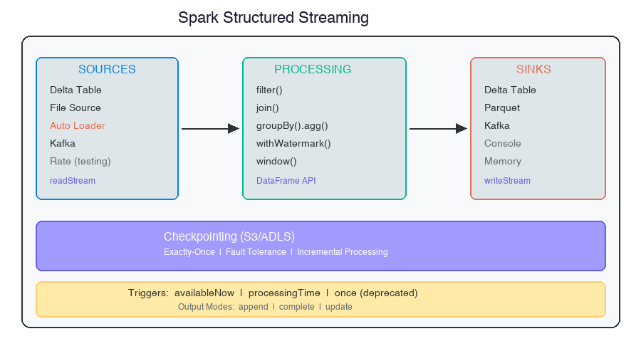
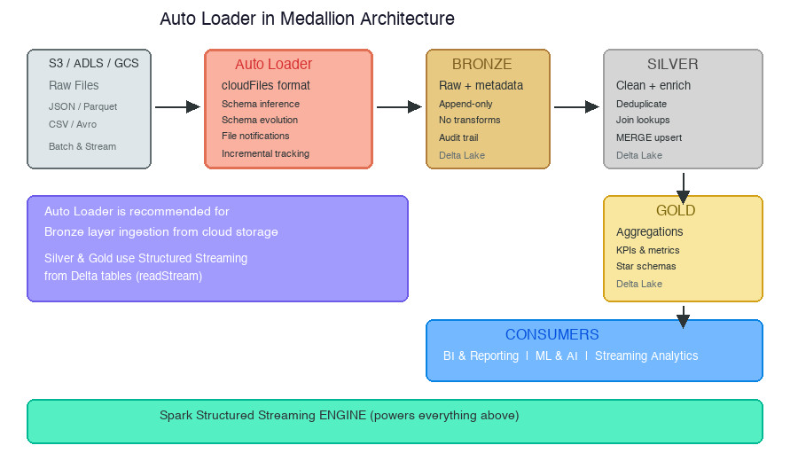

# Structured Streaming & Auto Loader: Moving Data in Real Time Through the Medallion Architecture

sreekanth keerthipati

---

In the [previous article](https://medium.com/@sreekanth489), we organized data into Bronze, Silver, and Gold layers using batch processing.

We scheduled jobs. We ran them manually. We moved data in intervals.

That works for many use cases.

But what if your source sends events every few minutes?

What if your upstream system generates continuous data — clickstreams, IoT sensor readings, transaction events?

Batch won't cut it.

You need **streaming**.

In this article, I'll cover:

- How Structured Streaming works as the streaming engine
- How it differs from batch processing
- What Auto Loader adds on top of Structured Streaming
- Three Auto Loader modes on AWS
- Schema evolution and incremental file detection
- How all of this fits into the Medallion Architecture

---

## What Is a Data Stream?

Before we get into the engine, let's define the input.

A data stream is any data source that grows over time:

- New JSON files landing in S3
- Database changes captured via CDC (Change Data Capture)
- Events queued in Kafka or Kinesis
- IoT sensor readings arriving every second

The key characteristic: **data keeps arriving**. There is no "end."

---

## Structured Streaming: The Engine


*Diagram by author*

**Spark Structured Streaming is the streaming engine.**

It takes the same DataFrame and SQL APIs you use for batch processing and applies them to continuously arriving data.

The magic behind Structured Streaming is simple:

It treats an ever-growing data source as if it were a static table of records.

New data in the stream is just **new rows appended to a table**.

That table is called an **unbounded table** — it has no fixed end.

The key mental model:

In batch, you read a **bounded table** — it has a fixed number of rows.

In streaming, you read an **unbounded table** — new rows keep arriving.

```python
# Batch
df = spark.read.format("delta").table("source_orders")

# Streaming
df = spark.readStream.format("delta").table("source_orders")
```

Same API. Same transformations. Same SQL.

The only difference: `read` vs `readStream`, `write` vs `writeStream`.

Structured Streaming handles:

- Micro-batch execution
- Checkpointing
- Fault tolerance
- Exactly-once semantics
- State management
- Watermarking for late data

---

## Streaming from a Delta Table

The most common streaming pattern in Medallion Architecture is reading from a Delta table as a stream.

```python
df_orders_stream = (
    spark.readStream
        .format("delta")
        .table("source_orders")
)

df_bronze = (
    df_orders_stream
    .filter(col("quantity") > 0)
    .withColumn("load_time", current_timestamp())
)

query = (
    df_bronze.writeStream
        .format("delta")
        .option("checkpointLocation", f"{checkpoint_path}/bronze_orders")
        .outputMode("append")
        .trigger(availableNow=True)
        .table("bronze_orders")
)

query.awaitTermination()
```

When new rows are added to `source_orders`, the stream picks up **only the new rows**.

The checkpoint tracks what's already been processed.

No re-scanning. No duplicate processing.

---

## The Checkpoint: Your Safety Net

Every streaming query has a checkpoint directory:

```
s3://bucket/checkpoints/bronze_orders/
    commits/       # completed micro-batch IDs
    offsets/       # what data was read
    sources/       # source-specific state
```

The checkpoint ensures:

- **Exactly-once processing**: each record is processed once
- **Fault tolerance**: if the job crashes, it resumes from the last completed micro-batch
- **Incremental processing**: only new data is processed

Never share a checkpoint between different streams.

Never delete a checkpoint unless you want to reprocess everything from scratch.

### Exactly-Once Guarantees

Structured Streaming provides two important guarantees:

1. **Fault tolerance**: If the job crashes, it resumes from where it left off. This works because of checkpointing and a mechanism called **write-ahead logs** that record the offset range of data being processed during each trigger.

2. **Exactly-once processing**: Streaming sinks are designed to be **idempotent**. Multiple writes of the same data (identified by offset) do not result in duplicates.

These guarantees work when the streaming source is **repeatable** (cloud storage, Kafka) and the sink is **idempotent** (Delta Lake).

Repeatable sources + idempotent sinks = end-to-end exactly-once semantics.

---

## Unsupported Operations

Most operations on a streaming DataFrame are identical to a static DataFrame.

But there are exceptions.

**Sorting** is not supported on streaming DataFrames:

```python
# This will fail on a streaming DataFrame
df_stream.orderBy("timestamp")
# AnalysisException: sorting is not supported on streaming DataFrames
```

Why? Because you can't sort an infinite dataset — new rows keep arriving.

**Deduplication** across the entire stream is also complex without watermarking.

For operations like these, you need advanced streaming methods like **windowing** and **watermarking**, which we cover later in this article.

---

## Streaming with SQL: Temporary Views

You can use SQL with streaming data by registering a streaming temporary view:

```python
spark.readStream.table("books").createOrReplaceTempView("books_streaming_tmp_vw")
```

Now you can write SQL against it:

```sql
SELECT author, count(book_id) AS total_books
FROM books_streaming_tmp_vw
GROUP BY author
```

This is a streaming query — it runs continuously, updating as new data arrives.

To persist the results, pass the logic back to PySpark and use `writeStream`:

```python
spark.table("author_counts_tmp_vw")
    .writeStream
    .trigger(availableNow=True)
    .outputMode("complete")
    .option("checkpointLocation", "/path/to/checkpoint")
    .table("author_counts")
```

**Important**: Spark always loads streaming views as streaming DataFrames. Incremental processing must be defined from the beginning with `readStream` to support incremental writing later.

---

## Trigger Strategies

Triggers control **when** your streaming job processes data.

### `trigger(availableNow=True)` — Recommended for Production

Processes all available data in multiple micro-batches, then stops.

This is the most common production pattern. You schedule a Databricks Workflow to run every 5-10 minutes. Each run processes whatever data has arrived since the last run.

```python
.trigger(availableNow=True)
```

### `trigger(processingTime="30 seconds")` — Continuous

Runs a micro-batch every 30 seconds. The stream stays running indefinitely.

```python
.trigger(processingTime="30 seconds")
```

Use this when you need near-real-time updates and are willing to keep a cluster running.

### `trigger(once=True)` — Deprecated

Processes a single micro-batch. **Don't use this.** Use `availableNow` instead.

The difference: `once` processes one micro-batch and might leave data behind. `availableNow` processes **all** available data across multiple micro-batches.

---

## Stream-Static Joins

A very common pattern: join streaming data with a static lookup table.

```python
# Streaming
df_bronze_stream = spark.readStream.format("delta").table("bronze_orders")

# Static (batch read)
df_customers = spark.table("customers_lookup")

# Join
df_enriched = df_bronze_stream.join(df_customers, "customer_id", "inner")
```

This is how you enrich streaming events with reference data — customer names, product details, store locations.

The static side is re-read on each micro-batch, so it always reflects the latest data.

---

## Watermarking

If you're doing aggregations on streaming data, you need watermarking.

Without it, Spark keeps **all state forever**. Memory grows unbounded.

With watermarking, you tell Spark: "I'm willing to accept data up to X minutes late. After that, drop it."

```python
df_windowed = (
    df_stream
    .withWatermark("order_date", "1 day")
    .groupBy(window("order_date", "1 day"), "customer_id")
    .agg(count("order_id").alias("daily_orders"))
)
```

This keeps memory bounded while still handling reasonable late arrivals.

---

## A Note on `skipChangeCommits`

When streaming from a Delta table that was initially created with `mode("overwrite")`, you may encounter:

```
DELTA_SOURCE_TABLE_IGNORE_CHANGES
```

This happens because the streaming checkpoint detects a non-append commit (the overwrite) in the transaction log.

The fix:

```python
spark.readStream
    .format("delta")
    .option("skipChangeCommits", "true")
    .table("source_orders")
```

`skipChangeCommits` tells Delta to skip non-append commits (overwrites, deletes) and only process actual data appends.

In production Bronze tables that are always append-only, you won't hit this. But in development where you might overwrite a source table, this option saves you.

---

## Incremental Data Ingestion from Files

Before we get to Auto Loader, it's worth knowing that Databricks provides **two mechanisms** for incrementally processing new data files:

### COPY INTO

A SQL command that loads data idempotently from a file location into a Delta table:

```sql
COPY INTO my_table
FROM '/path/to/files'
FILEFORMAT = CSV
FORMAT_OPTIONS('delimiter' = '|', 'header' = 'true')
COPY_OPTIONS('mergeSchema' = 'true');
```

Each time you run it, it loads **only new files**. Previously loaded files are skipped.

### Auto Loader

Uses Structured Streaming to efficiently process new data files as they arrive.

### When to Use Which?

| Scenario | Use |
|----------|-----|
| Thousands of files | COPY INTO |
| Millions of files or more | Auto Loader |
| Need schema evolution | Auto Loader |
| Need near-real-time | Auto Loader |
| Simple one-time loads | COPY INTO |

Databricks recommends **Auto Loader as the general best practice** for ingesting data from cloud object storage.

---

## Now: Auto Loader

Here's where many people get confused.

**Auto Loader is NOT a streaming engine.**

**Auto Loader is a specialized file ingestion SOURCE built on top of Structured Streaming.**

The relationship:

```
S3 / ADLS / GCS
      |
      v
Auto Loader (cloudFiles)       ← SOURCE
      |
      v
Spark Structured Streaming     ← ENGINE
      |
      v
Delta Lake (Bronze Table)
```

Every Auto Loader pipeline IS a Structured Streaming query internally.

When you run `spark.readStream.format("cloudFiles")`, Spark uses the same micro-batch engine, checkpoints, and fault tolerance as any other streaming query.

Auto Loader just provides a **better file ingestion mechanism**.

---

## Why Auto Loader Exists

Standard Spark file streaming has limitations:

```python
# Standard file streaming
spark.readStream.format("parquet").schema(my_schema).load("/data/")
```

Problems:

- **Re-lists the entire directory** on every trigger (expensive for large directories)
- **No schema inference** — you must specify the schema manually
- **No schema evolution** — if source adds a column, the job breaks
- **Struggles with millions of files**

Auto Loader solves all of these:

```python
# Auto Loader
spark.readStream.format("cloudFiles").option("cloudFiles.format", "parquet").load("s3://bucket/data/")
```

Same streaming engine underneath. But now you get:

- **Incremental file tracking** via checkpoint
- **Schema inference** persisted to `schemaLocation`
- **Schema evolution** with `addNewColumns`
- **Efficient file discovery** via notifications or incremental listing
- **Scales to millions of files**

---

## Auto Loader File Detection Modes on AWS

Databricks documents two file detection modes for Auto Loader, with the file notification mode having two variants in practice.

### Mode 1: Directory Listing — Start Here

The simplest setup. Zero infrastructure required.

```python
spark.readStream
    .format("cloudFiles")
    .option("cloudFiles.format", "json")
    .option("cloudFiles.useNotifications", "false")
    .option("cloudFiles.schemaLocation", f"{schema_path}/events")
    .load(f"{raw_data_path}/json_events/")
```

Auto Loader lists the directory, compares against its checkpoint, and processes only new files.

It works on both Free and Premium editions.

Start here. It always works.

### Mode 2: File Notification — Production

File notification mode leverages cloud notification services to detect new files as they arrive, without scanning directories.

On AWS, there are two approaches:

**Managed File Events** (recommended for Databricks Premium with Unity Catalog):

```python
spark.readStream
    .format("cloudFiles")
    .option("cloudFiles.format", "json")
    .option("cloudFiles.useManagedFileEvents", "true")
    .option("cloudFiles.schemaLocation", f"{schema_path}/events")
    .load(f"{raw_data_path}/json_events/")
```

Databricks manages the S3 notification infrastructure via Unity Catalog external locations. You enable file events on your external location, and Databricks handles the SNS/SQS plumbing.

Requires: Unity Catalog external location with file events enabled.

**Classic Notifications** (legacy approach):

```python
spark.readStream
    .format("cloudFiles")
    .option("cloudFiles.format", "json")
    .option("cloudFiles.useNotifications", "true")
    .option("cloudFiles.region", "us-east-1")  # must match bucket region
    .option("cloudFiles.schemaLocation", f"{schema_path}/events")
    .load(f"{raw_data_path}/json_events/")
```

Auto Loader auto-manages SNS/SQS resources per stream. More moving parts, more failure modes. Use managed file events instead when possible.

### Which to Use?

| Approach | Setup | Scale | Best For |
|----------|-------|-------|----------|
| Directory listing | None | Moderate | Dev, learning, scheduled batch |
| Managed file events | External location + file events | Millions+ | Production (Premium) |
| Classic notifications | IAM for SNS/SQS | Millions+ | Legacy setups |

---

## Schema Evolution

One of Auto Loader's most valuable features.

When your source adds a new column, Auto Loader handles it automatically:

```python
.option("cloudFiles.schemaEvolutionMode", "addNewColumns")
```

In the lab, I demonstrated this:

1. Batch 1 and 2 had 7 columns
2. Batch 3 added a new `referrer` column
3. Auto Loader detected the schema change, updated the persisted schema, and added the column to the Delta table
4. Old records got `NULL` for `referrer`. New records got the actual values.

No code changes. No manual intervention. The pipeline just adapts.

What actually happens internally:

1. Auto Loader detects the new column in the incoming data
2. It throws an `UnknownFieldException` to signal the schema change
3. It updates the schema file at `schemaLocation` with the new column
4. On retry (or next trigger), the stream succeeds with the updated schema

In production, you configure **retries** in your Databricks Workflow. The first attempt detects the change, the second attempt processes it.

The default `schemaEvolutionMode` is `addNewColumns` when no schema is provided (Auto Loader infers it). If you explicitly provide a schema, the default changes to `none`. Other options include `rescue` (captures unknown fields in a `_rescued_data` column) and `failOnNewColumns` (halts the stream for manual review).

### Auto Loader Schema Location

Auto Loader can automatically infer the schema of your data. To avoid inference costs on every restart, the inferred schema is persisted:

```python
.option("cloudFiles.schemaLocation", "s3://bucket/checkpoints/schema")
```

This location can be the same as your checkpoint location. The schema is inferred once from the first batch of files and reused on every subsequent run.

---

## Streaming Multi-Hop Pipeline

The real power of combining Structured Streaming with Auto Loader is the **multi-hop streaming pipeline** — data flows continuously from Bronze through Silver to Gold.

```python
# BRONZE: Auto Loader ingests raw files
spark.readStream
    .format("cloudFiles")
    .option("cloudFiles.format", "parquet")
    .option("cloudFiles.schemaLocation", "s3://bucket/schema/orders")
    .load("s3://bucket/raw/orders/")
    .writeStream
    .option("checkpointLocation", "s3://bucket/checkpoints/bronze")
    .outputMode("append")
    .table("bronze.orders")

# SILVER: Stream from Bronze, join with lookup, write enriched data
spark.readStream
    .table("bronze.orders")
    .join(spark.table("silver.customers"), "customer_id", "inner")
    .filter(col("quantity") > 0)
    .writeStream
    .option("checkpointLocation", "s3://bucket/checkpoints/silver")
    .outputMode("append")
    .table("silver.orders")

# GOLD: Stream from Silver, aggregate, write business metrics
spark.readStream
    .table("silver.orders")
    .groupBy(date_trunc("day", col("order_date")), "customer_id")
    .agg(sum("quantity").alias("daily_items"))
    .writeStream
    .option("checkpointLocation", "s3://bucket/checkpoints/gold")
    .outputMode("complete")
    .trigger(availableNow=True)
    .table("gold.daily_customer_orders")
```

Each layer reads as a stream from the previous layer.

When new files land in S3, Auto Loader detects them and writes to Bronze. The Silver stream picks up the new Bronze records, enriches them, and writes to Silver. The Gold stream picks up the new Silver records, aggregates them, and refreshes Gold.

The entire pipeline can be automated with Databricks Workflows — one trigger starts the chain.

This is the Medallion Architecture in motion.

---

## Where Each Tool Fits in Medallion Architecture


*Diagram by author*

**Auto Loader** is the **recommended approach for Bronze layer ingestion** from cloud object storage (S3, ADLS, GCS). Databricks explicitly recommends it as the general best practice when ingesting data from cloud storage.

Why Auto Loader specifically for Bronze?

- Bronze receives raw files from external systems — exactly what Auto Loader is designed for
- Auto Loader handles schema inference and evolution, which is critical at the ingestion layer where source schemas may change
- File notification mode provides near-real-time detection of new files landing in S3
- Incremental tracking via checkpoints ensures exactly-once processing without re-scanning

**Structured Streaming** from Delta tables is used for **Silver and Gold** — reading from one Delta table and writing to the next. At these layers, data is already in Delta format, so you don't need Auto Loader's file discovery capabilities. A simple `spark.readStream.table("bronze.orders")` is sufficient.

| Layer | Recommended Ingestion Method | Why |
|-------|------------------------------|-----|
| **Bronze** | **Auto Loader** (`cloudFiles`) | Raw files from cloud storage; needs schema inference, file tracking |
| **Silver** | Structured Streaming from Delta | Data already in Delta; just needs `readStream.table()` |
| **Gold** | Structured Streaming from Delta or Batch | Aggregations from Silver; can use `readStream` or `spark.read` |

---

## One Sentence to Remember

If someone asks you in an interview or certification exam:

> *"How are Structured Streaming and Auto Loader related?"*

Answer:

> Auto Loader is a file ingestion mechanism built on top of Spark Structured Streaming. It provides scalable file discovery, schema inference, and incremental ingestion from cloud storage, while relying on Structured Streaming to execute the micro-batch processing pipeline.

---

## What's Next?

We've now covered:

- How to **organize** data (Medallion Architecture)
- How to **move** data with batch processing
- How to **stream** data with Structured Streaming
- How to **ingest files** efficiently with Auto Loader

But we've been running each layer manually.

In a real production system, you need:

- **Orchestration** — run Bronze before Silver, Silver before Gold
- **Data quality expectations** — automatically flag bad records
- **Declarative pipelines** — define what you want, not how to run it

That's what **Delta Live Tables** (now called Spark Declarative Pipelines) provides.

In the next session, we'll build a complete declarative pipeline with built-in data quality checks, automatic dependency resolution, and continuous processing.

---

All the lab notebooks are available on GitHub:

- [Day 19: Structured Streaming](https://github.com/sreekanth489/spark-databricks-zero-to-pro/tree/main/day19-structured-streaming)
- [Day 20: Auto Loader](https://github.com/sreekanth489/spark-databricks-zero-to-pro/tree/main/day20-auto-loader)
- [Day 00: Environment Setup](https://github.com/sreekanth489/spark-databricks-zero-to-pro/tree/main/day00-environment-setup)

---

*Previously in this series:*

- [Medallion Architecture: Building Production Data Pipelines with Bronze, Silver, and Gold Layers](#) *(previous article)*
- [Inside the Delta Log — The Complete Series](https://medium.com/@sreekanth489/inside-the-delta-log-the-complete-series-acid-internals-performance-concurrency-a5db53b2fb6f)
- [From Data Lakes to Delta Lake: A Practical Guide](https://medium.com/@sreekanth489/from-data-lakes-to-delta-lake-a-practical-guide-for-beginners-to-experienced-data-engineers-4571ff129f30)
- [Why Hadoop, Spark, and Databricks Exist](https://medium.com/@sreekanth489/why-hadoop-spark-and-databricks-exist-and-why-we-even-need-delta-lake-235441d5f148)
