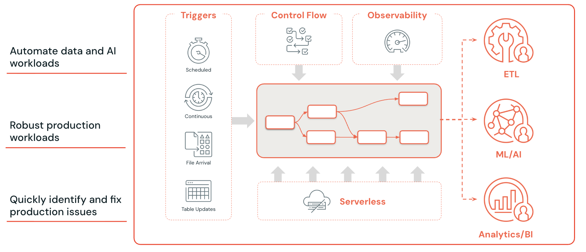

# Lakeflow Jobs: Orchestrating Your Entire Data Platform

sreekanth keerthipati

---

We've come a long way.

In [earlier articles](https://medium.com/@sreekanth489), we built the Medallion Architecture. We streamed data with Auto Loader. We replaced manual scripts with Spark Declarative Pipelines.

But there's still a missing piece.

Who **runs** the pipeline? When does it run? What happens when it fails? How do you chain multiple pipelines together? How do you promote everything from dev to production?

In our community sessions, someone asked: "This is great, but how does this actually run in production at 6 AM every day?"

The answer is **Lakeflow Jobs**.

---

## What You'll Learn

- What Lakeflow Jobs solves and why external orchestrators become optional
- Multi-task workflows with DAG patterns
- Five trigger modes: manual, scheduled, continuous, file arrival, table updates
- Smart retries and repair runs
- Parameters, notifications, and RBAC
- End-to-end Lakeflow workflow combining Connect + SDP + Jobs
- Databricks Asset Bundles for CI/CD
- Serverless compute for cost efficiency

---

## The Orchestration Problem

Before Lakeflow Jobs, running data pipelines in Databricks meant using an external orchestrator.

**Apache Airflow** was the most common choice. You'd define DAGs in Python, configure connections, manage an Airflow server, and trigger Databricks notebooks via the API.

**Azure Data Factory** was popular for Azure shops. **AWS Step Functions** for AWS-native teams. **cron jobs** for teams that liked to live dangerously.

The problem? Your orchestration lived in a completely different system from your data logic.

Your transformations were in Databricks notebooks. Your scheduling was in Airflow. Your monitoring was split across two UIs. Your retry logic was configured in one place, your pipeline code in another.

When something failed at 3 AM, you had to check Airflow logs, then Databricks logs, then the notebook output, then the cluster logs. Four systems. Four sets of credentials. Four places where things could go wrong.

Lakeflow Jobs brings orchestration **inside** Databricks.

---

## What Lakeflow Jobs Provides


<p align="center"><em>Image credit: <a href="https://www.databricks.com/product/lakeflow">Databricks</a></em></p>

Lakeflow Jobs is Databricks' native workflow orchestration engine.

It lets you:

- **Compose** multiple tasks into a single workflow
- **Schedule** workflows on any cadence
- **Retry** failed tasks automatically
- **Repair** partially failed runs without reprocessing successful work
- **Monitor** everything from a single UI
- **Control access** with role-based permissions
- **Deploy** across environments with Databricks Asset Bundles

Think of it as Airflow built into Databricks — but simpler, tighter integrated, and with features that only a native orchestrator can provide.

---

## Multi-Task Workflows

A Lakeflow Job is a **workflow** composed of one or more **tasks**.

Each task can be:

- A **notebook** (PySpark, SQL, Scala, R)
- A **Python script** (standalone .py file)
- A **SQL query** (ad-hoc or saved query)
- A **Spark Declarative Pipeline** (SDP)
- A **dbt project** (dbt Core tasks)
- A **JAR** (Java/Scala applications)

You can mix and match. One workflow might run an SDP pipeline, then execute a SQL quality check, then trigger a Python notification script.

### DAG Patterns

Tasks within a workflow form a DAG — a directed graph of dependencies.

**Linear (Sequential):**

```
Task A → Task B → Task C
```

Each task waits for the previous one to complete. Use this for strict ordering: ingest, then transform, then publish.

**Fan-Out (Parallel):**

```
          ┌→ Task B
Task A ──►├→ Task C
          └→ Task D
```

Task A completes, then B, C, and D run in parallel. Use this when independent transformations can happen simultaneously.

**Fan-In (Convergence):**

```
Task B ──►┐
Task C ──►├→ Task E
Task D ──►┘
```

Task E waits for B, C, and D to all complete. Use this when a downstream task needs results from multiple upstream tasks.

**Diamond (Fan-Out + Fan-In):**

```
          ┌→ Task B ──►┐
Task A ──►│            ├→ Task D
          └→ Task C ──►┘
```

The most common production pattern. Ingest (A), transform in parallel (B and C), then aggregate (D).

**Conditional:**

```
Task A → [if success] → Task B
         [if failure] → Task C (alert)
```

Run different tasks based on the outcome of previous tasks. Use this for error handling workflows — if the pipeline fails, send a notification instead of proceeding.

### Configuring Dependencies in the UI

In the Databricks UI, you build the task DAG visually:

1. Create a new Job
2. Add tasks one by one
3. For each task, select its **dependencies** (which tasks must complete first)
4. The UI draws the DAG automatically

You can also define jobs as code using Databricks Asset Bundles (more on that later).

---

## Trigger Modes

How does a workflow know when to run? Lakeflow Jobs supports five trigger modes.

### Manual (On-Demand)

Click "Run Now" in the UI. Or trigger via the REST API.

```bash
# Trigger via API
curl -X POST \
  https://<workspace>.cloud.databricks.com/api/2.1/jobs/run-now \
  -H "Authorization: Bearer $TOKEN" \
  -d '{"job_id": 12345}'
```

Use this for ad-hoc runs, testing, or workflows triggered by external systems.

### Scheduled (Cron)

The most common production trigger. Run on a schedule using cron syntax.

```
# Every day at 6 AM UTC
0 6 * * *

# Every hour
0 * * * *

# Every Monday at midnight
0 0 * * 1

# Every 15 minutes
*/15 * * * *
```

The Databricks UI provides a visual cron builder — you don't need to memorize cron syntax.

### Continuous

The workflow runs continuously. As soon as one run completes, the next starts immediately.

Use this for near-real-time pipelines where you want data refreshed as fast as possible.

With continuous trigger and SDP streaming tables, you can achieve near-real-time data freshness from source to Gold layer.

### File Arrival

The workflow triggers when new files arrive in a specified cloud storage location.

```
Trigger: File arrival
Path: s3://my-bucket/raw/orders/
```

When new JSON files land in the orders directory, the workflow kicks off automatically.

This is powerful when combined with Auto Loader. Files arrive, the job triggers, Auto Loader picks up the new files, and the pipeline processes them through Bronze, Silver, and Gold.

No polling. No scheduled guessing. Event-driven.

### Table Updates

The workflow triggers when a specified Delta table is updated.

```
Trigger: Table update
Table: catalog.schema.bronze_orders
```

When new rows are written to `bronze_orders`, the downstream workflow triggers automatically.

This enables **table-driven orchestration** — instead of time-based scheduling, your workflows react to data changes.

### Which Trigger Mode to Use

| Trigger | Latency | Cost | Best For |
|---------|---------|------|----------|
| **Manual** | On-demand | Pay per run | Testing, ad-hoc, external triggers |
| **Scheduled** | Minutes to hours | Predictable | Most production workloads |
| **Continuous** | Seconds | Highest | Real-time dashboards, alerting |
| **File arrival** | Seconds to minutes | Event-driven | S3/ADLS file-based ingestion |
| **Table update** | Seconds to minutes | Event-driven | Cross-pipeline dependencies |

For most teams, **scheduled triggers** are the starting point. Move to file arrival or table updates when you need lower latency.

---

## Smart Retries and Repair Runs

This is where Lakeflow Jobs really shines compared to external orchestrators.

### Configurable Retries Per Task

Each task in a workflow can have its own retry policy:

```
Task: bronze_ingestion
  Max retries: 3
  Retry interval: 60 seconds

Task: silver_transformation
  Max retries: 2
  Retry interval: 120 seconds

Task: gold_aggregation
  Max retries: 1
  Retry interval: 300 seconds
```

A transient S3 timeout on Bronze? Retry 3 times with a 60-second gap. Most transient errors resolve on the first retry.

A complex Silver transformation failure? Retry twice with a longer gap.

A Gold aggregation failure? Retry once, then fail — if Silver data is wrong, retrying Gold won't help.

Different tasks get different retry strategies. You don't configure this in Airflow — you configure it right next to the task definition.

### Repair Runs: The Killer Feature

Here's the scenario: you have a workflow with 10 tasks. Tasks 1 through 7 succeed. Task 8 fails.

In Airflow, you typically re-run the entire DAG. Tasks 1-7 execute again unnecessarily.

In Lakeflow Jobs, you run a **repair run**.

A repair run re-executes **only the failed tasks and their downstream dependents**. Tasks 1-7 are skipped — their results from the original run are reused.

```
Original Run:
  Task 1: ✓ (success)
  Task 2: ✓ (success)
  ...
  Task 7: ✓ (success)
  Task 8: ✗ (failure)
  Task 9: ⊘ (skipped)
  Task 10: ⊘ (skipped)

Repair Run:
  Task 1-7: ⊘ (reused from original)
  Task 8: ✓ (re-executed, now succeeds)
  Task 9: ✓ (runs with Task 8's output)
  Task 10: ✓ (runs with Task 9's output)
```

This saves:

- **Time** — don't reprocess 7 successful tasks
- **Money** — don't pay for compute on already-completed work
- **Reliability** — the successful tasks' outputs are guaranteed consistent

In our community session, when I explained repair runs, someone said: "That alone is worth switching from Airflow." And honestly? For many teams, it is.

---

## Parameters, Notifications, and RBAC

### Dynamic Parameters

Workflows can accept parameters at runtime:

```python
# In your notebook
dbutils.widgets.text("environment", "dev")
dbutils.widgets.text("start_date", "2024-01-01")

environment = dbutils.widgets.get("environment")
start_date = dbutils.widgets.get("start_date")
```

When configuring the job, you set default values for these parameters. When triggering a run manually or via API, you can override them.

This enables:

- **Environment switching**: same workflow code, different parameters for dev/staging/prod
- **Date range processing**: reprocess a specific date range without modifying code
- **Feature flags**: enable/disable pipeline features via parameters

### Task Values: Passing Data Between Tasks

Tasks can pass values to downstream tasks:

```python
# Task A: Set a value
dbutils.jobs.taskValues.set(key="record_count", value=1500000)

# Task B: Read the value from Task A
count = dbutils.jobs.taskValues.get(
    taskKey="task_a",
    key="record_count"
)
print(f"Task A processed {count} records")
```

This is useful for conditional logic, monitoring, and passing metadata between tasks.

### Notifications

Lakeflow Jobs supports multiple notification channels:

- **Email** — built-in, no configuration needed
- **Slack** — via webhook integration
- **PagerDuty** — for on-call escalation
- **Microsoft Teams** — via webhook
- **Custom webhooks** — for any system that accepts HTTP POST

Configure notifications per event:

```
On start: email team
On success: Slack channel
On failure: PagerDuty + email + Slack
On duration warning: Slack (if run exceeds 2 hours)
```

The duration warning is particularly useful. If your pipeline usually runs in 30 minutes but today it's been running for 2 hours, you want to know before it times out.

### RBAC (Role-Based Access Control)

Lakeflow Jobs integrates with Unity Catalog's permission model:

| Role | Can Do |
|------|--------|
| **Owner** | Full control: edit, run, delete, manage permissions |
| **Can Manage** | Edit job configuration, manage runs |
| **Can Run** | Trigger runs, view results |
| **Can View** | View job configuration and run history |

This matters in regulated industries. Your data engineers can manage the pipeline. Your analysts can trigger runs. Your auditors can view history. Nobody has more access than they need.

---

## End-to-End Lakeflow Workflow

Let's tie all three Lakeflow components together into a single production workflow.

### The Scenario

An e-commerce company needs:

1. **Ingest** Salesforce customer data and S3 order files
2. **Transform** through Bronze, Silver, Gold layers
3. **Run** SQL quality checks
4. **Notify** the team on completion or failure

### The Workflow

```
┌─────────────────────────────┐
│   Task 1: Lakeflow Connect  │
│   (Managed Connector)       │
│   Salesforce → Bronze       │
│   Trigger: File arrival     │
└─────────────┬───────────────┘
              │
              ▼
┌─────────────────────────────┐
│   Task 2: SDP Pipeline      │
│   Bronze → Silver → Gold    │
│   Auto retries: 3           │
│   Expectations enforced     │
└─────────────┬───────────────┘
              │
              ▼
┌─────────────────────────────┐
│   Task 3: SQL Quality Check │
│   COUNT(*) validations      │
│   Schema drift detection    │
└─────────────┬───────────────┘
              │
              ▼
┌─────────────────────────────┐
│   Task 4: Notification      │
│   Python script             │
│   Slack + email summary     │
└─────────────────────────────┘
```

### Task 1: Lakeflow Connect

A managed connector syncs Salesforce customer data into Unity Catalog. This runs as a separate scheduled sync (daily at midnight) or as the first task in the workflow.

Meanwhile, Auto Loader (configured in the SDP pipeline) watches the S3 orders directory.

### Task 2: SDP Pipeline

The Spark Declarative Pipeline processes everything:

```python
# Bronze: ingest raw orders via Auto Loader
@dp.table
def bronze_orders():
    return spark.readStream.format("cloudFiles").load(...)

# Bronze: Salesforce customers (already landed by Connect)
@dp.materialized_view
def bronze_customers():
    return spark.read.table("raw.salesforce_customers")

# Silver: cleansed and enriched
@dp.materialized_view
@dp.expect_or_drop("valid_email", "email IS NOT NULL")
def silver_customers():
    return spark.sql("SELECT ... FROM LIVE.bronze_customers")

@dp.table
@dp.expect("valid_amount", "order_amount > 0")
def silver_orders():
    return spark.readStream.table("LIVE.bronze_orders").filter(...)

# Gold: business metrics
@dp.materialized_view
def gold_customer_lifetime_value():
    return spark.sql("""
        SELECT
            c.customer_id,
            c.customer_name,
            COUNT(o.order_id) AS total_orders,
            SUM(o.order_amount) AS lifetime_value
        FROM LIVE.silver_orders o
        JOIN LIVE.silver_customers c ON o.customer_id = c.customer_id
        GROUP BY c.customer_id, c.customer_name
    """)
```

Retries are configured at the task level: 3 retries with 60-second intervals.

### Task 3: SQL Quality Check

A SQL notebook that validates the pipeline output:

```sql
-- Ensure Gold table has records
SELECT
    CASE
        WHEN COUNT(*) = 0 THEN RAISE_ERROR('gold_customer_lifetime_value is empty')
        ELSE 'PASS'
    END AS check_result
FROM catalog.schema.gold_customer_lifetime_value;

-- Ensure no negative lifetime values
SELECT
    CASE
        WHEN COUNT(*) > 0 THEN RAISE_ERROR('Found negative lifetime values')
        ELSE 'PASS'
    END AS check_result
FROM catalog.schema.gold_customer_lifetime_value
WHERE lifetime_value < 0;
```

If any check fails, the workflow reports failure and triggers the notification task via the conditional path.

### Task 4: Notification

A Python script that sends a summary:

```python
import requests

run_id = dbutils.jobs.taskValues.get(taskKey="sdp_pipeline", key="run_id")
record_count = dbutils.jobs.taskValues.get(taskKey="sdp_pipeline", key="record_count")

slack_message = {
    "text": f"Pipeline completed. Run ID: {run_id}. Records processed: {record_count}."
}

requests.post(slack_webhook_url, json=slack_message)
```

The complete workflow runs on a schedule (6 AM daily), with file arrival triggers as an alternative for near-real-time processing.

---

## Databricks Asset Bundles (DAB)

So far, everything we've configured has been through the UI.

That's fine for development. But in production, you need:

- **Version control** — track changes to job configurations
- **Code review** — peer review before deploying pipeline changes
- **CI/CD** — automated testing and deployment
- **Environment promotion** — dev to staging to production

Databricks Asset Bundles (DAB) solves this.

### What Are Asset Bundles?

Asset Bundles are a **configuration-as-code** approach to managing Databricks resources. You define your jobs, pipelines, and resources in YAML files, version them in Git, and deploy them with the Databricks CLI.

### The `databricks.yml` File

```yaml
bundle:
  name: ecommerce-pipeline

workspace:
  host: https://my-workspace.cloud.databricks.com

resources:
  jobs:
    ecommerce_daily:
      name: "E-Commerce Daily Pipeline"
      schedule:
        quartz_cron_expression: "0 0 6 * * ?"
        timezone_id: "America/New_York"
      tasks:
        - task_key: ingest
          pipeline_task:
            pipeline_id: ${resources.pipelines.ecommerce_sdp.id}

        - task_key: quality_check
          depends_on:
            - task_key: ingest
          notebook_task:
            notebook_path: ./notebooks/quality_checks.sql

        - task_key: notify
          depends_on:
            - task_key: quality_check
          notebook_task:
            notebook_path: ./notebooks/send_notification.py

  pipelines:
    ecommerce_sdp:
      name: "E-Commerce SDP Pipeline"
      target: "ecommerce_gold"
      libraries:
        - notebook:
            path: ./notebooks/pipeline.py
```

Your entire workflow — jobs, pipelines, schedules, dependencies — is defined in one YAML file.

### Environment Targets

```yaml
targets:
  dev:
    mode: development
    workspace:
      host: https://dev-workspace.cloud.databricks.com
    resources:
      jobs:
        ecommerce_daily:
          name: "[DEV] E-Commerce Daily Pipeline"
          schedule:
            pause_status: PAUSED

  staging:
    workspace:
      host: https://staging-workspace.cloud.databricks.com
    resources:
      jobs:
        ecommerce_daily:
          name: "[STG] E-Commerce Daily Pipeline"
          schedule:
            quartz_cron_expression: "0 0 8 * * ?"

  production:
    mode: production
    workspace:
      host: https://prod-workspace.cloud.databricks.com
    resources:
      jobs:
        ecommerce_daily:
          name: "E-Commerce Daily Pipeline"
```

Same code. Different configurations per environment.

- **Dev**: schedule paused, development mode
- **Staging**: different schedule, test data
- **Production**: full schedule, production data

### Deploy Workflow

```bash
# Validate the bundle
databricks bundle validate

# Deploy to dev
databricks bundle deploy --target dev

# Run in dev
databricks bundle run --target dev ecommerce_daily

# Deploy to staging (after code review)
databricks bundle deploy --target staging

# Deploy to production (after staging validation)
databricks bundle deploy --target production
```

### CI/CD Integration

In your CI/CD pipeline (GitHub Actions, Azure DevOps, GitLab CI):

```yaml
# .github/workflows/deploy.yml
name: Deploy Pipeline

on:
  push:
    branches: [main]

jobs:
  deploy-staging:
    runs-on: ubuntu-latest
    steps:
      - uses: actions/checkout@v4
      - uses: databricks/setup-cli@main
      - run: databricks bundle validate --target staging
      - run: databricks bundle deploy --target staging

  deploy-production:
    needs: deploy-staging
    runs-on: ubuntu-latest
    environment: production  # requires approval
    steps:
      - uses: actions/checkout@v4
      - uses: databricks/setup-cli@main
      - run: databricks bundle deploy --target production
```

Merge to main triggers staging deployment. A manual approval gate protects production.

This is how enterprise teams manage data pipelines. No manual UI clicking. No configuration drift between environments. Everything in Git.

---

## Serverless Compute

Lakeflow Jobs supports **serverless compute** — and this changes the economics of running pipelines.

### The Traditional Model

Before serverless:

1. Create a cluster
2. Wait 5-10 minutes for it to start
3. Run your 15-minute pipeline
4. Cluster sits idle (or you terminate it manually)
5. Next run: wait 5-10 minutes again

You paid for startup time. You paid for idle time. You managed cluster configurations, instance types, auto-scaling policies.

### The Serverless Model

With serverless:

1. Trigger the job
2. Compute is allocated in seconds
3. Pipeline runs
4. Compute is released immediately

No cluster management. No startup wait. No idle costs.

### What Runs Serverless

| Resource | Serverless Support |
|----------|-------------------|
| SDP Pipelines | Yes |
| Notebooks | Yes |
| SQL tasks | Yes (SQL Warehouses) |
| Python scripts | Yes |
| dbt tasks | Yes |

### Cost Comparison

For a pipeline that runs 4 times daily, each run taking 15 minutes:

**Classic clusters** (with 10-minute startup, 5-minute idle):
- Active compute: 4 runs x 15 min = 60 min
- Startup overhead: 4 x 10 min = 40 min
- Idle time: 4 x 5 min = 20 min
- **Total billed: ~120 min/day**

**Serverless**:
- Active compute: 4 runs x 15 min = 60 min
- Startup overhead: ~0 (seconds)
- Idle time: 0
- **Total billed: ~60 min/day**

Serverless pricing per minute is higher, but you use **half the minutes**. For most workloads, serverless is cheaper overall.

---

## The Complete Picture

Let's step back and see how all three Lakeflow components work together.

```
┌──────────────────────────────────────────────────────┐
│                   LAKEFLOW JOBS                       │
│            (Schedule, Orchestrate, Monitor)           │
│                                                      │
│  ┌────────────────┐  ┌─────────────┐  ┌───────────┐ │
│  │ LAKEFLOW       │  │ SPARK       │  │ SQL /     │ │
│  │ CONNECT        │→ │ DECLARATIVE │→ │ NOTEBOOK  │ │
│  │                │  │ PIPELINES   │  │ TASKS     │ │
│  │ Salesforce     │  │             │  │           │ │
│  │ PostgreSQL     │  │ Bronze      │  │ Quality   │ │
│  │ S3 Files       │  │ Silver      │  │ Checks    │ │
│  │ Kafka          │  │ Gold        │  │ Reports   │ │
│  └────────────────┘  └─────────────┘  └───────────┘ │
│                                                      │
│  Retries ✓  Repair Runs ✓  Notifications ✓  RBAC ✓ │
└──────────────────────────────────────────────────────┘
              │
              ▼
┌──────────────────────────────────────────────────────┐
│              UNITY CATALOG                            │
│   Governance · Lineage · Access Control · Discovery  │
└──────────────────────────────────────────────────────┘
              │
              ▼
┌──────────────────────────────────────────────────────┐
│              CONSUMERS                                │
│   Dashboards · ML Models · SQL Analytics · APIs      │
└──────────────────────────────────────────────────────┘
```

**Lakeflow Connect** gets data in from any source — databases, SaaS, files, streams.

**Spark Declarative Pipelines** transforms data through Bronze, Silver, Gold with built-in quality, CDC, and automatic orchestration within the pipeline.

**Lakeflow Jobs** orchestrates across pipelines — scheduling, retries, repair runs, notifications, cross-pipeline dependencies.

**Unity Catalog** governs everything — who can access what, where data came from, how it's used.

This is the complete Databricks data engineering stack. From raw source to business insight. Fully managed. Fully governed. Fully observable.

---

## Lakeflow Jobs vs External Orchestrators

Should you replace Airflow with Lakeflow Jobs?

| Aspect | Lakeflow Jobs | Apache Airflow |
|--------|--------------|----------------|
| **Setup** | Zero — built into Databricks | Deploy and manage Airflow server |
| **Task types** | Notebooks, SQL, SDP, scripts, dbt | Any Python callable |
| **Repair runs** | Native — re-run only failed tasks | Limited — usually re-run entire DAG |
| **Compute** | Serverless or classic clusters | Separate compute management |
| **Non-Databricks tasks** | Limited | Unlimited (any system) |
| **Multi-cloud** | Within Databricks workspaces | Cross-cloud, cross-platform |
| **Monitoring** | Built into Databricks UI | Airflow UI + custom dashboards |
| **CI/CD** | Databricks Asset Bundles | Git-sync, custom deployment |

**Use Lakeflow Jobs when**: your entire data pipeline runs within Databricks.

**Keep Airflow when**: you need to orchestrate across multiple platforms (Databricks + Snowflake + custom APIs + legacy systems).

**Hybrid approach**: use Airflow as the top-level orchestrator that triggers Lakeflow Jobs. Airflow manages cross-platform dependencies; Lakeflow Jobs manages within-Databricks execution.

Many enterprise teams use this hybrid pattern. Airflow triggers a Lakeflow Job via the REST API, then monitors its completion. The Lakeflow Job handles retries, repair runs, and internal task orchestration. Best of both worlds.

---

## Monitoring and Observability

Lakeflow Jobs provides built-in monitoring that covers the operational questions every data team asks.

### Run History

Every workflow run is logged with:

- Start time, end time, duration
- Status (success, failure, running, cancelled)
- Per-task status and duration
- Compute costs per task
- Parameters used

### Gantt Chart View

The Databricks UI provides a Gantt chart showing task execution over time. You can see:

- Which tasks ran in parallel
- Which tasks were on the critical path
- Where bottlenecks occurred
- How long each task waited for dependencies

### Cost Attribution

Each run shows the compute cost broken down by task. This helps you:

- Identify expensive tasks that need optimization
- Justify serverless vs classic cluster decisions
- Plan capacity and budgets

### System Tables

Databricks stores run history in **system tables** that you can query with SQL:

```sql
SELECT
    run_id,
    start_time,
    end_time,
    TIMESTAMPDIFF(MINUTE, start_time, end_time) AS duration_minutes,
    result_state
FROM system.workflow.job_run_timeline
WHERE job_id = 12345
ORDER BY start_time DESC
LIMIT 30
```

Build dashboards on your own pipeline performance. Track trends over time. Alert on anomalies.

---

## Key Takeaways

1. **Lakeflow Jobs is Databricks' native orchestrator.** It eliminates the need for external tools like Airflow for Databricks-only workloads.

2. **Multi-task workflows** let you compose notebooks, SQL, SDP pipelines, and scripts into a single DAG with fan-out, fan-in, and conditional patterns.

3. **Five trigger modes** cover every use case: manual, scheduled (cron), continuous, file arrival, and table updates.

4. **Repair runs are the killer feature.** Re-run only failed tasks and their downstream dependents. No reprocessing of successful work.

5. **Configurable retries per task** handle transient failures automatically. Different tasks can have different retry strategies.

6. **Databricks Asset Bundles** bring CI/CD to pipeline deployment. Define jobs in YAML, version in Git, deploy across environments.

7. **Serverless compute** eliminates cluster management and idle costs. Pay only for active processing time.

8. **The three Lakeflow components** form a complete platform: Connect (ingest) + SDP (transform) + Jobs (orchestrate).

---

## What's Next?

Over the last three articles, we've covered the complete Lakeflow platform:

- [**Lakeflow Connect**](https://medium.com/@sreekanth489): Getting data into the lakehouse
- [**Spark Declarative Pipelines**](https://medium.com/@sreekanth489): Transforming data through medallion layers
- [**Lakeflow Jobs**](https://medium.com/@sreekanth489): Orchestrating everything in production

Together, these three components take you from raw source data to governed, production-grade analytics.

In upcoming sessions, we'll dive deeper into Unity Catalog governance, performance tuning, and advanced Spark patterns. The foundation is set — now we build on it.

Stay tuned.

---

All the lab notebooks are available on GitHub:

- [Day 24: Lakeflow Jobs](https://github.com/sreekanth489/spark-databricks-zero-to-pro/tree/main/day24-lakeflow-jobs)
- [Day 23: Lakeflow Spark Declarative Pipelines](https://github.com/sreekanth489/spark-databricks-zero-to-pro/tree/main/day23-lakeflow-spark-declarative-pipelines)
- [Day 22: Lakeflow Connect](https://github.com/sreekanth489/spark-databricks-zero-to-pro/tree/main/day22-lakeflow-connect)
- [Day 00: Environment Setup](https://github.com/sreekanth489/spark-databricks-zero-to-pro/tree/main/day00-environment-setup)

---

*Previously in this series:*

- [From Imperative Spark to Declarative Pipelines: The Evolution That Changes Everything](https://medium.com/@sreekanth489) *(previous article)*
- [Lakeflow Connect: Getting Data Into the Lakehouse Without Writing a Single Line of Code](https://medium.com/@sreekanth489)
- [Structured Streaming & Auto Loader: Moving Data in Real Time Through the Medallion Architecture](https://medium.com/@sreekanth489)
- [Medallion Architecture: Building Production Data Pipelines with Bronze, Silver, and Gold Layers](https://medium.com/@sreekanth489)
- [Inside the Delta Log — The Complete Series](https://medium.com/@sreekanth489/inside-the-delta-log-the-complete-series-acid-internals-performance-concurrency-a5db53b2fb6f)
- [From Data Lakes to Delta Lake: A Practical Guide](https://medium.com/@sreekanth489/from-data-lakes-to-delta-lake-a-practical-guide-for-beginners-to-experienced-data-engineers-4571ff129f30)
- [Why Hadoop, Spark, and Databricks Exist](https://medium.com/@sreekanth489/why-hadoop-spark-and-databricks-exist-and-why-we-even-need-delta-lake-235441d5f148)
