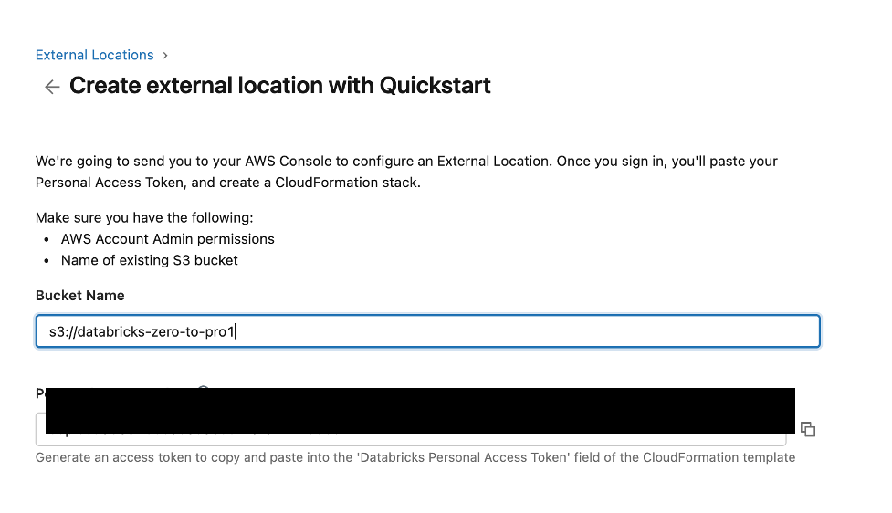

# Option 2: Databricks Premium on AWS or Azure

> Full setup for production labs with Unity Catalog, external locations, and cloud storage (S3 or ADLS).

---

## When Do I Need This?

You need a Databricks Premium workspace on a cloud account for:
- **Day 18**: Medallion Architecture (writing to S3/ADLS)
- **Day 20**: Auto Loader (file ingestion from cloud storage)
- **Day 21+**: Delta Live Tables, Feature Store, and advanced labs

If you're still on Day 01-17, start with the [Free Edition](00-databricks-free-setup.md) instead.

---

## Choose Your Cloud Provider

| Feature | AWS | Azure |
|---------|-----|-------|
| Object storage | S3 | ADLS Gen2 |
| External location setup | CloudFormation Quickstart | Azure Portal |
| IAM / Identity | IAM Roles | Managed Identity / Service Principal |
| Free tier storage | 5 GB S3 for 12 months | 5 GB Blob for 12 months |

**This guide covers both**. Follow the section for your cloud provider.

---

## Part 1: Create a Cloud Account

### AWS

1. Go to [aws.amazon.com](https://aws.amazon.com/) and click **Create an AWS Account**
2. Enter your email, password, and account name
3. Choose **Personal** account type
4. Enter payment information (required, but S3 free tier covers 5 GB for 12 months)
5. Verify your phone number
6. Select **Basic Support (Free)** plan
7. Sign in to the [AWS Management Console](https://console.aws.amazon.com)

### Azure

1. Go to [azure.microsoft.com/free](https://azure.microsoft.com/free/) and click **Start free**
2. Sign in with your Microsoft account (or create one)
3. Enter payment information (required, but you get $200 free credits for 30 days)
4. Verify your identity
5. Sign in to the [Azure Portal](https://portal.azure.com)

---

## Part 2: Create Cloud Storage

### AWS: Create an S3 Bucket

1. In the AWS Console, search for **S3** and open the S3 service
2. Click **Create bucket**
3. Enter a bucket name (e.g., `databricks-zero-to-pro`)
4. Select your preferred region (e.g., `us-east-1`)
5. Leave all other settings as default (Block all public access = ON)
6. Click **Create bucket**

### Azure: Create a Storage Account + Container

1. In the Azure Portal, search for **Storage accounts**
2. Click **Create**
3. Select your subscription and resource group (or create a new one)
4. Enter a storage account name (e.g., `databrickszerotopro`)
5. Select your region (e.g., `East US`)
6. Performance: **Standard**, Redundancy: **LRS** (cheapest)
7. Click **Review + Create** > **Create**
8. Once created, go to the storage account > **Containers** > **+ Container**
9. Name it (e.g., `medallion-lab`), access level: **Private**

**Remember your bucket/container name and region.**

---

## Part 3: Create a Databricks Premium Workspace

### AWS

1. Go to [databricks.com/try-databricks](https://www.databricks.com/try-databricks)
2. Click **Start Free Trial**
3. Select **AWS** as the cloud provider
4. Follow the guided setup to link your AWS account
5. The trial gives you 14 days of Premium features

### Azure

1. In the Azure Portal, search for **Azure Databricks**
2. Click **Create**
3. Select your subscription, resource group, and region
4. Enter a workspace name (e.g., `databricks-zero-to-pro`)
5. Pricing tier: **Premium** (required for Unity Catalog)
6. Click **Review + Create** > **Create**
7. Once deployed, click **Launch Workspace**

---

## Part 4: Create a Compute Cluster

With a Premium workspace, you can use either serverless or classic compute:

### Serverless (Recommended)
- Notebooks automatically connect to serverless compute
- No configuration needed
- Fastest way to start

### Classic Cluster (Optional)
1. Click **Compute** in the left sidebar
2. Click **Create Compute**
3. Configure:
   - **Name**: `learning-cluster`
   - **Runtime**: Latest LTS (e.g., 15.x LTS)
   - **Node Type**: Smallest available (e.g., `i3.xlarge` on AWS, `Standard_DS3_v2` on Azure)
   - **Workers**: 0 (single-node for labs)
   - **Auto-terminate**: 60 minutes
4. Click **Create Compute**

---

## Part 5: Generate a Personal Access Token (PAT)

Required for the AWS Quickstart external location setup.

1. In Databricks, click your **profile icon** (top-right)
2. Click **Settings**
3. Navigate to **Developer** > **Access Tokens**
4. Click **Manage** > **Generate new token**
5. Comment: `External Location Setup`
6. Lifetime: 90 days
7. Click **Generate**
8. **Copy the token immediately** -- you cannot view it again

> **Security**: Never share your PAT token. Never commit it to version control.

---

## Part 6: Create an External Location

An external location connects Unity Catalog to your cloud storage, allowing Databricks to read/write data.

### AWS: Quickstart (Recommended)

#### Step 1: Open External Locations
1. Click **Catalog** in the left sidebar
2. Click **External Data** at the top
3. Click **External Locations** tab
4. Click **Create external location**


#### Step 2: Choose Quickstart
Select **AWS Quickstart (Recommended)**. This creates the external location and IAM role automatically via CloudFormation.

#### Step 3: Enter Bucket and PAT Token
1. Enter your **S3 bucket name** (e.g., `s3://databricks-zero-to-pro`)
2. Paste the **PAT token** from Part 5



3. Click **Launch in Quickstart**

#### Step 4: Create CloudFormation Stack in AWS
You'll be redirected to the AWS CloudFormation Console:

1. The template is pre-filled with your workspace details
2. Review the parameters (bucket name should be correct)
3. Scroll to the bottom
4. **Check the box**: *"I acknowledge that AWS CloudFormation might create IAM resources with custom names"*
5. Click **Create stack**
6. Wait 2-3 minutes for status: `CREATE_COMPLETE`

**What CloudFormation creates automatically:**

| Resource | Purpose |
|----------|---------|
| IAM Role | Allows Databricks to access your S3 bucket |
| IAM Policy | S3 permissions: Get/Put/Delete objects, List bucket, bucket notifications |
| Trust Policy | Allows Databricks control plane to assume the role |

#### Step 5: Verify
Go back to Databricks > **Catalog** > **External Data**:

- **External Locations** tab: your location should appear with `s3://your-bucket/`
- **Credentials** tab: the auto-created IAM role credential should appear


### Azure: Manual Setup

1. In Databricks, go to **Catalog** > **External Data** > **Credentials**
2. Click **Create credential**
3. Choose **Azure Managed Identity** or **Service Principal**
4. Enter the details from your Azure Storage Account
5. Go to **External Locations** > **Create external location**
6. Enter the ADLS path: `abfss://container@storageaccount.dfs.core.windows.net/`
7. Select the credential you created
8. Click **Create**

---

## Part 7: Create Unity Catalog Schemas

The Medallion Architecture labs use separate schemas per layer:

```sql
USE CATALOG databricks_pro;  -- replace with your catalog name

CREATE SCHEMA IF NOT EXISTS bronze COMMENT 'Raw, unfiltered data';
CREATE SCHEMA IF NOT EXISTS silver COMMENT 'Cleansed, validated data';
CREATE SCHEMA IF NOT EXISTS gold   COMMENT 'Business-ready aggregations';
```

---

## Part 8: Test Your Setup

Run this in a Databricks notebook:

### AWS
```python
# Replace with your bucket name
bucket = "s3://databricks-zero-to-pro"

test_df = spark.createDataFrame([(1, "test")], ["id", "value"])
test_df.write.format("delta").mode("overwrite").save(f"{bucket}/test_setup")
print("WRITE: OK")

result = spark.read.format("delta").load(f"{bucket}/test_setup")
result.display()
print("READ: OK")

dbutils.fs.rm(f"{bucket}/test_setup", recurse=True)
print("CLEANUP: OK")
```

### Azure
```python
# Replace with your storage details
container = "abfss://medallion-lab@databrickszerotopro.dfs.core.windows.net"

test_df = spark.createDataFrame([(1, "test")], ["id", "value"])
test_df.write.format("delta").mode("overwrite").save(f"{container}/test_setup")
print("WRITE: OK")

result = spark.read.format("delta").load(f"{container}/test_setup")
result.display()
print("READ: OK")

dbutils.fs.rm(f"{container}/test_setup", recurse=True)
print("CLEANUP: OK")
```

If all three succeed, your setup is complete.

---

## Part 9: Enable File Events (Optional -- for Auto Loader Day 20)

```sql
ALTER EXTERNAL LOCATION your_location_name ENABLE FILE EVENTS;
```

This enables `cloudFiles.useManagedFileEvents = true` for near-real-time file detection.

---

## Troubleshooting

### CloudFormation / Deployment Issues

| Issue | Fix |
|-------|-----|
| Stack stuck in CREATING | Check AWS region matches S3 bucket region |
| Permission denied | Need AWS/Azure admin permissions |
| Invalid PAT token | Generate a new token and retry |

### Storage Access Errors

| Error | Fix |
|-------|-----|
| Access Denied on S3 write | Check IAM role has S3 permissions, external location points to correct path |
| `PermanentRedirect` | S3 bucket region mismatch -- set `cloudFiles.region` |
| `GetBucketNotification AccessDenied` | IAM role needs `s3:GetBucketNotification` |
| "no matching external location" | Create external location and enable file events |

---

## Quick Reference

| Item | AWS | Azure |
|------|-----|-------|
| Console | [console.aws.amazon.com](https://console.aws.amazon.com) | [portal.azure.com](https://portal.azure.com) |
| Storage path | `s3://bucket-name/` | `abfss://container@account.dfs.core.windows.net/` |
| Credential type | IAM Role | Managed Identity / Service Principal |
| External location setup | CloudFormation Quickstart | Manual in Catalog |

---

## What's Next?

- [Day 18: Medallion Architecture](../day18-medallion-architecture/) -- Bronze/Silver/Gold pipeline
- [Day 19: Structured Streaming](../day19-structured-streaming/) -- streaming engine
- [Day 20: Auto Loader](../day20-auto-loader/) -- optimized file ingestion
