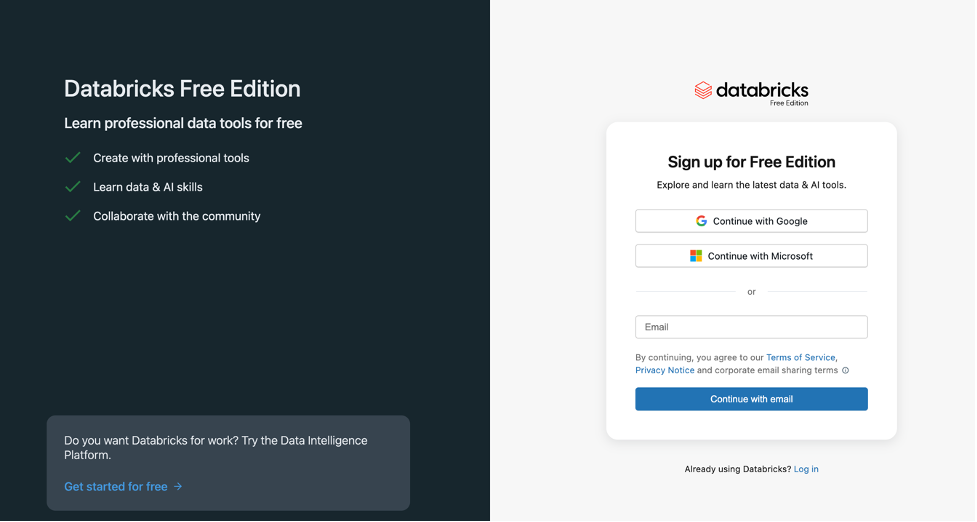

# Option 1: Databricks Free Edition Setup

> Sign up and start learning in under 5 minutes. No credit card. No cloud account. Serverless compute included.

---

## Step 1: Sign Up

1. Go to [community.cloud.databricks.com](https://community.cloud.databricks.com/)
2. Sign up using one of:
   - **Continue with Google** (fastest -- one click with your Gmail)
   - **Continue with Microsoft** (use your Outlook/Hotmail account)
   - **Email** (any email address + password)



3. If using email, check your inbox and verify your email address
4. Once verified, you'll be logged into your Databricks workspace

---

## Step 2: Start Using Notebooks (Serverless Compute)

Databricks Free Edition now includes **serverless compute** -- you do NOT need to create a cluster.

When you open or create a notebook:
1. The notebook automatically connects to serverless compute
2. There is no cluster to configure, start, or wait for
3. Just start writing and running code

**This means you can go from signup to running Spark code in under 2 minutes.**

> **Note**: If you prefer to create your own cluster (classic compute), you can still do so from the **Compute** page in the left sidebar. But serverless is the recommended default for learning.

---

## Step 3: Import Notebooks from This Repository

### Method A: Import by File Upload

1. In the left sidebar, click **Workspace**
2. Navigate to your user folder (e.g., `/Users/your-email/`)
3. Click the dropdown arrow next to your folder and select **Import**
4. Choose **File** and upload any `_notebook.py` file from this repository
5. The notebook opens ready to run

### Method B: Import by URL

1. Click **Import** > **URL**
2. Paste the raw GitHub URL of the notebook, for example:
   ```
   https://raw.githubusercontent.com/sreekanth489/spark-databricks-zero-to-pro/main/day14-delta-lake-fundamentals/14-delta-lake-fundamentals_notebook.py
   ```
3. Click **Import**

---

## Step 4: Run Your First Notebook

1. Open an imported notebook
2. It will automatically attach to serverless compute
3. Click **Run All** or run individual cells with `Shift+Enter`
4. Output appears directly below each cell

---

## What You Get with Free Edition

| Feature | Included |
|---------|:--------:|
| Spark notebooks (Python, SQL, Scala, R) | Yes |
| Serverless compute (no cluster setup) | Yes |
| Delta Lake | Yes |
| Basic Unity Catalog | Yes |
| Databricks Assistant (AI) | Yes |
| Community support | Yes |

---

## What Free Edition Does NOT Include

| Feature | Free Edition | Premium (Cloud) |
|---------|:------------:|:---------------:|
| External locations (S3/ADLS) | No | Yes |
| Auto Loader (`cloudFiles`) | No | Yes |
| Managed file events | No | Yes |
| Multi-node clusters | No | Yes |
| Workflows / Jobs | No | Yes |
| SQL Warehouses | No | Yes |
| Row/column-level security | No | Yes |

For labs requiring external storage and full Unity Catalog (Day 18+), see [Option 2: Databricks Premium on AWS/Azure](00-databricks-cloud-setup.md).

---

## Troubleshooting

### "Continue with Google" doesn't work
- Make sure pop-ups are enabled in your browser
- Try a different browser (Chrome recommended)
- Use the email option as an alternative

### Notebook won't run
- Check that serverless compute is available (look for the green connected indicator at the top of the notebook)
- If serverless is unavailable, create a classic cluster from the **Compute** page

### Import fails
- Ensure the file ends in `.py` and uses Databricks source format (first line: `# Databricks notebook source`)
- Try the URL import method instead
