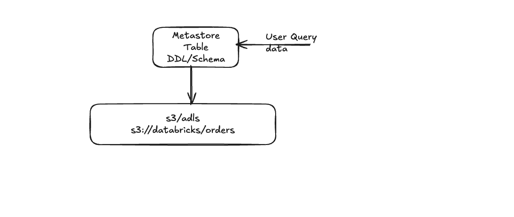
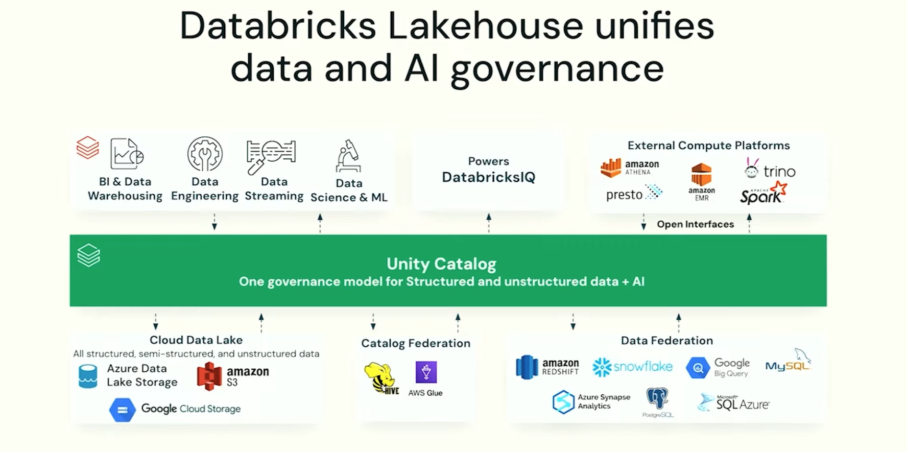

# Unity Catalog Fundamentals
> Module: Data Governance | Day 10 | Level: Beginner-Intermediate | Time: 120 min

## Learning Objectives

After completing this session, you will be able to:
- Explain what Unity Catalog is and why it replaces the Hive Metastore
- Navigate the 3-level namespace: Catalog → Schema → Table
- Distinguish between Unity Catalog metastore and Hive Metastore
- Create and configure a Unity Catalog metastore on Azure
- Understand account-level admin roles and responsibilities
- Understand managed vs external storage in Unity Catalog
- Create and manage catalogs, schemas, tables, and views
- Use Unity Catalog Volumes for file governance
- Explore data lineage and search capabilities

---

## Conceptual Overview

### What is a Metastore?

Before diving into Unity Catalog, we need to understand the fundamental concept that everything builds on: **what is a metastore, and why does it exist?**

When you store data in cloud storage (S3, ADLS, GCS), you get a bucket full of files — Parquet files, Delta files, CSVs. The files contain the actual data. But files alone are not enough to run SQL queries. To query `SELECT * FROM orders`, the engine needs to know:

- Where is the file physically stored? (`s3://databricks/orders`)
- What is the schema? (columns, types)
- What file format is it? (Delta, Parquet, CSV?)
- Who is allowed to read it?

This **descriptive information about the data** — separate from the data itself — is called **metadata**. The system that stores and manages this metadata is called a **metastore**.



> *Diagram: User query → Metastore (Table DDL/Schema) → Cloud Storage (s3/adls)*
> *Credit: Sreekanth Keerthipati*

The diagram above captures the essential model:

```
  User Query
      │
      ▼
  ┌───────────────────────────┐
  │  Metastore                │   ← "What does this table look like?"
  │  Table: orders            │
  │  DDL / Schema             │     columns, types, format, partitions,
  │  (Table definition)       │     owner, ACLs, row filters, col masks
  └─────────────┬─────────────┘
                │
                │  points to physical location
                ▼
  ┌───────────────────────────┐
  │  s3 / adls                │   ← "Where is the actual data?"
  │  s3://databricks/orders   │
  │  (Data files)             │     Delta / Parquet files on disk
  └───────────────────────────┘
```

**Both must exist and stay in sync.** The query engine (Spark) reads the metastore first to find the location and schema, then reads the data files. If they fall out of sync:

| Out-of-sync scenario | Consequence |
|----------------------|-------------|
| Files deleted from S3, metastore not updated | Query fails: "file not found" |
| Files added to S3 directly, metastore not updated | New files invisible to SQL queries |
| Schema changed in metastore, files not updated | Read errors or wrong column types |
| Table dropped from metastore, files left in S3 | "Ghost files" — orphaned storage costs |

This is exactly why **managed tables** in Unity Catalog are valuable: UC keeps both in sync automatically. Drop the table → UC deletes both the metadata AND the data files together.

This is the core insight: **a table is not just data in storage — it is data + metadata, and both must be kept in sync.**

---

### The Evolution of Metastores

#### Phase 1: Apache Hive Metastore (HMS)

The original open-source metastore from the Apache Hive project. It stores metadata in a relational database (MySQL, PostgreSQL, Derby). Databricks used it as the default before Unity Catalog.

```
  ┌───────────────────────────────────────────────────────────────────────┐
  │                    APACHE HIVE METASTORE                               │
  │                                                                         │
  │  ┌──────────────────────────────────────────────────────────────────┐  │
  │  │  HMS Database (MySQL / PostgreSQL / Derby)                        │  │
  │  │                                                                   │  │
  │  │  DATABASES (Schemas)                                              │  │
  │  │  ┌──────────────┐  ┌──────────────┐  ┌──────────────┐           │  │
  │  │  │  hr_db        │  │  finance_db  │  │  sales_db    │           │  │
  │  │  │  ──────────── │  │  ──────────  │  │  ──────────  │           │  │
  │  │  │  employees    │  │  accounts    │  │  orders      │           │  │
  │  │  │  departments  │  │  ledger      │  │  customers   │           │  │
  │  │  └──────────────┘  └──────────────┘  └──────────────┘           │  │
  │  │                                                                   │  │
  │  │  For each table: location, schema, format, partitions, stats     │  │
  │  └──────────────────────────────────────────────────────────────────┘  │
  │                  │                                                       │
  │                  │ Points to                                             │
  │                  ▼                                                       │
  │  ┌──────────────────────────────────────────────────────────────────┐  │
  │  │  Cloud Storage (S3 / ADLS / GCS / HDFS)                          │  │
  │  │  Actual Parquet / ORC / Delta data files                         │  │
  │  └──────────────────────────────────────────────────────────────────┘  │
  │                                                                         │
  │  Scope: ONE workspace (workspace-local)                                 │
  │  Users & ACLs: workspace-local only                                     │
  │  Namespace: schema.table (2-level)                                      │
  │  Governed objects: tables, views, functions only                        │
  │  Lineage: NONE                                                          │
  │  Audit: NONE                                                            │
  └───────────────────────────────────────────────────────────────────────┘
```

**What HMS does well**: Simple, open-source, compatible with Hive/Spark/Trino/Presto.

**What HMS lacks**:
- Workspace-isolated — no cross-workspace sharing
- No user/group governance at the account level
- No lineage, no audit logs
- No governance for files, ML models, or volumes
- 2-level namespace (schema.table) — no environment separation

#### Phase 2: Unity Catalog Metastore

Unity Catalog replaces the Hive Metastore with an account-level, cloud-native metastore that governs all data and AI assets across every workspace and cloud.

```
  ┌───────────────────────────────────────────────────────────────────────┐
  │                   UNITY CATALOG METASTORE                              │
  │                                                                         │
  │  ┌──────────────────────────────────────────────────────────────────┐  │
  │  │  UC Metastore (Databricks-managed, account-level, per region)    │  │
  │  │                                                                   │  │
  │  │  ┌────────────────┐ ┌──────────────┐ ┌────────────┐ ┌────────┐  │  │
  │  │  │   Object       │ │  Access      │ │  Lineage   │ │ Audit  │  │  │
  │  │  │   Metadata     │ │  Control     │ │  Graph     │ │  Logs  │  │  │
  │  │  │  (catalogs,    │ │  (ACLs,      │ │  (tables → │ │ (who   │  │  │
  │  │  │   schemas,     │ │   row filter,│ │   jobs →   │ │  did   │  │  │
  │  │  │   tables,      │ │   col masks) │ │   dashbds) │ │  what, │  │  │
  │  │  │   volumes,     │ │              │ │            │ │  when) │  │  │
  │  │  │   models)      │ │              │ │            │ │        │  │  │
  │  │  └────────────────┘ └──────────────┘ └────────────┘ └────────┘  │  │
  │  │                                                                   │  │
  │  │  Managed Storage Root                                             │  │
  │  │  abfss://uc-root@storage.dfs.core.windows.net/  (Azure)          │  │
  │  │  s3://uc-metastore-bucket/                       (AWS)            │  │
  │  └──────────────────────────────────────────────────────────────────┘  │
  │                         │                                               │
  │       Points to                                                         │
  │                         ▼                                               │
  │  ┌──────────────────────────────────────────────────────────────────┐  │
  │  │  Cloud Storage (S3 / ADLS / GCS)                                 │  │
  │  │  Data files for managed AND external tables                      │  │
  │  └──────────────────────────────────────────────────────────────────┘  │
  │                                                                         │
  │  Scope: Account-level, across ALL workspaces in a region               │
  │  Users & ACLs: Account-level (synced from Azure AD / Okta via SCIM)    │
  │  Namespace: catalog.schema.table (3-level)                             │
  │  Governed objects: tables, views, volumes, functions, models, shares   │
  │  Lineage: AUTOMATIC                                                     │
  │  Audit: FULL (queryable via system.access.audit)                       │
  └───────────────────────────────────────────────────────────────────────┘
```

---

### Hive Metastore vs Unity Catalog — Side by Side

```
  ┌────────────────────────────────────────────────────────────────────────┐
  │              HIVE METASTORE              │        UNITY CATALOG         │
  ├──────────────────────────────────────────┼──────────────────────────────┤
  │  Metadata storage:                        │  Metadata storage:           │
  │  MySQL/PostgreSQL/Derby DB               │  Databricks-managed cloud    │
  │                                           │  service (per region)        │
  ├──────────────────────────────────────────┼──────────────────────────────┤
  │  Scope: ONE workspace                    │  Scope: ALL workspaces        │
  │  (workspace-local, isolated)             │  in the region (shared)      │
  ├──────────────────────────────────────────┼──────────────────────────────┤
  │  Namespace: schema.table                 │  Namespace: catalog.schema    │
  │  (2-level)                               │  .table (3-level)             │
  ├──────────────────────────────────────────┼──────────────────────────────┤
  │  Users: workspace-local                  │  Users: account-level         │
  │  Must recreate per workspace             │  Sync once, use everywhere    │
  ├──────────────────────────────────────────┼──────────────────────────────┤
  │  Governed objects:                       │  Governed objects:            │
  │  Tables, Views, Functions                │  Tables, Views, Volumes,      │
  │                                           │  Functions, Models, Shares    │
  ├──────────────────────────────────────────┼──────────────────────────────┤
  │  File governance: NONE                   │  File governance: Volumes     │
  │  (S3 IAM = full access)                  │  (GRANT READ/WRITE VOLUME)   │
  ├──────────────────────────────────────────┼──────────────────────────────┤
  │  Lineage: NONE                           │  Lineage: AUTOMATIC           │
  ├──────────────────────────────────────────┼──────────────────────────────┤
  │  Audit logs: NONE                        │  Audit logs: FULL             │
  │                                           │  (system.access.audit)       │
  ├──────────────────────────────────────────┼──────────────────────────────┤
  │  Row-level security:                     │  Row-level security:          │
  │  Dynamic views only                      │  Native Row Filters           │
  │                                           │  (ALTER TABLE SET ROW FILTER) │
  ├──────────────────────────────────────────┼──────────────────────────────┤
  │  Column masking:                         │  Column masking:              │
  │  Dynamic views only                      │  Native Column Masks          │
  │                                           │  (ALTER COLUMN SET MASK)     │
  ├──────────────────────────────────────────┼──────────────────────────────┤
  │  Still accessible in UC via:             │                              │
  │  hive_metastore.schema.table             │                              │
  └──────────────────────────────────────────┴──────────────────────────────┘
```

---

### Data Lineage Deep Dive

**Lineage** answers the question: *"Where did this data come from, and where does it go?"*

This is critical for:
- **Impact analysis** — "If I change this source table, what downstream reports break?"
- **Root cause analysis** — "This dashboard shows wrong numbers — which upstream table is the problem?"
- **Compliance** — "Show me every place this customer's PII flows to"
- **Trust** — "Can I trust this Gold table? Where was it derived from?"

#### Lineage: Before Unity Catalog

```
  BEFORE UNITY CATALOG — No Automated Lineage
  ┌─────────────────────────────────────────────────────────────────────┐
  │                                                                      │
  │  You had to manually document this in a spreadsheet or wiki:        │
  │                                                                      │
  │  "orders_bronze" → (notebook: transform_orders.py, Job #442)        │
  │    → "orders_silver" → (notebook: aggregate.py, Job #443)           │
  │      → "sales_gold" → (dashboard: Monthly Sales)                    │
  │                     → (ML model: revenue_forecast_v2)               │
  │                                                                      │
  │  Problems:                                                           │
  │  ✗ Manual — always out of date                                      │
  │  ✗ Incomplete — people forget to document                           │
  │  ✗ Hard to query — "which jobs read orders_bronze?"                 │
  │  ✗ No column-level lineage                                          │
  └─────────────────────────────────────────────────────────────────────┘
```

#### Lineage: With Unity Catalog

Unity Catalog captures lineage **automatically** — every SQL query, notebook run, and job execution is tracked.

```
  WITH UNITY CATALOG — Automatic Lineage Capture
  ┌─────────────────────────────────────────────────────────────────────┐
  │                                                                      │
  │  [Volume: raw/orders.csv]                                           │
  │           │                                                          │
  │           │ read_files() in notebook "ingest_orders"                │
  │           ▼                                                          │
  │  [Table: bronze.orders_raw]                                         │
  │           │                                                          │
  │           │ SQL transform in job "daily_silver_refresh"             │
  │           ▼                                                          │
  │  [Table: silver.orders_clean]                                       │
  │           │                                                          │
  │           │ CTAS in job "gold_aggregation"                          │
  │           ▼                                                          │
  │  [Table: gold.sales_summary]                                        │
  │           │                           │                             │
  │           │ used by                   │ used by                     │
  │           ▼                           ▼                             │
  │  [Dashboard: Monthly Sales]    [ML Model: revenue_forecast_v3]     │
  │                                                                      │
  │  Also tracked:                                                       │
  │  • Column-level lineage — which source columns feed target columns  │
  │  • Which notebooks/jobs/queries created each version                │
  │  • When each operation ran                                          │
  └─────────────────────────────────────────────────────────────────────┘
```

> **Image Reference**: Unity Catalog data lineage UI
> Source: https://docs.databricks.com/en/data-governance/unity-catalog/data-lineage.html
> Credit: Databricks, Inc.

#### What Lineage Captures

| Source | Lineage Tracked |
|--------|----------------|
| SQL queries | Table → Table reads/writes |
| Notebooks | All SQL cells, DataFrame reads/writes |
| Jobs | All tasks in the job |
| Dashboards | Queries backing each widget |
| ML models (MLflow) | Feature tables used for training |
| Delta Live Tables | Full pipeline lineage automatically |

#### Viewing Lineage

**In the UI**:
1. Open **Catalog Explorer** (left sidebar → Catalog icon)
2. Navigate to any table
3. Click the **Lineage** tab
4. See upstream tables (where data came from) and downstream tables (where data goes)

**Programmatically** via system tables:
```sql
-- Tables that READ from our bronze table (downstream)
SELECT source_table_full_name, target_table_full_name,
       created_by, event_time
FROM system.access.table_lineage
WHERE source_table_full_name = 'prod_catalog.bronze.orders_raw'
ORDER BY event_time DESC;

-- Everything that feeds into our gold table (upstream)
SELECT source_table_full_name, target_table_full_name,
       created_by, event_time
FROM system.access.table_lineage
WHERE target_table_full_name = 'prod_catalog.gold.sales_summary'
ORDER BY event_time DESC;

-- Column-level lineage
SELECT source_table_full_name, source_column_name,
       target_table_full_name, target_column_name
FROM system.access.column_lineage
WHERE target_table_full_name = 'prod_catalog.gold.sales_summary';
```

#### Lineage for Impact Analysis

```sql
-- "I'm about to change the schema of bronze.orders_raw.
--  What tables/jobs depend on it? Would they break?"

SELECT DISTINCT
  target_table_full_name AS depends_on_orders_raw,
  created_by             AS written_by_job_or_user,
  event_time
FROM system.access.table_lineage
WHERE source_table_full_name = 'prod_catalog.bronze.orders_raw'
ORDER BY target_table_full_name;
```

---

### The World Before Unity Catalog

In the pre-Unity Catalog era, every Databricks workspace was an island. Governance was hard, chaotic, and error-prone.

```
  ┌─────────────────────────────────────────────────────────────────────┐
  │                     BEFORE UNITY CATALOG                            │
  │                                                                      │
  │   Workspace A (Dev)          Workspace B (Prod)    Workspace C (DS) │
  │  ┌──────────────────┐      ┌──────────────────┐  ┌──────────────┐  │
  │  │  Hive Metastore  │      │  Hive Metastore  │  │Hive Metastore│  │
  │  │  ─────────────── │      │  ─────────────── │  │──────────────│  │
  │  │  Users: local    │      │  Users: local    │  │Users: local  │  │
  │  │  Groups: local   │      │  Groups: local   │  │Groups: local │  │
  │  │  ACLs: local     │      │  ACLs: local     │  │ACLs: local   │  │
  │  │  No lineage      │      │  No lineage      │  │No lineage    │  │
  │  │  No audit log    │      │  No audit log    │  │No audit log  │  │
  │  └──────────────────┘      └──────────────────┘  └──────────────┘  │
  │         │                          │                     │          │
  │    S3/ADLS                    S3/ADLS               S3/ADLS        │
  │   (no governance)           (no governance)        (no governance) │
  │                                                                      │
  │  Problems:                                                           │
  │  ✗ Must re-create users/groups in EVERY workspace                   │
  │  ✗ Cannot share tables across workspaces without data copies        │
  │  ✗ No visibility into who accessed what data                        │
  │  ✗ Files in S3/ADLS have NO governance (anyone with storage access) │
  │  ✗ No data lineage — impossible to trace data origin                │
  │  ✗ No built-in data catalog or search                               │
  └─────────────────────────────────────────────────────────────────────┘
```

### The World With Unity Catalog

Unity Catalog sits as a single governance layer across everything — Databricks workloads above it and cloud storage / federated sources below it:



> *Credit: Databricks, Inc. — "Databricks Lakehouse unifies data and AI governance"*
>
> The diagram shows Unity Catalog at the centre:
> - **Above**: BI & Data Warehousing, Data Engineering, Data Streaming, Data Science & ML, DatabricksIQ, and external compute (Athena, EMR, Trino, Spark, Presto)
> - **Below**: Cloud Data Lake (ADLS, S3, GCS), Catalog Federation (Hive, AWS Glue), Data Federation (Redshift, Snowflake, BigQuery, MySQL, Synapse, PostgreSQL, SQL Azure)
>
> One governance model for **all** of them — structured, semi-structured, unstructured data + AI.

```
  ┌─────────────────────────────────────────────────────────────────────┐
  │                      WITH UNITY CATALOG                             │
  │                                                                      │
  │                    Databricks Account Console                        │
  │  ┌──────────────────────────────────────────────────────────────┐   │
  │  │                    UC Metastore (per region)                  │   │
  │  │  ┌────────────────┐  ┌────────────────┐  ┌───────────────┐  │   │
  │  │  │  Account-level │  │   Governance    │  │   Lineage &   │  │   │
  │  │  │  Identities    │  │   (Catalogs,    │  │   Audit Logs  │  │   │
  │  │  │  Users/Groups  │  │   ACLs, Tags)   │  │   (auto)      │  │   │
  │  │  └────────────────┘  └────────────────┘  └───────────────┘  │   │
  │  └──────────────────────────────────────────────────────────────┘   │
  │           │                      │                      │            │
  │    Workspace A (Dev)     Workspace B (Prod)    Workspace C (DS)     │
  │    (assigned to metastore)  (same metastore)   (same metastore)    │
  │                                                                      │
  │  Benefits:                                                           │
  │  ✓ Define users/groups ONCE, assign to multiple workspaces          │
  │  ✓ Share tables across workspaces — single source of truth          │
  │  ✓ Full audit trail of every access event                           │
  │  ✓ Volumes govern file access in S3/ADLS under UC policies          │
  │  ✓ Automated lineage across tables, notebooks, jobs, dashboards     │
  │  ✓ Built-in search and discovery across all data assets             │
  └─────────────────────────────────────────────────────────────────────┘
```

> **Image Reference**: Databricks documentation — Unity Catalog architecture overview
> Source: https://docs.databricks.com/en/data-governance/unity-catalog/index.html
> Credit: Databricks, Inc.

---

## Before vs After: Feature Comparison

| Capability | Before UC (Hive Metastore) | After UC |
|------------|---------------------------|----------|
| Identity scope | Per workspace | Account-level, assigned to workspaces |
| User management | Duplicated in every workspace | Single account-level identity |
| Cross-workspace sharing | Data copies required | Native via shared metastore |
| Table governance | Basic ACLs (workspace-scoped) | Fine-grained, cross-workspace, cross-cloud |
| File governance | None (S3/ADLS access = full access) | Volumes with GRANT/REVOKE |
| Data lineage | Manual / third-party tools | Automatic, built-in |
| Data discovery | None | Catalog Explorer with search, tags, descriptions |
| Audit logging | None / limited | Full audit log (queryable via system tables) |
| ML model governance | None | ML models as governed objects |
| Row-level security | Dynamic views (complex, view-only) | Native Row Filters on tables |
| Column masking | Dynamic views (complex, view-only) | Native Column Masks on tables |
| Delta Sharing | Not available | Built-in with governed sharing |

---

## The 3-Level Namespace

### Hive Metastore: 2-Level Namespace

```sql
SELECT * FROM schema.table
-- e.g., SELECT * FROM hr_db.employees
-- Problem: which workspace? which environment?
```

### Unity Catalog: 3-Level Namespace

```sql
SELECT * FROM catalog.schema.table
-- e.g., SELECT * FROM prod_catalog.hr_db.employees
-- Clear: environment (prod), domain (hr), table (employees)
```

```
Unity Catalog Object Hierarchy
━━━━━━━━━━━━━━━━━━━━━━━━━━━━━

  Metastore (regional, assigned to workspaces)
  │
  ├── Catalog: prod_catalog          ← Top-level org container (by env, BU, project)
  │   ├── Schema: hr_db              ← Groups related objects (like a database)
  │   │   ├── Table: employees       ← Delta, Parquet, or external data
  │   │   ├── Table: departments
  │   │   ├── View: active_emps_vw   ← Virtual table (includes dynamic views)
  │   │   ├── Function: mask_email() ← UDF, masking functions, row filter functions
  │   │   └── Volume: raw_uploads/   ← Governed file storage (CSV, images, etc.)
  │   ├── Schema: finance_db
  │   │   └── Table: transactions
  │   └── Schema: information_schema ← Auto-created, metadata queries
  │
  ├── Catalog: dev_catalog
  │   └── Schema: sandbox
  │       └── Table: experiments
  │
  └── Catalog: hive_metastore        ← Legacy catalog (always available, per-workspace)
      └── Schema: default
          └── Table: old_legacy_table
```

---

## Unity Catalog Object Types

Unity Catalog governs **all** data and AI assets — not just tables:

```
  UC Securable Objects
  ┌────────────────────────────────────────────────────────────────────┐
  │                                                                     │
  │  Data Objects          AI/ML Objects       Infrastructure Objects  │
  │  ┌─────────────┐      ┌─────────────┐      ┌─────────────────┐    │
  │  │ Tables       │      │ ML Models   │      │ Storage Creds   │    │
  │  │ Views        │      │ (registered │      │ External Locs   │    │
  │  │ Volumes      │      │  models)    │      │ Connections     │    │
  │  │ Functions    │      └─────────────┘      │ (federation)    │    │
  │  │ (UDFs, row   │                           └─────────────────┘    │
  │  │  filters,    │      Sharing Objects                             │
  │  │  col masks)  │      ┌─────────────┐                             │
  │  └─────────────┘      │ Shares       │                             │
  │                        │ Recipients   │                             │
  │                        │ (Delta Share)│                             │
  │                        └─────────────┘                             │
  └────────────────────────────────────────────────────────────────────┘
```

---

## Metastore Deep Dive

The **metastore** is the top-level container for Unity Catalog. It is:
- **Regional**: One metastore per cloud region (e.g., one for `eastus`, one for `westus`)
- **Multi-workspace**: Multiple workspaces share one metastore
- **Managed by Account Admins**: Created and configured from the Account Console

```
  UC Metastore Internals
  ┌──────────────────────────────────────────────────────────┐
  │                      UC Metastore                         │
  │                                                           │
  │  ┌──────────────┐  ┌──────────────┐  ┌────────────────┐ │
  │  │  Object      │  │  Access      │  │  Audit Logs    │ │
  │  │  Metadata    │  │  Control     │  │  (System       │ │
  │  │  (catalogs,  │  │  Lists       │  │   Tables)      │ │
  │  │   schemas,   │  │  (ACLs)      │  │                │ │
  │  │   tables)    │  │              │  │                │ │
  │  └──────────────┘  └──────────────┘  └────────────────┘ │
  │                                                           │
  │  ┌─────────────────────────────────────────────────────┐ │
  │  │  Managed Storage Root                                │ │
  │  │  Azure: abfss://container@account.dfs.core...       │ │
  │  │  AWS:   s3://uc-metastore-bucket/                   │ │
  │  │  GCP:   gs://uc-metastore-bucket/                   │ │
  │  │  (Where managed table data physically lives)        │ │
  │  └─────────────────────────────────────────────────────┘ │
  └──────────────────────────────────────────────────────────┘
         │             │               │
    Workspace A   Workspace B    Workspace C
    (assigned)    (assigned)     (assigned)
    Dev team      Prod team      Data Science
```

### One Metastore Per Region — Why?

```
  Global Account
  │
  ├── Region: East US (Azure)
  │   └── Metastore: eastus-metastore
  │       ├── Workspace: databricks-dev-eastus
  │       ├── Workspace: databricks-prod-eastus
  │       └── Workspace: databricks-analytics-eastus
  │
  ├── Region: West US (Azure)
  │   └── Metastore: westus-metastore
  │       ├── Workspace: databricks-dev-westus
  │       └── Workspace: databricks-prod-westus
  │
  └── Region: EU West (Azure)
      └── Metastore: euwest-metastore
          └── Workspace: databricks-eu-prod
```

Teams in the same region share a metastore and can access each other's catalogs (subject to permissions). Cross-region access is possible via Delta Sharing.

---

## Creating a Metastore on Azure

### Prerequisites

Before creating a metastore on Azure, you need:

1. **Databricks Account** with Account Admin access
2. **Azure Data Lake Storage Gen2** container for managed storage
3. **Azure Managed Identity** or **Service Principal** with Storage Blob Data Contributor role
4. **Access Connector for Azure Databricks** (recommended) — a managed identity for Databricks

### Step 1: Create ADLS Gen2 Storage

```
  Azure Portal: Create Storage Account
  ┌────────────────────────────────────────────────────┐
  │  Storage Account: ucmetastorestorage               │
  │  Region: East US                                    │
  │  Performance: Standard                              │
  │  Redundancy: GRS or LRS                             │
  │                                                     │
  │  Advanced Tab:                                      │
  │  ☑ Enable hierarchical namespace (ADLS Gen2)        │
  └────────────────────────────────────────────────────┘

  Container: uc-metastore-root
  (This becomes the managed storage for your metastore)
```

### Step 2: Create an Access Connector for Azure Databricks

The Access Connector is a first-party Azure resource that provides a managed identity for Databricks to access ADLS.

```
  Azure Portal → Create Resource → "Access Connector for Azure Databricks"
  ┌────────────────────────────────────────────────────┐
  │  Name: databricks-uc-access-connector              │
  │  Region: East US (must match metastore region)     │
  │  Resource Group: databricks-governance-rg          │
  └────────────────────────────────────────────────────┘

  After creation, note the Resource ID:
  /subscriptions/<sub-id>/resourceGroups/<rg>/providers/
  Microsoft.Databricks/accessConnectors/databricks-uc-access-connector
```

### Step 3: Assign ADLS Permissions to Access Connector

```
  ADLS Gen2 → IAM → Add Role Assignment
  ┌────────────────────────────────────────────────────┐
  │  Role: Storage Blob Data Contributor               │
  │  Assign access to: Managed Identity                │
  │  Select: databricks-uc-access-connector            │
  │  Scope: Storage Account (or Container level)       │
  └────────────────────────────────────────────────────┘
```

### Step 4: Create the Metastore in Account Console

```
  accounts.azuredatabricks.net → Data → Create Metastore
  ┌────────────────────────────────────────────────────┐
  │  Name: my-company-eastus                           │
  │  Region: eastus                                    │
  │  ADLS Gen2 path:                                   │
  │    abfss://uc-metastore-root@ucmetastorestorage    │
  │    .dfs.core.windows.net/                          │
  │  Access Connector ID:                              │
  │    /subscriptions/.../accessConnectors/            │
  │    databricks-uc-access-connector                  │
  └────────────────────────────────────────────────────┘
```

### Step 5: Assign Workspaces to the Metastore

```
  Account Console → Data → [Select Metastore] → Workspaces → Assign
  ┌────────────────────────────────────────────────────┐
  │  Select workspaces to assign:                      │
  │  ☑ databricks-dev-workspace                        │
  │  ☑ databricks-prod-workspace                       │
  │  ☑ databricks-analytics-workspace                  │
  └────────────────────────────────────────────────────┘

  All assigned workspaces share the same metastore and can
  access each other's catalogs (subject to permissions).
```

> **Image Reference**: Creating a Unity Catalog metastore on Azure
> Source: https://docs.databricks.com/en/data-governance/unity-catalog/create-metastore.html
> Credit: Databricks, Inc.

---

## Account-Level Admin Roles

Unity Catalog introduces account-level governance with distinct admin roles:

```
  Admin Role Hierarchy
  ┌─────────────────────────────────────────────────────────────────────┐
  │                                                                      │
  │  Account Admin                                                       │
  │  ┌─────────────────────────────────────────────────────────────┐    │
  │  │ Can:                                                          │    │
  │  │  • Create/delete metastores                                  │    │
  │  │  • Assign workspaces to metastores                           │    │
  │  │  • Create account-level users, groups, service principals    │    │
  │  │  • Assign Metastore Admin role to users                      │    │
  │  │  • Manage identity federation (SCIM/Azure AD sync)           │    │
  │  │  • Access all workspaces                                     │    │
  │  │  • Enable/disable workspace features                         │    │
  │  └─────────────────────────────────────────────────────────────┘    │
  │            │                                                          │
  │            ▼                                                          │
  │  Metastore Admin                                                     │
  │  ┌─────────────────────────────────────────────────────────────┐    │
  │  │ Can:                                                          │    │
  │  │  • Create/manage catalogs                                    │    │
  │  │  • Grant/revoke privileges on any object in the metastore    │    │
  │  │  • Create storage credentials and external locations         │    │
  │  │  • Transfer ownership of any object                         │    │
  │  │  • Enable/disable Delta Sharing                              │    │
  │  └─────────────────────────────────────────────────────────────┘    │
  │            │                                                          │
  │            ▼                                                          │
  │  Workspace Admin                                                     │
  │  ┌─────────────────────────────────────────────────────────────┐    │
  │  │ Can:                                                          │    │
  │  │  • Manage workspace-level users and groups                   │    │
  │  │  • Manage clusters, jobs, notebooks                          │    │
  │  │  • Assign workspace roles (but NOT metastore roles)          │    │
  │  │  • Enable workspace-level features                           │    │
  │  └─────────────────────────────────────────────────────────────┘    │
  │            │                                                          │
  │            ▼                                                          │
  │  Catalog Owner / Schema Owner / Table Owner                          │
  │  ┌─────────────────────────────────────────────────────────────┐    │
  │  │  Can grant/revoke privileges on objects they own             │    │
  │  └─────────────────────────────────────────────────────────────┘    │
  └─────────────────────────────────────────────────────────────────────┘
```

### Identity Federation: Azure AD → Databricks

For Azure deployments, Unity Catalog integrates with Azure Active Directory (Entra ID):

```
  Azure AD (Entra ID)          Databricks Account Console
  ┌────────────────────┐       ┌────────────────────────────┐
  │  Users:            │ SCIM  │  Account-level Users:       │
  │  alice@corp.com    │──────▶│  alice@corp.com             │
  │  bob@corp.com      │ sync  │  bob@corp.com               │
  │                    │       │                             │
  │  Groups:           │ SCIM  │  Account-level Groups:      │
  │  DataEngineers     │──────▶│  DataEngineers              │
  │  Analysts          │ sync  │  Analysts                   │
  └────────────────────┘       └────────────────────────────┘
                                         │
                              ┌──────────┴──────────┐
                              │                     │
                         Workspace A           Workspace B
                         (identities           (identities
                          assigned)             assigned)
```

SCIM (System for Cross-domain Identity Management) automatically syncs users and groups from Azure AD to Databricks when employees join, move teams, or leave the company.

---

## Managed vs External Tables

```
  Managed Table                        External Table
  ┌─────────────────────────────┐     ┌──────────────────────────────┐
  │  CREATE TABLE employees (   │     │  CREATE TABLE events (       │
  │    id INT,                  │     │    id INT,                   │
  │    name STRING              │     │    ts TIMESTAMP              │
  │  )                          │     │  )                           │
  │  -- No LOCATION specified   │     │  LOCATION                    │
  │                             │     │  'abfss://raw@storage.../'   │
  │  Data stored in:            │     │                              │
  │  Metastore managed storage  │     │  Data lives at: your path    │
  └─────────────────────────────┘     └──────────────────────────────┘
           │                                       │
     DROP TABLE employees               DROP TABLE events
           │                                       │
     ┌─────┴──────┐                   ┌────────────┴───────┐
     │ Metadata   │                   │ Metadata DELETED   │
     │ DELETED    │                   │                    │
     │ Data files │                   │ Data files KEPT    │
     │ DELETED    │                   │ (at LOCATION path) │
     └────────────┘                   └────────────────────┘
```

### Storage Hierarchy for Managed Tables

```
  Metastore Root Storage
  abfss://uc-metastore-root@storage.dfs.core.windows.net/
  │
  ├── __unitystorage/       (UC internal metadata)
  │
  ├── prod_catalog/
  │   ├── hr_db/
  │   │   ├── employees/   (managed table data as Delta files)
  │   │   └── departments/
  │   └── finance_db/
  │       └── transactions/
  │
  └── dev_catalog/
      └── sandbox/
          └── experiments/

  Optional: Catalog-level or Schema-level storage override
  (gives each team their own ADLS container while UC manages governance)
```

---

## Unity Catalog Volumes

**Volumes** solve a critical gap: files in cloud storage had NO governance before UC.

```
  Before Volumes                        With Volumes
  ┌────────────────────────┐           ┌────────────────────────┐
  │  S3 / ADLS bucket      │           │  UC Volume             │
  │  ─────────────────     │           │  ──────────────        │
  │  Access = IAM role     │           │  Access = GRANT/REVOKE │
  │  No audit trail        │           │  Full audit trail      │
  │  No lineage            │           │  Lineage tracked       │
  │  No search             │           │  Discoverable in UC    │
  │  No tags               │           │  Tags and comments     │
  └────────────────────────┘           └────────────────────────┘
```

```sql
-- Create a managed volume (UC controls storage)
CREATE VOLUME my_catalog.my_schema.raw_files
COMMENT 'Raw CSV files for ingestion';

-- Create an external volume (you control storage)
CREATE EXTERNAL VOLUME my_catalog.my_schema.archive_files
URL 'abfss://archive@storage.dfs.core.windows.net/files/'
WITH (STORAGE CREDENTIAL my_azure_cred);

-- Access via /Volumes/ path
LIST '/Volumes/my_catalog/my_schema/raw_files/';
dbutils.fs.put('/Volumes/my_catalog/my_schema/raw_files/data.csv', content)

-- Read files from volume
SELECT * FROM read_files('/Volumes/my_catalog/my_schema/raw_files/data.csv');
```

---

## Data Lineage

Unity Catalog automatically captures lineage for:
- SQL queries (tables, views)
- Notebook runs
- Job runs
- Dashboards
- ML model training

```
  Lineage Example: E-Commerce Data Pipeline
  ──────────────────────────────────────────

  [CSV Volume]           [Notebook: ingest_job]
  raw_files/orders ─────────────────────────────▶ [bronze.orders]
                                                         │
                                                [Notebook: transform]
                                                         │
                                                         ▼
  [bronze.customers] ──────────────────────────▶ [silver.order_summary]
                                                         │
                                                [Job: daily_gold_refresh]
                                                         │
                                                         ▼
                                                [gold.sales_kpis]
                                                         │
                                          ┌──────────────┤
                                          ▼              ▼
                                  [Dashboard:      [ML Model:
                                   Sales KPIs]      demand_forecast]
```

View lineage: **Catalog Explorer → Table → Lineage tab**

---

## System Tables for Governance

Unity Catalog exposes system tables for querying audit logs, lineage, and usage data:

```sql
-- Who accessed which tables (audit log)
SELECT event_time, user_identity.email, action_name, request_params
FROM system.access.audit
WHERE action_name = 'getTable'
ORDER BY event_time DESC
LIMIT 100;

-- Table lineage
SELECT source_table_full_name, target_table_full_name, created_by
FROM system.access.table_lineage
WHERE target_table_full_name LIKE 'prod_catalog.gold%';

-- Storage usage per table
SELECT table_catalog, table_schema, table_name, bytes
FROM system.information_schema.table_storage
ORDER BY bytes DESC;
```

> **Image Reference**: Unity Catalog system tables overview
> Source: https://docs.databricks.com/en/administration-guide/system-tables/index.html
> Credit: Databricks, Inc.

---

## Hands-On Walkthrough

See the companion notebook: [`10-unity-catalog-fundamentals_notebook.py`](10-unity-catalog-fundamentals_notebook.py)

The lab covers:
1. Exploring the 3-level namespace (SHOW CATALOGS, SHOW SCHEMAS)
2. Creating managed tables in Unity Catalog
3. Working with Volumes for file governance
4. Exploring table metadata and history
5. Viewing data lineage in Catalog Explorer
6. Querying information_schema for metadata
7. Accessing legacy hive_metastore tables

---

## Cloud Provider Notes: Metastore Setup

| Step | AWS | Azure | GCP |
|------|-----|-------|-----|
| Managed storage | S3 bucket | ADLS Gen2 container (hierarchical namespace ON) | GCS bucket |
| Auth credential | IAM Role (cross-account) | Access Connector for Azure Databricks | Service Account |
| IAM permission | `s3:GetObject`, `s3:PutObject`, etc. on bucket | Storage Blob Data Contributor on ADLS | Storage Object Admin on GCS bucket |
| Account console | accounts.cloud.databricks.com | accounts.azuredatabricks.net | accounts.gcp.databricks.com |
| Identity federation | SCIM + AWS SSO / Okta | Azure AD (Entra ID) + SCIM | Google Identity + SCIM |
| External location path | `s3://bucket/path/` | `abfss://container@account.dfs.core.windows.net/path/` | `gs://bucket/path/` |

---

## Certification Tip

The **Databricks Certified Data Engineer Associate** and **Databricks Data Engineer Professional** exams test:
- The 3-level namespace: `catalog.schema.table`
- Difference between Unity Catalog metastore and Hive Metastore
- Managed vs external tables (especially what happens on DROP)
- How metastores are assigned to workspaces (1 metastore per region)
- Identity federation: account-level vs workspace-level identities
- Volumes for file governance
- `hive_metastore` as the legacy catalog name
- Storage credentials and external locations

---

## Key Takeaways

1. **Before UC** each workspace was isolated — duplicate users, separate ACLs, no cross-workspace sharing
2. **Unity Catalog** moves governance to account level — define once, enforce everywhere
3. The **3-level namespace** (catalog.schema.table) adds catalogs as environment/domain organizers
4. A **metastore** is regional, created once per cloud region, and assigned to multiple workspaces
5. **Azure metastore** requires ADLS Gen2 + Access Connector for Azure Databricks
6. **Account Admin** creates metastores; **Metastore Admin** manages data governance
7. **Managed tables** have lifecycle controlled by UC; **external tables** preserve data on drop
8. **Volumes** bring governance to files — same GRANT/REVOKE model as tables
9. **Lineage** is automatic — tracks from files through tables to dashboards and models
10. **Legacy Hive Metastore** remains accessible via the `hive_metastore` catalog

---

## Next Steps

- [Day 11: Unity Catalog Security](../day11-unity-catalog-security/) — RBAC, privileges, row filters, column masks
- [Day 12: Managed vs External Tables](../day12-managed-vs-external-tables/) — deep dive into table types
- [Day 13: Volumes in Databricks](../day13-volumes-in-databricks/) — governed file access
