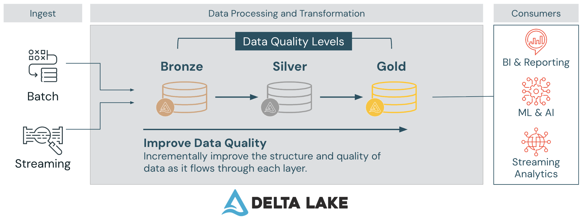

# Medallion Architecture
> Module: Data Engineering Pipelines | Day 18 | Level: Intermediate | Time: 90 min

## Learning Objectives

After completing this session, you will be able to:
- Explain the Medallion Architecture and its role in lakehouse data platforms
- Design Bronze, Silver, and Gold layers with clear separation of concerns
- Implement incremental multi-hop pipelines using Delta Lake and Structured Streaming
- Apply progressive data quality refinement across layers
- Choose the right transformations for each layer

---

## Conceptual Overview

### What is Medallion Architecture?

The **Medallion Architecture** (also called **multi-hop architecture**) is a data design pattern that logically organizes data in a lakehouse into multiple structured layers. Each layer represents a progressive step in refining raw data into high-quality, business-ready datasets.




```
   Raw Data Sources (Kafka, RDBMS, IoT, APIs, Files)
                        |
                        v
              +-------------------+
              |   Bronze Layer    |  Raw, unfiltered, immutable
              |   (Raw Data)      |  Schema-on-read, append-only
              +-------------------+
                        |
                        v
              +-------------------+
              |   Silver Layer    |  Cleansed, deduplicated, conformed
              |   (Refined Data)  |  Enterprise view, validated
              +-------------------+
                        |
                        v
              +-------------------+
              |   Gold Layer      |  Aggregated, denormalized
              |   (Business Data) |  Star schemas, KPIs, dashboards
              +-------------------+
                        |
                        v
          Dashboards / ML Models / Reports
```

This model is widely adopted in modern data platforms built on **Databricks**, **Delta Lake**, **Apache Spark**, and **dbt**.

### Why Use Medallion Architecture?

Traditional data lakes often devolve into **data swamps** -- poorly organized repositories where raw data from multiple sources is dumped without structure. This leads to:
- **Disorganization**: inconsistent and redundant data across teams
- **Data overload**: repeated transformations every time data is accessed
- **Inefficiency**: excessive compute for ad-hoc queries against raw data

Medallion Architecture solves these problems by enforcing a layered approach:

| Problem | Solution |
|---------|----------|
| Data swamps | Structured layers with clear purpose |
| Redundant processing | Transform once per layer, reuse downstream |
| Poor auditability | Bronze layer preserves original data |
| Governance gaps | Access control and ownership per layer |
| Quality issues | Progressive validation catches errors early |

---

## The Three Layers

### Bronze Layer: Raw Ingestion

**Purpose**: Store raw, unfiltered, and immutable data from various sources exactly as received.

**Key Characteristics**:
- Data stored as-is from source systems with no transformation
- Additional metadata columns: load timestamp, source file, process ID
- Append-only -- existing records are never altered
- Serves as historical archive and audit trail
- Supports Change Data Capture (CDC) for reprocessing

**Common Data Sources**:
- Kafka or Kinesis streams
- Relational database dumps (OLTP)
- IoT sensor data
- API responses (JSON)
- Event logs and clickstream data
- File drops (CSV, Parquet, Avro)

**Typical Activities**:
- Schema inference or tagging via Auto Loader
- Basic partitioning by ingestion date for storage optimization
- Appending new records without altering existing ones

**AWS S3 Storage Pattern**:
```
s3://my-lakehouse/bronze/
    orders/
        _delta_log/
        year=2024/month=01/...
    customers/
        _delta_log/
        year=2024/month=01/...
```

### Silver Layer: Refined and Validated

**Purpose**: Clean, filter, and normalize data into a structured and usable form that provides an **enterprise view** of key business entities.

**Key Characteristics**:
- Deduplicated and validated data
- Transformed into standardized schemas
- Ready for joins and modeling
- Follows ELT methodology -- "just-enough" transformations
- More normalized data models (3NF-like or Data Vault)

**Common Transformations**:
- Type casting and date parsing
- Null value handling and default imputation
- Removing duplicates based on business keys
- Standardizing time zones, currencies, and units
- Flattening nested JSON structures
- Joining with reference/lookup tables
- Schema conformance and column renaming

**Who Uses Silver Data**:
- Data Engineers for building downstream pipelines
- Data Scientists for ad-hoc analysis and ML feature exploration
- Departmental Analysts for self-service reporting

### Gold Layer: Business-Curated

**Purpose**: Serve analytics-ready, highly refined datasets optimized for specific business use cases and stakeholders.

**Key Characteristics**:
- Business-level aggregations and KPIs
- Denormalized, read-optimized models (star schemas, data marts)
- Project-specific databases (Customer Analytics, Sales Analytics, etc.)
- Performance-optimized for BI tool queries
- Final data quality rules applied

**Examples of Gold Tables**:
- Daily/weekly revenue by region
- Customer lifetime value calculations
- Product category sales rankings per store
- Marketing funnel conversion metrics
- Churn prediction feature tables

**Consumers**:
- BI tools (Tableau, Power BI, Looker, Databricks SQL)
- Business analysts and executives
- Machine learning training pipelines
- Scheduled reports and dashboards

---

## Data Modeling by Layer

| Aspect | Bronze | Silver | Gold |
|--------|--------|--------|------|
| **Schema** | Source-aligned, schema-on-read | Enterprise-conformed, 3NF-like | Denormalized star schemas |
| **Data Quality** | Raw, unvalidated | Cleansed, deduplicated | Aggregated, business-validated |
| **Transformations** | None (metadata only) | Just-enough (ELT) | Heavy (aggregations, joins) |
| **Storage Format** | Delta Lake (Parquet) | Delta Lake (Parquet) | Delta Lake (Parquet) |
| **Update Pattern** | Append-only | Merge/Upsert | Overwrite or Merge |
| **Governance** | Source team owns | Data engineering owns | Business/functional teams own |
| **Consumers** | Data engineers only | Engineers + analysts | Everyone (BI, ML, reports) |

---

## Multi-Hop Pipeline: Streaming + Batch

A key benefit of Medallion Architecture is the ability to combine **streaming and batch workloads** in the same pipeline. Each layer can be independently configured as streaming or batch.

### How It Works

1. **Bronze**: Auto Loader streams raw files from S3 into Bronze Delta tables
2. **Silver**: Structured Streaming reads from Bronze, applies transformations, writes to Silver
3. **Gold**: Can use streaming (`trigger(availableNow=True)`) or batch processing

```
Auto Loader          Structured Streaming       Batch/Streaming
(S3 -> Bronze)  -->  (Bronze -> Silver)    -->  (Silver -> Gold)
   Stream               Stream                  trigger(availableNow)
```

### Auto Loader for Bronze Ingestion

Auto Loader (`cloudFiles` format) is the recommended way to ingest files into the Bronze layer. Three modes are available on AWS:

**Directory listing** (recommended starter -- zero setup):
```python
spark.readStream
    .format("cloudFiles")
    .option("cloudFiles.format", "parquet")
    .option("cloudFiles.useNotifications", "false")
    .option("cloudFiles.schemaLocation", "s3://my-lakehouse/schemas/orders")
    .load("s3://my-lakehouse/raw/orders/")
    .withColumn("source_file", col("_metadata.file_path"))
```

**Managed file events** (recommended production -- Premium + Unity Catalog):
```python
spark.readStream
    .format("cloudFiles")
    .option("cloudFiles.format", "parquet")
    .option("cloudFiles.useManagedFileEvents", "true")
    .option("cloudFiles.schemaLocation", "s3://my-lakehouse/schemas/orders")
    .load("s3://my-lakehouse/raw/orders/")
    .withColumn("source_file", col("_metadata.file_path"))
```

**Classic notifications** (legacy -- more moving parts):
```python
spark.readStream
    .format("cloudFiles")
    .option("cloudFiles.format", "parquet")
    .option("cloudFiles.useNotifications", "true")
    .option("cloudFiles.region", "us-east-1")  # must match bucket region
    .option("cloudFiles.schemaLocation", "s3://my-lakehouse/schemas/orders")
    .load("s3://my-lakehouse/raw/orders/")
```

**Note**: Use `_metadata.file_path` instead of `input_file_name()` in Unity Catalog.

See **Day 19: Structured Streaming** for hands-on labs with all three modes.

Key benefits:
- Automatically discovers new files as they arrive in S3
- Handles schema inference and evolution
- Exactly-once processing guarantees
- Scales to millions of files

### Incremental Processing

Each layer uses **checkpoints** to track progress and enable incremental processing:

```python
# Bronze write with checkpoint
stream.writeStream
    .format("delta")
    .option("checkpointLocation", "s3://my-lakehouse/checkpoints/orders_bronze")
    .outputMode("append")
    .table("orders_bronze")
```

This ensures that when new data arrives, only the new records are processed -- not the entire dataset.

---

## Real-World Example: Retail Pipeline

### Bronze Layer
- Raw sales transactions from POS devices land in S3 as JSON
- Includes timestamps, product IDs, prices, store IDs
- Stored without transformation, enriched with `load_time` and `source_file`

### Silver Layer
- Cleaned sales records with:
  - Joined product metadata from lookup tables
  - Normalized time formats (Unix -> timestamp)
  - Removed duplicate transactions
  - Validated against store master data
  - Filtered out records with zero quantity

### Gold Layer
- Daily and weekly aggregated sales metrics:
  - Revenue by region and store
  - Top-selling categories per store
  - Customer retention and repeat purchase analysis
- Ready for direct use in dashboards and KPIs

---

## Common Tech Stack

| Layer | Component | Options |
|-------|-----------|---------|
| **Bronze** | Storage | AWS S3, Azure ADLS, GCS |
| | Ingestion | Auto Loader, Kafka, Kinesis, Apache NiFi |
| | Format | Delta Lake (backed by Parquet) |
| **Silver** | Processing | Apache Spark, Structured Streaming |
| | Validation | Delta Lake constraints, Great Expectations |
| | Format | Delta Lake |
| **Gold** | Serving | Databricks SQL, Redshift Spectrum, Athena |
| | Visualization | Tableau, Power BI, Looker, Superset |
| | Format | Delta Lake |

---

## Benefits of Medallion Architecture

- **Simple Data Model**: Easy to understand and implement -- three clear layers with distinct purposes
- **Modular Pipelines**: Each layer can evolve independently without breaking others
- **Auditability**: Bronze layer always retains the original raw data for replay and auditing
- **Data Quality**: Problems are caught progressively -- each layer adds validation
- **Scalability**: Parallel and distributed processing at each layer
- **Data Governance**: Easier to manage access control and security per layer
- **Incremental ETL**: Process only new/changed data, not the full dataset
- **ACID Transactions**: Delta Lake provides reliability at every layer
- **Time Travel**: Roll back any layer to a previous version if needed
- **Mixed Workloads**: Combine streaming and batch processing in the same pipeline

---

## When NOT to Use Medallion Architecture

- **Ultra-low-latency requirements**: If you need sub-second response times, the multi-hop approach adds latency
- **Simple one-off pipelines**: A single transformation step does not need three layers
- **Small-scale environments**: The layering overhead is not justified for tiny datasets
- **Real-time only use cases**: Pure event-driven architectures may be better served by stream processing frameworks directly

---

## Production Best Practices

### Unity Catalog Governance

Each medallion layer gets its own schema for clean separation, access control, and discoverability:
```sql
USE CATALOG databricks_pro;
CREATE SCHEMA medallion_bronze COMMENT 'Raw, unfiltered data with ingestion metadata';
CREATE SCHEMA medallion_silver COMMENT 'Cleansed, deduplicated, validated data';
CREATE SCHEMA medallion_gold   COMMENT 'Business-ready aggregations and KPIs';
```

This gives you:
```
databricks_pro (catalog)
  ├── medallion_bronze.orders          -- raw data (includes dirty records)
  ├── medallion_silver.orders          -- cleansed, enriched orders
  ├── medallion_silver.customers       -- customer master reference
  ├── medallion_silver.products        -- product catalog reference
  ├── medallion_gold.daily_revenue     -- regional dashboards
  ├── medallion_gold.customer_summary  -- customer LTV
  └── medallion_gold.product_performance -- merchandising
```

### Delta Table Properties

Enable auto-optimization for all tables:
```sql
ALTER TABLE medallion_bronze.orders SET TBLPROPERTIES (
  'delta.autoOptimize.optimizeWrite' = 'true',
  'delta.autoOptimize.autoCompact' = 'true'
);
```

### Data Quality Constraints

Add CHECK constraints on Silver tables to enforce data quality:
```sql
ALTER TABLE medallion_silver.orders ADD CONSTRAINT valid_quantity CHECK (quantity > 0);
ALTER TABLE medallion_silver.orders ADD CONSTRAINT valid_amount CHECK (total_amount > 0);
```

### MERGE for Idempotent Silver Updates

Use MERGE INTO (upsert) instead of overwrite for incremental Silver updates:
```python
from delta.tables import DeltaTable

silver_table = DeltaTable.forName(spark, "medallion_silver.orders")

(silver_table.alias("target")
    .merge(df_new_data.alias("source"), "target.order_id = source.order_id")
    .whenMatchedUpdateAll()
    .whenNotMatchedInsertAll()
    .execute()
)
```

### OPTIMIZE and ZORDER

Periodically compact small files and co-locate data for faster queries:
```sql
OPTIMIZE medallion_silver.orders ZORDER BY (customer_id, order_date);
OPTIMIZE medallion_gold.daily_revenue ZORDER BY (order_day, city);
```

---

## Advanced: Four-Layer Architecture (Platinum Layer)

Some enterprise teams extend the pattern to four layers by adding a **Platinum Layer** between Silver and Gold:

```
Bronze -> Silver -> Platinum -> Gold
```

- **Silver**: Source-aligned clean data (owned by data engineering)
- **Platinum**: Functional-area data marts (owned by business teams like Marketing, Finance)
- **Gold**: Company-wide single source of truth for shared KPIs and entity definitions

This addresses governance challenges in large organizations where different teams need different views of the same data.

---

## Cloud Provider Notes

| Feature | AWS | Azure | GCP |
|---------|-----|-------|-----|
| Object Storage | S3 | ADLS Gen2 | GCS |
| Auto Loader | S3 notifications (SQS) | Event Grid | Pub/Sub |
| Streaming Ingestion | Kinesis | Event Hubs | Pub/Sub |
| SQL Analytics | Databricks SQL, Athena | Databricks SQL, Synapse | Databricks SQL, BigQuery |
| Data Catalog | Unity Catalog, Glue | Unity Catalog, Purview | Unity Catalog, Data Catalog |

---

## Certification Tip

The **Databricks Certified Data Engineer Associate** exam tests Medallion Architecture heavily:
- Know the purpose and characteristics of each layer
- Understand when to use append vs merge/upsert at each layer
- Be comfortable with Auto Loader configuration for Bronze ingestion
- Know how Structured Streaming propagates data through layers
- Understand `trigger(availableNow=True)` for batch-style processing in streaming pipelines

---

## Key Takeaways

1. Medallion Architecture organizes data into **Bronze** (raw), **Silver** (cleaned), and **Gold** (business-ready) layers
2. Each layer progressively improves data quality while maintaining auditability
3. The Bronze layer is append-only and immutable -- it is your audit trail
4. The Silver layer applies "just-enough" transformations following ELT methodology
5. The Gold layer is optimized for specific business use cases with denormalized models
6. Auto Loader and Structured Streaming enable incremental, fault-tolerant pipelines
7. Delta Lake provides ACID transactions, time travel, and schema enforcement at every layer
8. The architecture supports both streaming and batch workloads in the same pipeline

---

## Hands-On Walkthrough

See the accompanying notebook: [`18-medallion-architecture_notebook.py`](18-medallion-architecture_notebook.py)

The lab builds a production-grade Bronze -> Silver -> Gold pipeline for a retail scenario using:
- **Separate Unity Catalog schemas** per layer: `medallion_bronze`, `medallion_silver`, `medallion_gold`
- **Dirty data in raw input** (null customer_id, zero/negative quantity, duplicates) to validate Silver filtering
- **Data quality validation** proving dirty records are filtered from Bronze to Silver
- CHECK constraints on Silver for enforcement
- MERGE (upsert) for idempotent Silver incremental updates
- OPTIMIZE + ZORDER for query performance
- Three Gold tables: daily revenue, customer LTV, product performance
- Delta Lake time travel and history across all layers

## Next Steps

- [Day 19: Structured Streaming](../day19-structured-streaming/)
