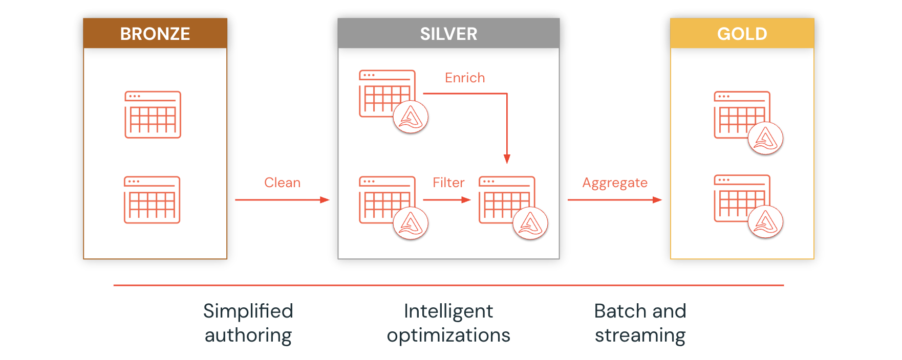

# Day 18: Medallion Architecture

> Module: Data Engineering Pipelines | Level: Intermediate | Time: 90 min

## Learning Objectives

- Understand the Medallion (multi-hop) architecture pattern and why it matters for lakehouse data platforms
- Design and implement Bronze, Silver, and Gold layers using Delta Lake on AWS S3
- Build an incremental multi-hop pipeline combining streaming and batch workloads
- Apply data quality improvements progressively across layers
- Understand data governance, lineage, and auditability benefits of the layered approach

## Key Concepts

- **Medallion Architecture** -- a data design pattern that organizes a lakehouse into Bronze, Silver, and Gold layers for progressive data quality refinement
- **Bronze Layer** -- raw, unfiltered data ingested as-is from source systems with metadata tagging
- **Silver Layer** -- cleansed, deduplicated, and conformed data providing an enterprise view of key entities
- **Gold Layer** -- business-level aggregations and denormalized models optimized for analytics and reporting
- **Multi-Hop Pipeline** -- incremental data flow where each layer reads from the previous, improving quality at each hop
- **Change Data Capture (CDC)** -- tracking changes in source data to enable incremental processing
- **ELT vs ETL** -- ELT loads first then transforms (preferred in lakehouses); ETL transforms before loading

## Topics Covered

- Data Lakes vs Data Lakehouses
- Why Medallion Architecture solves data swamp problems
- Bronze Layer: raw ingestion, schema inference, Auto Loader, metadata enrichment
- Silver Layer: deduplication, joins, type casting, null handling, schema conformance
- Gold Layer: aggregations, star schemas, KPIs, reporting-ready datasets
- Combining streaming and batch workloads in a single pipeline
- Real-world retail pipeline example (POS transactions -> sales analytics)
- Common tech stack: AWS S3, Delta Lake, Apache Spark, Databricks SQL
- When NOT to use Medallion Architecture

## Hands-On

See the accompanying guide and notebook:

- **Guide**: [`18-medallion-architecture.md`](18-medallion-architecture.md) -- comprehensive theory, architecture patterns, and cloud-specific notes
- **Notebook**: [`18-medallion-architecture_notebook.py`](18-medallion-architecture_notebook.py) -- production-grade Databricks lab with Unity Catalog, MERGE upserts, CHECK constraints, OPTIMIZE/ZORDER, and incremental ETL on AWS S3

## Certification Tip

The Databricks Certified Data Engineer Associate exam covers Medallion Architecture extensively. Expect questions on:
- Identifying the purpose of each layer (Bronze, Silver, Gold)
- Choosing the correct layer for specific transformations
- Understanding incremental processing with Auto Loader and Structured Streaming
- Benefits of Delta Lake ACID transactions across layers

## Next Steps

- [Day 19: Structured Streaming](../day19-structured-streaming/)
