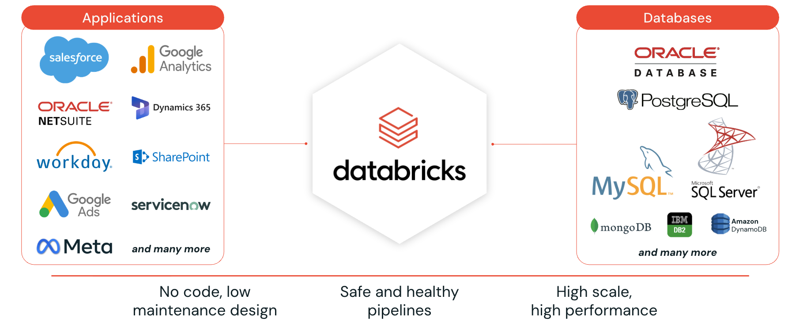

# Lakeflow Connect
> Module: Data Engineering Pipelines | Day 22 | Level: Intermediate | Time: 60 min


<p align="center"><em>Image credit: <a href="https://www.databricks.com/product/lakeflow">Databricks</a></em></p>

## Learning Objectives

After completing this session, you will be able to:
- Explain where Lakeflow Connect fits in the Databricks Lakeflow ecosystem
- Choose between Manual Upload, Standard Connectors, and Managed Connectors
- Implement Standard Connector ingestion using Auto Loader, JDBC, and Kafka
- Configure Managed Connectors for database and SaaS app ingestion
- Integrate ingested data with Unity Catalog for governance

---

## What is Lakeflow Connect?

Lakeflow Connect is the **ingestion layer** of the Databricks Lakeflow ecosystem. It provides simple, efficient connectors to bring data into the Lakehouse from a wide range of external sources.

Lakeflow has three components that form a complete data engineering platform:

```
                    ┌──────────────────────────────────────────────────────────────┐
                    │                   LAKEFLOW  PLATFORM                         │
                    │                                                              │
                    │   ┌────────────┐      ┌───────────────────┐    ┌──────────┐  │
                    │   │  CONNECT   │ ───> │ SPARK DECLARATIVE │ ──>│   JOBS   │  │
                    │   │  (Ingest)  │      │    PIPELINES      │    │(Orchestr)│  │
                    │   │   Day 22   │      │   (Transform)     │    │  Day 24  │  │
                    │   │            │      │    Day 23         │    │          │  │
                    │   └────────────┘      └───────────────────┘    └──────────┘  │
                    │                                                              │
                    │  External Sources      Bronze → Silver        Scheduling     │
                    │  → Bronze Tables       → Gold Tables          & Monitoring   │
                    └──────────────────────────────────────────────────────────────┘
```

- **Lakeflow Connect** (this session): Brings data INTO the Lakehouse from external sources
- **Spark Declarative Pipelines** (Day 23): Transforms data through the Medallion layers
- **Lakeflow Jobs** (Day 24): Orchestrates pipelines, connectors, and notebooks on a schedule

---

## Architecture Overview

```
  External Sources               Lakeflow Connect                     Lakehouse
  ═══════════════        ════════════════════════════════       ═══════════════════

  ┌──────────────┐       ┌──────────────────────────────┐      ┌─────────────────┐
  │ Cloud Storage│──────> │  Standard Connectors         │ ───> │                 │
  │(S3/ADLS/GCS) │       │  • Auto Loader (cloudFiles)  │      │  Unity Catalog  │
  └──────────────┘       │  • Batch (spark.read)        │      │                 │
                         │  • Streaming (readStream)    │      │  ┌───────────┐  │
  ┌──────────────┐       └──────────────────────────────┘      │  │  Bronze   │  │
  │    Kafka     │──────> │  Standard Connectors         │ ───> │  │  Tables   │  │
  │    Topics    │       │  • Kafka Connector            │      │  └───────────┘  │
  └──────────────┘       └──────────────────────────────┘      │                 │
                                                               │  ┌───────────┐  │
  ┌──────────────┐       ┌──────────────────────────────┐      │  │ Streaming │  │
  │  Databases   │──────> │  Managed Connectors          │ ───> │  │  Tables   │  │
  │ (PostgreSQL, │       │  • No-code UI setup           │      │  └───────────┘  │
  │  MySQL,      │       │  • CDC-based incremental      │      │                 │
  │  Oracle)     │       │  • Serverless compute         │      │  ┌───────────┐  │
  └──────────────┘       └──────────────────────────────┘      │  │  Volumes  │  │
                                                               │  └───────────┘  │
  ┌──────────────┐       ┌──────────────────────────────┐      │                 │
  │  SaaS Apps   │──────> │  Managed Connectors          │ ───> │                 │
  │ (Salesforce, │       │  • Workday, ServiceNow       │      │                 │
  │  Workday)    │       │  • Schema auto-inference     │      └─────────────────┘
  └──────────────┘       └──────────────────────────────┘

  ┌──────────────┐       ┌──────────────────────────────┐
  │ Local Files  │──────> │  Manual File Upload          │ ───> Volume or Table
  │ (CSV, JSON)  │       │  • Databricks UI             │
  └──────────────┘       └──────────────────────────────┘
```

---

## Three Ingestion Types

### 1. Manual File Upload

The simplest way to get data into Databricks. Upload files directly through the workspace UI.

**How it works**:
- Navigate to a Unity Catalog volume or a SQL warehouse
- Drag and drop files (CSV, JSON, Parquet, etc.)
- Databricks infers the schema and creates a table, or stores the file in a volume

**When to use**:
- One-time loads of reference data
- Small lookup tables
- Quick prototyping and testing
- Files under 2 GB

**Using `read_files` after upload**:
```python
# Read an uploaded file from a volume
df = spark.read.format("csv") \
    .option("header", "true") \
    .option("inferSchema", "true") \
    .load("/Volumes/ecommerce/raw/uploads/products.csv")

# Or use the read_files table-valued function in SQL
# SELECT * FROM read_files('/Volumes/ecommerce/raw/uploads/products.csv')
```

---

### 2. Standard Connectors

Code-based ingestion using Spark's built-in connectors plus Databricks enhancements. You write the ingestion logic yourself using PySpark or SQL.

#### Ingestion Modes

| Mode | Description | Latency | Use Case |
|------|-------------|---------|----------|
| **Batch** | Full load every run | Minutes to hours | Small tables, full snapshots, dimension data |
| **Incremental Batch** | Only new/changed rows since last run | Minutes | Medium tables, append-only logs, watermark-based |
| **Streaming** | Continuous real-time ingestion | Seconds | Event streams, clickstream, IoT, Kafka topics |

#### Batch Ingestion (Full Load)

```python
# Read entire table from PostgreSQL
jdbc_df = spark.read \
    .format("jdbc") \
    .option("url", "jdbc:postgresql://host:5432/ecommerce") \
    .option("dbtable", "products") \
    .option("user", dbutils.secrets.get("jdbc", "user")) \
    .option("password", dbutils.secrets.get("jdbc", "password")) \
    .load()

# Write to Unity Catalog managed table (overwrite for full load)
jdbc_df.write \
    .mode("overwrite") \
    .saveAsTable("ecommerce.bronze.products")
```

#### Incremental Batch Ingestion

```python
# Only read rows newer than the last load
last_loaded = spark.sql(
    "SELECT MAX(updated_at) FROM ecommerce.bronze.orders"
).collect()[0][0]

incremental_df = spark.read \
    .format("jdbc") \
    .option("url", "jdbc:postgresql://host:5432/ecommerce") \
    .option("dbtable", "orders") \
    .option("user", dbutils.secrets.get("jdbc", "user")) \
    .option("password", dbutils.secrets.get("jdbc", "password")) \
    .option("predicatePushdown", "true") \
    .load() \
    .filter(col("updated_at") > last_loaded)

incremental_df.write \
    .mode("append") \
    .saveAsTable("ecommerce.bronze.orders")
```

#### Streaming Ingestion (Auto Loader)

Auto Loader is the **standard connector for cloud file ingestion**. It was covered in depth in Day 20, and it is a key part of Lakeflow Connect.

```python
# Auto Loader: Standard Connector for cloud files
spark.readStream \
    .format("cloudFiles") \
    .option("cloudFiles.format", "json") \
    .option("cloudFiles.schemaLocation", "s3://ecommerce-lakehouse/schemas/clickstream") \
    .option("cloudFiles.inferColumnTypes", "true") \
    .load("s3://ecommerce-lakehouse/raw/clickstream/") \
    .withColumn("load_time", current_timestamp()) \
    .withColumn("source_file", col("_metadata.file_path")) \
    .writeStream \
    .format("delta") \
    .option("checkpointLocation", "s3://ecommerce-lakehouse/checkpoints/clickstream") \
    .outputMode("append") \
    .toTable("ecommerce.bronze.clickstream")
```

#### Streaming Ingestion (Kafka)

```python
# Kafka: Standard Connector for message streams
spark.readStream \
    .format("kafka") \
    .option("kafka.bootstrap.servers", "broker:9092") \
    .option("subscribe", "ecommerce.events") \
    .option("startingOffsets", "latest") \
    .load() \
    .select(
        col("key").cast("string"),
        from_json(col("value").cast("string"), event_schema).alias("data"),
        col("timestamp").alias("kafka_timestamp")
    ) \
    .select("data.*", "kafka_timestamp") \
    .writeStream \
    .format("delta") \
    .option("checkpointLocation", "s3://ecommerce-lakehouse/checkpoints/events") \
    .outputMode("append") \
    .toTable("ecommerce.bronze.events")
```

---

### 3. Managed Connectors

Purpose-built, no-code connectors managed entirely by Databricks. They handle the complexity of connecting to enterprise databases and SaaS applications.

#### Key Features

| Feature | Detail |
|---------|--------|
| **No-code setup** | Configure entirely through the Databricks UI |
| **Serverless compute** | No clusters to manage; Databricks handles infrastructure |
| **CDC-based ingestion** | Uses database change logs for efficient incremental reads |
| **Schema inference** | Automatically detects source schema |
| **Schema evolution** | Handles new columns and type changes automatically |
| **Unity Catalog governed** | All ingested data is registered in Unity Catalog |
| **Auto-scaling** | Compute scales based on data volume |
| **Built-in monitoring** | Pipeline health, data freshness, and error tracking |

#### Supported Sources

**Databases**:
- PostgreSQL
- MySQL
- SQL Server
- Oracle
- Db2

**SaaS Applications**:
- Salesforce
- Workday
- ServiceNow
- Microsoft Dynamics 365
- Google Analytics
- Netsuite
- SAP
- SharePoint

#### How Managed Connectors Work

```
  Source Database                Databricks (Serverless)              Lakehouse
  ═══════════════          ══════════════════════════════       ═══════════════════

  ┌─────────────┐          ┌──────────────────────────┐       ┌─────────────────┐
  │ PostgreSQL  │          │  Managed Connector        │       │  Unity Catalog  │
  │             │          │                           │       │                 │
  │  ┌───────┐  │   CDC    │  1. Connect to source     │       │  ┌───────────┐  │
  │  │ WAL / │──┼─────────>│  2. Read change log (CDC) │──────>│  │ Streaming │  │
  │  │ Binlog│  │          │  3. Apply changes         │       │  │  Table    │  │
  │  └───────┘  │          │  4. Track progress        │       │  └───────────┘  │
  │             │          │                           │       │                 │
  └─────────────┘          │  Serverless Compute       │       │  Access Control │
                           │  Auto-scaling             │       │  Lineage        │
                           └──────────────────────────┘       └─────────────────┘
```

**Setup Steps (UI-based)**:
1. Navigate to **Catalog** > **Create** > **Connection**
2. Select the source type (e.g., PostgreSQL)
3. Provide connection details (host, port, database, credentials)
4. Test the connection
5. Select tables to ingest
6. Choose destination catalog and schema
7. Configure schedule (continuous or triggered)
8. Start the ingestion pipeline

#### SQL Approach for Managed Connectors

You can also set up Managed Connectors using SQL:

```sql
-- Step 1: Create a connection to the source
CREATE CONNECTION my_postgres_conn
TYPE postgresql
OPTIONS (
    host 'db-host.example.com',
    port '5432',
    user secret('jdbc-secrets', 'username'),
    password secret('jdbc-secrets', 'password')
);

-- Step 2: Create a streaming table from the connection
CREATE STREAMING TABLE ecommerce.bronze.pg_customers
AS SELECT * FROM STREAM read_changefeed(
    'my_postgres_conn',
    'public.customers'
);
```

---

## Auto Loader and Lakeflow Connect

Auto Loader (covered in Day 20) is the **standard connector for cloud file ingestion** within Lakeflow Connect. The relationship is:

```
  Lakeflow Connect
  ├── Manual File Upload      (UI drag-and-drop)
  ├── Standard Connectors
  │   ├── Auto Loader         (cloud files -- Day 20)  <-- most common
  │   ├── JDBC                (databases -- batch)
  │   ├── Kafka               (message streams)
  │   └── Other Spark sources (SFTP, REST APIs via custom connectors)
  └── Managed Connectors      (no-code, serverless, CDC-based)
```

If you are ingesting files from S3, ADLS, or GCS, **Auto Loader is the recommended Standard Connector**. It provides:
- Incremental file discovery (no re-scanning)
- Schema inference and evolution
- Exactly-once guarantees via checkpoints
- Three modes: directory listing, managed file events, classic notifications

---

## Comparing Ingestion Methods

| Criteria | Manual Upload | Standard Connectors | Managed Connectors |
|----------|---------------|--------------------|--------------------|
| **Setup complexity** | None | Code required | No-code (UI/SQL) |
| **Compute** | Workspace | User-managed clusters | Serverless |
| **Latency** | Manual trigger | Configurable (batch to streaming) | Near real-time (CDC) |
| **Scale** | Small files (<2 GB) | Any size | Auto-scaling |
| **Schema management** | Auto-inferred | Code-managed | Auto-inferred + evolution |
| **Governance** | Unity Catalog | Unity Catalog | Unity Catalog |
| **Monitoring** | None | Custom | Built-in dashboards |
| **Sources** | Local files | Any Spark source | Databases + SaaS apps |
| **Cost** | Minimal | Cluster costs | Serverless pricing |
| **Best for** | Ad-hoc loads | Custom pipelines | Enterprise integration |

---

## Unity Catalog Integration

All three ingestion types in Lakeflow Connect integrate with Unity Catalog:

- **Access Control**: Ingested tables inherit Unity Catalog permissions
- **Lineage**: Track data origin from source through to the Lakehouse
- **Discovery**: All tables are searchable in the Unity Catalog explorer
- **Audit**: All access is logged for compliance
- **Connections**: Managed Connector connections are Unity Catalog objects

```sql
-- Grant access to ingested data
GRANT SELECT ON TABLE ecommerce.bronze.customers TO `data-analysts`;

-- View lineage for a table
-- (Available in Databricks UI: Catalog > Table > Lineage tab)
```

---

## Hands-On Walkthrough

See the companion notebook [`22-lakeflow-connect_notebook.py`](22-lakeflow-connect_notebook.py) for:
1. Standard Connector: Auto Loader ingestion from S3 (CSV, JSON)
2. Standard Connector: Batch ingestion with `spark.read`
3. Standard Connector: Streaming ingestion simulation
4. Managed Connector: UI walkthrough and SQL setup
5. Manual Upload: Using `read_files` to query uploaded data
6. Comparison of all three methods

---

## Cloud Provider Notes

| Feature | AWS | Azure | GCP |
|---------|-----|-------|-----|
| **Cloud storage** | S3 | ADLS Gen2 | GCS |
| **Auto Loader file events** | S3 Events + SQS | Azure Event Grid | GCS Pub/Sub |
| **Managed file events** | Unity Catalog external locations | Unity Catalog external locations | Unity Catalog external locations |
| **Managed Connectors** | Available | Available | Available |
| **Serverless compute** | Available | Available | Available |
| **Kafka connectivity** | MSK, Confluent | Event Hubs (Kafka API), Confluent | Confluent |
| **JDBC sources** | RDS, Aurora | Azure SQL, CosmosDB | Cloud SQL, AlloyDB |

---

## Certification Tip

For the **Databricks Certified Data Engineer Associate** exam:
- Know that Lakeflow Connect is the ingestion component of Lakeflow
- Understand the difference between Standard and Managed Connectors
- Know that Auto Loader is a Standard Connector for cloud files
- Managed Connectors are serverless and no-code
- Managed Connectors use CDC for incremental database ingestion
- All ingested data is governed by Unity Catalog
- Know the SQL syntax for `CREATE CONNECTION` and `CREATE STREAMING TABLE`

---

## Key Takeaways

1. **Lakeflow Connect** is the ingestion layer: it brings external data INTO the Lakehouse
2. **Three ingestion types**: Manual Upload (ad-hoc), Standard Connectors (code-based), Managed Connectors (no-code)
3. **Auto Loader** is the standard connector for cloud file ingestion (covered in Day 20)
4. **Managed Connectors** use CDC for efficient database ingestion, run on serverless compute, and require no code
5. **Unity Catalog** governs all ingested data regardless of ingestion method
6. Choose your connector type based on source, latency needs, and operational complexity
7. Lakeflow Connect feeds into **Spark Declarative Pipelines** (Day 24) for transformation

---

## Next Steps

- [Day 23: SCD Type 2 Pipelines](../day23-scd-type-2-pipelines/) -- implement slowly changing dimensions
- [Day 24: Spark Declarative Pipelines](../day24-lakeflow-spark-declarative-pipelines/) -- transform ingested data through Medallion layers
