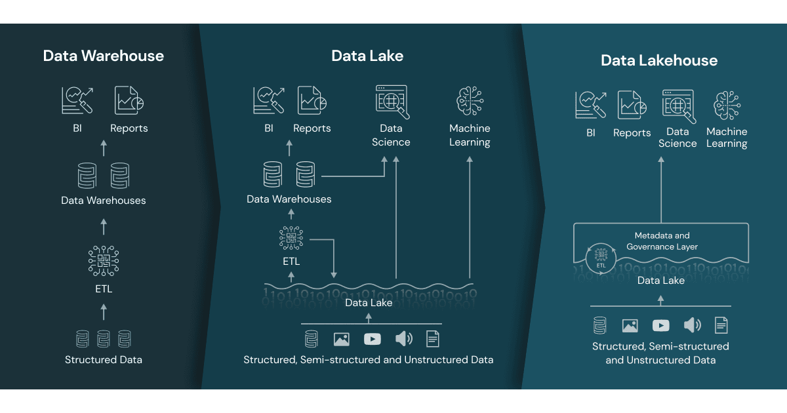

# Open Table Formats
> Module: Storage & Data Architecture | Day 28 | Level: Intermediate | Time: 120 min

## Learning Objectives

After completing this session, you will be able to:
- Explain the data storage problem that existed before open table formats
- Understand why open table formats emerged when they did (the "why now")
- Compare Delta Lake, Apache Iceberg, and Apache Hudi architecturally
- Identify the specific problems each format was built to solve
- Choose the right format for a given use case and organizational context
- Read and write any of the three formats from Databricks using UniForm

---

## The World Before Open Table Formats

To understand why open table formats exist, you need to feel the pain they replaced.

### The Architecture Evolution: Warehouse → Lake → Lakehouse

*(Source: Databricks)*



The diagram above tells the story in three panels:

| Era | What you got | What was missing |
|-----|-------------|-----------------|
| **Data Warehouse** | ACID, SQL, BI/Reports | Only structured data; expensive; no ML/DS |
| **Data Lake** | All data types (structured, semi-structured, unstructured); cheap object storage; ML/DS workloads | No ACID → dirty reads; no governance; "data swamp" |
| **Data Lakehouse** | All data types + ACID + Metadata & Governance Layer + BI/Reports/DS/ML from one store | Needed a new layer between raw files and query engines — this is exactly what open table formats provide |

The **Data Lake era** (roughly 2010–2019) unlocked cheap, scalable storage for all data types. But it introduced a governance vacuum: raw Parquet files on S3/ADLS/GCS had no concept of transactions, history, or row-level deletes. The Metadata and Governance Layer you see in the Lakehouse panel is not a single product — it is the combination of an open table format (Delta Lake, Iceberg, or Hudi) sitting on top of object storage.

### The Parquet + Hive Metastore Era

Before 2019, most data lakes were built on **raw Parquet files** managed by the **Hive Metastore**. This approach had a fundamental problem: Parquet is just a file format, not a table format. It describes how bytes are laid out on disk — it knows nothing about transactions, history, or schema evolution.

```
  THE PARQUET-ONLY DATA LAKE (pre-2019)
  ┌─────────────────────────────────────────────────────────────────────────┐
  │                                                                          │
  │  s3://my-datalake/sales/year=2024/month=01/part-00001.parquet           │
  │  s3://my-datalake/sales/year=2024/month=01/part-00002.parquet           │
  │  s3://my-datalake/sales/year=2024/month=01/part-00003.parquet  ← NEW   │
  │                                                                          │
  │  Hive Metastore knows: "sales table lives at s3://my-datalake/sales/"   │
  │  That's it. No more metadata.                                            │
  │                                                                          │
  │  PROBLEMS:                                                               │
  │                                                                          │
  │  1. ACID violations                                                      │
  │     Reader reads part-00001 while writer hasn't finished part-00003     │
  │     → Reader sees half-written, inconsistent data                       │
  │                                                                          │
  │  2. No upserts or deletes                                                │
  │     GDPR "delete this user's data" = rewrite the entire partition       │
  │     Manual, error-prone, takes hours                                     │
  │                                                                          │
  │  3. No schema evolution                                                  │
  │     Add a column to new files → old files don't have it                 │
  │     Query breaks. You need manual Hive metastore DDL updates.           │
  │                                                                          │
  │  4. Small files problem                                                  │
  │     Streaming writes → millions of tiny files → LIST API calls → slow   │
  │                                                                          │
  │  5. No time travel                                                       │
  │     "What did this table look like yesterday?" = impossible              │
  │     Once overwritten, data is gone forever                              │
  │                                                                          │
  │  6. Partition evolution is impossible                                    │
  │     Changed your partitioning strategy? Rewrite all historical data.    │
  │                                                                          │
  └─────────────────────────────────────────────────────────────────────────┘
```

### Why the Problem Got Worse Over Time

Three trends accelerated the pain:

**1. Regulatory pressure (GDPR, CCPA, HIPAA)**
"Delete all data for user ID 12345" went from a nice-to-have to a legal requirement with fines. Rewriting entire partitions to satisfy delete requests became a compliance bottleneck.

**2. Streaming + batch convergence**
Companies stopped doing nightly batch jobs and moved to near-real-time pipelines. Streaming writes at high frequency amplified the small-files problem and ACID violations.

**3. Data lake scale explosion**
Petabyte-scale data lakes meant that scanning all metadata on every query became prohibitively slow. The Hive Metastore was never designed to track billions of files efficiently.

---

## What Is an Open Table Format?

An open table format is a **specification** — a set of rules for how to organize files, how to track metadata, and how to provide table-level semantics (ACID, schema, history) on top of raw object storage.

```
  OPEN TABLE FORMAT = FILE FORMAT + METADATA LAYER + TRANSACTION LOG
  ┌──────────────────────────────────────────────────────────────────────┐
  │                                                                       │
  │  Storage Layer:   Parquet / ORC / Avro files (the actual data)       │
  │                                                                       │
  │  Metadata Layer:  Which files belong to this table version?          │
  │                   What is the current schema?                        │
  │                   What partitions exist?                             │
  │                   What statistics does each file have?               │
  │                                                                       │
  │  Transaction Log: What operations happened? In what order?           │
  │                   Who committed what, when?                          │
  │                   Which version is "current"?                        │
  │                                                                       │
  │  Result: ACID guarantees, time travel, schema evolution,             │
  │          upserts, deletes — all without a traditional database       │
  └──────────────────────────────────────────────────────────────────────┘
```

The three dominant open table formats are **Delta Lake**, **Apache Iceberg**, and **Apache Hudi**. They solve the same fundamental problem but with different architectural decisions, different design philosophies, and different sweet spots.

---

## Why Now? The Timing of Open Table Formats

All three formats appeared between 2017 and 2019. That timing is not a coincidence.

```
  TIMELINE
  ─────────────────────────────────────────────────────────────────────
  2016  AWS S3 Select launched → object storage gets fast enough
  2017  Uber opens Hudi (Hadoop Upserts Deletes and Incrementals)
  2018  Netflix opens Iceberg (internal project started 2017)
  2019  Databricks opens Delta Lake (built on Spark 2016–2019)
  2020  Delta Lake donates to Linux Foundation
  2020  Iceberg becomes Apache top-level project
  2021  Hudi becomes Apache top-level project
  2022  Iceberg v2 spec (row-level deletes)
  2023  Delta Lake 3.0 (UniForm: read Delta as Iceberg)
  2024  Databricks-Snowflake Iceberg interoperability (open ecosystem)
  ─────────────────────────────────────────────────────────────────────
```

**Four forces converged in 2017–2019:**

1. **Cloud object storage matured**: S3, ADLS, and GCS became fast enough (with conditional PUT, list consistency) to support atomic operations without a centralized file system.

2. **Spark hit mainstream**: Organizations had the compute engine but lacked the table layer. Spark could process anything — but tracking what to process was still manual.

3. **Streaming became standard**: Kafka + Spark Structured Streaming pipelines were common, but writing streaming data to Parquet created the ACID and small-files nightmares at scale.

4. **Regulatory requirements landed**: GDPR took effect in May 2018. The "right to be forgotten" made row-level deletes from immutable storage a legal necessity, not a feature request.

---

## Delta Lake

### Origin and Philosophy

Delta Lake was created at **Databricks** and open-sourced in 2019. It was built by the same team that built Apache Spark — so it is Spark-first by design. It became a **Linux Foundation** project in 2020.

**Core philosophy**: Reliability and simplicity on top of Spark. Make the common cases just work.

### Architecture: The Transaction Log

The key innovation in Delta Lake is the **`_delta_log/`** directory — a write-ahead log stored as JSON and Parquet checkpoint files alongside the data.

```
  DELTA LAKE STORAGE LAYOUT
  ┌─────────────────────────────────────────────────────────────────────┐
  │                                                                      │
  │  s3://bucket/sales_table/                                           │
  │  │                                                                   │
  │  ├── _delta_log/                      ← THE TRANSACTION LOG        │
  │  │   ├── 00000000000000000000.json    ← Commit 0: CREATE TABLE     │
  │  │   ├── 00000000000000000001.json    ← Commit 1: INSERT batch 1   │
  │  │   ├── 00000000000000000002.json    ← Commit 2: INSERT batch 2   │
  │  │   ├── 00000000000000000009.json    ← Commit 9: DELETE rows      │
  │  │   ├── 00000000000000000010.checkpoint.parquet  ← Checkpoint     │
  │  │   └── _last_checkpoint             ← Points to latest checkpoint│
  │  │                                                                   │
  │  ├── part-00001-a1b2c3d4.snappy.parquet   ← Data file              │
  │  ├── part-00002-e5f6a7b8.snappy.parquet   ← Data file              │
  │  └── part-00003-c9d0e1f2.snappy.parquet   ← Data file (new)       │
  │                                                                      │
  │  Each JSON commit entry records:                                    │
  │    add: { path, size, stats, partitionValues }   ← new file added  │
  │    remove: { path, deletionTimestamp }            ← file removed    │
  │    metaData: { schema, partitionColumns }         ← schema change   │
  │    commitInfo: { operation, timestamp, user }     ← audit trail     │
  │                                                                      │
  └─────────────────────────────────────────────────────────────────────┘
```

### How ACID Works in Delta Lake

```
  OPTIMISTIC CONCURRENCY CONTROL (OCC)
  ─────────────────────────────────────
  Writer 1 reads: current version = 5
  Writer 2 reads: current version = 5

  Writer 1 writes new data files
  Writer 1 tries to commit version 6  → SUCCESS (first to commit)

  Writer 2 writes new data files
  Writer 2 tries to commit version 6  → CONFLICT DETECTED
  Delta checks: do Writer 1 and Writer 2 touch the same data?
    → If different partitions: RETRY, commit as version 7 ✓
    → If same rows: FAIL with conflict error ✗
```

Readers always see a **consistent snapshot** — they read the version that was current when their query started, regardless of concurrent writers.

### Delta Lake: Key Features

| Feature | Description |
|---------|-------------|
| **ACID transactions** | Full serializable isolation via optimistic concurrency control |
| **Time Travel** | `VERSION AS OF 5` or `TIMESTAMP AS OF '2024-01-01'` |
| **Schema enforcement** | Rejects writes that don't match the schema |
| **Schema evolution** | `ALTER TABLE ADD COLUMN` or `mergeSchema` option |
| **MERGE INTO** | Upsert: update matching rows, insert non-matching |
| **OPTIMIZE** | Compacts small files into larger ones (Z-order supported) |
| **VACUUM** | Deletes old data files no longer referenced by any version |
| **Change Data Feed (CDF)** | Track row-level changes (inserts/updates/deletes) |
| **Liquid Clustering** | Dynamic, auto-managed clustering (replaces static partitioning) |
| **UniForm** | Expose a Delta table as Iceberg or Hudi metadata simultaneously |

### Delta Lake: The Transaction Log in Detail

```python
# Every Delta operation writes a JSON entry like this:
{
  "add": {
    "path": "part-00001-a1b2c3.snappy.parquet",
    "partitionValues": {"year": "2024", "month": "01"},
    "size": 1048576,
    "modificationTime": 1704067200000,
    "dataChange": true,
    "stats": "{\"numRecords\":50000,\"minValues\":{\"amount\":1.5},\"maxValues\":{\"amount\":9999.99}}"
  }
}

# Stats enable data skipping:
# Query: WHERE amount > 5000
# Delta reads stats for each file → skips files where maxValues.amount < 5000
# Result: scan 10% of files instead of 100%
```

---

## Apache Iceberg

### Origin and Philosophy

Apache Iceberg was created at **Netflix** to handle their massive data scale (petabytes, billions of files) and open-sourced in 2018. It became an **Apache top-level project** in 2020.

**Core philosophy**: Correctness and scalability at any scale. Designed for engines that are NOT Spark. Built to be engine-agnostic from day one.

Netflix's key pain point: the Hive Metastore could not scale to billions of files. A single `LIST` operation on a large Hive table could take minutes. Iceberg replaced the metastore entirely with a **hierarchical metadata tree** stored in the object store itself.

### Architecture: The Metadata Tree

Iceberg's architecture is more sophisticated than Delta Lake's flat transaction log. It uses a **three-tier metadata hierarchy**:

```
  APACHE ICEBERG STORAGE LAYOUT
  ┌─────────────────────────────────────────────────────────────────────┐
  │                                                                      │
  │  s3://bucket/sales_table/                                           │
  │  │                                                                   │
  │  ├── metadata/                                                      │
  │  │   ├── v1.metadata.json   ← Snapshot 1: CREATE TABLE             │
  │  │   ├── v2.metadata.json   ← Snapshot 2: INSERT                   │
  │  │   ├── v3.metadata.json   ← Snapshot 3: INSERT (current)         │
  │  │   ├── snap-001-manifest-list.avro  ← Lists all manifest files   │
  │  │   ├── snap-002-manifest-list.avro  ← Lists all manifest files   │
  │  │   ├── a1b2-manifest.avro           ← Lists Parquet data files   │
  │  │   └── c3d4-manifest.avro           ← Lists Parquet data files   │
  │  │                                                                   │
  │  └── data/                                                          │
  │      ├── year=2024/month=01/00001.parquet                          │
  │      └── year=2024/month=02/00002.parquet                          │
  │                                                                      │
  │  HIERARCHY:                                                         │
  │                                                                      │
  │  Catalog pointer                                                    │
  │      └── Table metadata file (v3.metadata.json)                    │
  │              ├── Current snapshot ID                               │
  │              ├── Schema history                                    │
  │              ├── Partition spec history                            │
  │              └── Snapshot list                                     │
  │                      └── Manifest List (.avro)                    │
  │                              └── Manifest File (.avro)            │
  │                                      └── Data files (.parquet)    │
  │                                                                      │
  └─────────────────────────────────────────────────────────────────────┘
```

### Why the Hierarchy Matters

The indirection in Iceberg's metadata is not accidental — it enables capabilities that are impossible with a flat transaction log:

```
  PARTITION EVOLUTION (Iceberg superpower)
  ─────────────────────────────────────────
  Original table: partitioned by month
  New requirement: partition by day (because data grew 10x)

  WITH HIVE/DELTA:
    Must rewrite all historical data to repartition ✗

  WITH ICEBERG:
    ALTER TABLE sales ADD PARTITION FIELD day(event_time) ✓
    Old data stays in month-partitioned files
    New data goes into day-partitioned files
    Queries work across BOTH partition specs transparently ✓

  HOW: Each snapshot records WHICH partition spec was active
  when that snapshot was written. Query planning applies the
  right spec to each manifest file automatically.
```

```
  HIDDEN PARTITIONING (Iceberg superpower)
  ─────────────────────────────────────────
  With Hive:
    CREATE TABLE sales PARTITIONED BY (year, month, day)
    Users must write: WHERE year=2024 AND month=1 AND day=15
    Forget the partition filter → full table scan ✗

  With Iceberg:
    CREATE TABLE sales PARTITIONED BY (days(event_time))
    Users write: WHERE event_time = '2024-01-15'
    Iceberg derives the partition automatically ✓
    Users CANNOT accidentally scan the whole table
```

### Iceberg v2: Row-Level Deletes

Iceberg v1 handled deletes by rewriting entire data files. Iceberg v2 (2022) introduced **delete files** — a much more efficient approach:

```
  ICEBERG V2 DELETE FILES
  ──────────────────────────────────────────────────────────────
  Positional deletes: "Delete row at position 42 in file XYZ"
  Equality deletes:   "Delete all rows WHERE user_id = 12345"

  Result: GDPR deletes without rewriting the data file
  The delete file is a small Parquet file that says which rows
  to exclude. At read time, the engine merges data + deletes.

  Compaction (table maintenance) eventually rewrites files
  to physically remove deleted rows.
```

### Iceberg: Key Features

| Feature | Description |
|---------|-------------|
| **Engine agnostic** | Spark, Flink, Trino, Presto, Hive, Dremio, Snowflake all read Iceberg natively |
| **Partition evolution** | Change partitioning without rewriting historical data |
| **Hidden partitioning** | Partition by transformed columns (day, month, bucket, truncate) |
| **Row-level deletes** | v2 delete files: equality and positional deletes |
| **Time travel** | Snapshot-based: `AS OF SNAPSHOT 12345` or `AS OF TIMESTAMP` |
| **Schema evolution** | Add, drop, rename, reorder columns without data rewrites |
| **Branch and tag** | Named snapshots — create "prod" and "dev" branches of the same table |
| **Incremental reads** | Read only rows that changed between snapshot A and snapshot B |
| **Multi-engine writes** | Flink writes, Spark reads — no coordination needed |

---

## Apache Hudi

### Origin and Philosophy

Apache Hudi was created at **Uber** in 2016 to solve a very specific problem: managing **hundreds of thousands of incremental upserts per second** from Uber's trip, event, and rider databases into their data lake. It was open-sourced in 2017 and became an **Apache top-level project** in 2021.

**Core philosophy**: Incremental processing first. Built for CDC (Change Data Capture) and high-frequency upserts from operational databases.

Uber's problem: They had MySQL and Cassandra databases for rides, drivers, and payments. They needed near-real-time copies in their Hadoop data lake for analytics. Rewriting entire Parquet partitions for each database changelog was too slow. Hudi was built to do **record-level upserts efficiently**.

### Architecture: Timeline + Storage Types

Hudi uses a **timeline** (like Delta's transaction log) but adds a crucial architectural concept: **two storage types** optimized for different access patterns.

```
  APACHE HUDI STORAGE LAYOUT
  ┌─────────────────────────────────────────────────────────────────────┐
  │                                                                      │
  │  s3://bucket/trips_table/                                           │
  │  │                                                                   │
  │  ├── .hoodie/                         ← HUDI METADATA (timeline)   │
  │  │   ├── 20240115T120000.commit       ← Completed write             │
  │  │   ├── 20240115T120500.deltacommit  ← Log file write (MoR)       │
  │  │   ├── 20240115T121000.compaction   ← MoR compaction event       │
  │  │   ├── .hoodie_properties           ← Table type, key config     │
  │  │   └── metadata/                   ← Hudi Metadata Table         │
  │  │                                                                   │
  │  ├── 2024/01/15/                                                    │
  │  │   ├── base-20240115T120000.parquet ← Base file (CoW)            │
  │  │   └── base-20240115T120000.parquet.20240115T120500.log ← delta  │
  │  │                                                                   │
  └─────────────────────────────────────────────────────────────────────┘
```

### Copy-on-Write (CoW) vs Merge-on-Read (MoR)

This is Hudi's defining architectural choice — and it is more explicit than Delta or Iceberg expose to users:

```
  COPY-ON-WRITE (CoW)
  ──────────────────────────────────────────────────────────────────────
  How writes work:
    On every write, rewrite the ENTIRE Parquet file that contains
    the updated records. New file replaces the old file.

  Trade-off:
    Write amplification:  HIGH (rewrite whole files for small changes)
    Read performance:     PERFECT (pure Parquet, no merge needed)
    Write latency:        HIGH (minutes for large files)

  Best for:
    - Tables that are read far more than written
    - Batch ETL workloads
    - Analytics queries that scan large portions of the table

  MERGE-ON-READ (MoR)
  ──────────────────────────────────────────────────────────────────────
  How writes work:
    New/updated records go into a small Avro LOG file alongside
    the base Parquet file. No rewrite of the base file.
    Periodically, a background COMPACTION job merges the log
    files back into the base Parquet files.

  Trade-off:
    Write amplification:  LOW (only write the delta)
    Read performance:     SLIGHTLY LOWER (merge base + log at read time)
    Write latency:        LOW (milliseconds)

  Two read modes:
    Read-optimized:  reads only base files (fast, slightly stale)
    Snapshot:        reads base + log files (slower, fully current)

  Best for:
    - High-frequency CDC from operational databases
    - Near-real-time streaming ingestion
    - When write latency matters more than read latency
```

```
  VISUAL: MoR vs CoW WRITE AMPLIFICATION
  ┌───────────────────────────────────────────────────────────────────┐
  │                                                                    │
  │  Scenario: Update 1,000 rows in a 100M-row table                 │
  │                                                                    │
  │  CoW:                                                             │
  │    Read affected Parquet file (1 GB)                             │
  │    Apply 1,000 updates                                           │
  │    Write new Parquet file (1 GB)   ← 1 GB written for 1K updates │
  │    Write amplification ratio: 1,000,000x                         │
  │                                                                    │
  │  MoR:                                                             │
  │    Write 1,000 records to Avro log file (10 KB)                  │
  │    Write amplification ratio: 1x (close to ideal)               │
  │    Base Parquet file untouched                                   │
  │    Background compaction merges periodically                     │
  │                                                                    │
  └───────────────────────────────────────────────────────────────────┘
```

### Hudi's Indexing Layer

Hudi maintains an **index** that maps a record key to the file that contains it. This is critical for efficient upserts — without it, finding which file contains user_id=12345 requires scanning all files.

```
  HUDI INDEX TYPES
  ────────────────────────────────────────────────────────────────────
  Bloom Filter:   Each data file stores a Bloom filter of its record keys.
                  Fast for "is this key definitely NOT in this file?"
                  Default index type.

  HBase Index:    Stores key→file mappings in Apache HBase.
                  Exact lookups, O(1) per key.
                  Requires HBase cluster.

  Bucket Index:   Hash the record key to determine which bucket (file
                  group) it belongs to. No index maintenance overhead.
                  Best for very high write throughput.

  Record-Level:   Tracks each record's exact file location.
                  Fastest upserts, highest memory cost.
```

### Hudi: Key Features

| Feature | Description |
|---------|-------------|
| **Upserts** | Record-level upserts using configurable index |
| **CoW and MoR** | Choose write-optimized (CoW) or read-optimized (MoR) per table |
| **Incremental queries** | `beginInstant` → `endInstant` reads only changed records |
| **Compaction** | Async or sync MoR log compaction |
| **Clustering** | Layout optimization (similar to Delta OPTIMIZE) |
| **Multi-modal ingestion** | DeltaStreamer: Kafka, DFS, JDBC sources built-in |
| **Savepoints** | Pin a timeline instant to prevent cleanup (rollback safety) |
| **Schema evolution** | Add/drop columns, rename (with limitations) |
| **Metadata Table** | In-table index of all files (eliminates expensive LIST calls) |

---

## Head-to-Head Comparison

```
  ARCHITECTURE COMPARISON
  ┌─────────────────────────────────────────────────────────────────────────┐
  │                   Delta Lake      Apache Iceberg    Apache Hudi         │
  ├─────────────────────────────────────────────────────────────────────────┤
  │ Created by        Databricks       Netflix           Uber               │
  │ Open-sourced      2019             2018              2017               │
  │ Foundation        Linux Found.     Apache            Apache             │
  ├─────────────────────────────────────────────────────────────────────────┤
  │ Metadata store    JSON/Parquet     Avro manifests    Avro timeline       │
  │                   log in _delta_   + metadata JSON   in .hoodie/        │
  ├─────────────────────────────────────────────────────────────────────────┤
  │ Transaction model Optimistic CC    Optimistic CC     MVCC + timeline    │
  ├─────────────────────────────────────────────────────────────────────────┤
  │ Primary engine    Spark-first      Engine agnostic   Spark + Flink      │
  │                                    (Flink native)                       │
  ├─────────────────────────────────────────────────────────────────────────┤
  │ Upsert model      MERGE INTO       MERGE INTO        Record-level       │
  │                                    (v2 delete files) index + upsert     │
  ├─────────────────────────────────────────────────────────────────────────┤
  │ Partition evol.   No (manual DDL)  YES (native)      Limited            │
  ├─────────────────────────────────────────────────────────────────────────┤
  │ Hidden partition  No               YES               No                 │
  ├─────────────────────────────────────────────────────────────────────────┤
  │ Storage types     Single (CoW)     Single (CoW)      CoW and MoR        │
  ├─────────────────────────────────────────────────────────────────────────┤
  │ Streaming writes  Excellent        Good              Excellent (MoR)    │
  ├─────────────────────────────────────────────────────────────────────────┤
  │ Multi-engine      Via UniForm      Excellent native  Good               │
  │ interop           (Iceberg compat) (Snowflake, Trino                    │
  │                                    Redshift natively)                   │
  ├─────────────────────────────────────────────────────────────────────────┤
  │ Databricks native YES (default)    Via UniForm or    Via UniForm or     │
  │                                    native connector  native connector   │
  ├─────────────────────────────────────────────────────────────────────────┤
  │ CDC / upsert      Good             Good              Excellent          │
  │ performance                                          (designed for it)  │
  ├─────────────────────────────────────────────────────────────────────────┤
  │ Time travel       YES              YES               YES                │
  │                   (version/ts)     (snapshot/ts)     (timeline instant) │
  ├─────────────────────────────────────────────────────────────────────────┤
  │ Schema evolution  Good             Excellent         Good               │
  ├─────────────────────────────────────────────────────────────────────────┤
  │ Ecosystem lock-in Databricks+      Minimal           Moderate           │
  │                   Linux Fdn                                             │
  └─────────────────────────────────────────────────────────────────────────┘
```

---

## Use Cases: When to Use Which Format

### Delta Lake

**Built for**: Teams on Databricks who want everything to just work, with the best Spark integration and the full Databricks feature set.

```
  USE DELTA LAKE WHEN:
  ✓ Your primary compute engine is Databricks / Apache Spark
  ✓ You use Unity Catalog (Delta is the native format)
  ✓ You want OPTIMIZE, Z-ORDER, Liquid Clustering without configuration
  ✓ You build Medallion Architecture (bronze/silver/gold pipelines)
  ✓ You use Structured Streaming (Delta has the tightest integration)
  ✓ You want Change Data Feed for downstream CDC consumers
  ✓ You use Lakeflow (DLT) — pipelines produce Delta tables natively
  ✓ You want the richest Databricks tooling (OPTIMIZE, VACUUM, DESCRIBE HISTORY)
  ✓ Your team doesn't need to query from Snowflake/Trino/Athena natively

  AVOID DELTA LAKE WHEN:
  ✗ You need multiple compute engines to write to the same table
    (Flink + Spark writing the same table = use Iceberg)
  ✗ You need Snowflake or Trino to read the table directly without Databricks
    (use Iceberg, which Snowflake reads natively)
  ✗ You are on an open-source only stack with no Databricks
    (Delta Lake open source exists but is far less capable than managed)
```

**Real-world examples**: Retail company building Medallion Architecture on Databricks, financial services firm running Spark ETL pipelines with Unity Catalog governance, any Databricks-first organization.

---

### Apache Iceberg

**Built for**: Multi-engine environments where the same data must be accessible from multiple compute engines — Spark, Flink, Trino, Presto, Athena, Snowflake, Redshift.

```
  USE APACHE ICEBERG WHEN:
  ✓ Multiple query engines must READ the same table
    (Spark for transformation, Trino/Athena for ad-hoc analytics)
  ✓ Multiple query engines must WRITE to the same table
    (Flink for streaming ingestion, Spark for batch transformation)
  ✓ You use AWS Glue, Snowflake, or Redshift to query your lake
    (all support Iceberg natively — Snowflake can read Iceberg on S3)
  ✓ You need partition evolution without data rewrites
    (table grew 10x, need to repartition by day instead of month)
  ✓ You want hidden partitioning to prevent accidental full table scans
  ✓ Your table is in the petabyte range with billions of files
    (Iceberg's manifest tree scales better than flat transaction logs)
  ✓ You want branches and tags for data as code workflows
  ✓ You are NOT on Databricks (open-source Iceberg works everywhere)

  AVOID APACHE ICEBERG WHEN:
  ✗ You are purely on Databricks and don't need multi-engine access
    (Delta Lake will give you a better experience with less setup)
  ✗ You need the tightest streaming write performance
    (Delta Lake's streaming integration is more mature on Databricks)
  ✗ You need high-frequency upserts from CDC (use Hudi for that)
```

**Real-world examples**: Media company where data scientists use Trino and Spark simultaneously, multi-cloud company needing Snowflake + Databricks to read the same lake, AWS-native team using Athena for ad-hoc + Spark for ETL.

---

### Apache Hudi

**Built for**: High-frequency CDC (Change Data Capture) ingestion from operational databases, near-real-time data lake updates, and workloads where write amplification is a cost concern.

```
  USE APACHE HUDI WHEN:
  ✓ You ingest CDC streams from MySQL, PostgreSQL, Oracle into your lake
    (Debezium → Kafka → Hudi is the standard pattern)
  ✓ You need record-level upserts at high frequency (millions/hour)
    (Hudi's indexed upsert is faster than MERGE INTO at high volume)
  ✓ Your table has a very high update-to-insert ratio
    (ride-sharing: every trip record gets updated 10+ times)
  ✓ You need MoR for low write latency AND a compaction schedule
  ✓ You use DeltaStreamer for multi-source ingestion with exactly-once semantics
  ✓ You run on Amazon EMR (AWS optimizes EMR for Hudi)
  ✓ You need incremental pull queries (Kafka-style: "give me only new changes")

  AVOID APACHE HUDI WHEN:
  ✗ You are on Databricks (Delta Lake is better-integrated and supported)
  ✗ You need multi-engine reads from non-Spark engines
    (Iceberg has better native support in Trino/Snowflake/Athena)
  ✗ Your workload is primarily batch analytics with few updates
    (CoW overhead not worth it; use Delta or Iceberg)
  ✗ You want simpler operations (Hudi requires more configuration and tuning)
```

**Real-world examples**: Uber (ride-sharing: high-frequency trip updates), any company running Debezium CDC pipelines from MySQL/PostgreSQL into a data lake, Amazon EMR shops with high-write-frequency event data.

---

## Decision Framework

```
  CHOOSING THE RIGHT OPEN TABLE FORMAT
  ┌─────────────────────────────────────────────────────────────────────┐
  │                                                                      │
  │  Are you primarily on Databricks?                                   │
  │          │                                                           │
  │          ├── YES ──→ Use DELTA LAKE                                 │
  │          │           (native, best tooling, Unity Catalog support)  │
  │          │                                                           │
  │          └── NO  ──→ What is your primary use case?                 │
  │                           │                                          │
  │                           ├── Multi-engine reads/writes?            │
  │                           │   Snowflake + Trino + Spark?            │
  │                           │   Petabyte scale?                       │
  │                           │   AWS Glue / Athena?                    │
  │                           │        └──→ APACHE ICEBERG              │
  │                           │                                          │
  │                           ├── High-frequency CDC upserts?           │
  │                           │   Debezium → Kafka → Lake?              │
  │                           │   Amazon EMR?                           │
  │                           │   Low write latency critical?           │
  │                           │        └──→ APACHE HUDI                 │
  │                           │                                          │
  │                           └── General batch analytics               │
  │                               Open-source Spark                     │
  │                               Trino/Athena primary                  │
  │                                    └──→ APACHE ICEBERG              │
  │                                                                      │
  └─────────────────────────────────────────────────────────────────────┘
```

---

## Interoperability: The Open Lakehouse Vision

The industry is moving toward **open interoperability** — the ability to write once and read from anywhere. Two mechanisms make this possible on Databricks today.

### Delta UniForm

**UniForm** (Universal Format) is a Delta Lake 3.0+ feature that writes **both** Delta transaction log entries **and** Iceberg metadata simultaneously. The same physical Parquet files are accessible via either the Delta or the Iceberg metadata layer.

```
  DELTA UNIFORM — ONE TABLE, TWO METADATA VIEWS
  ┌──────────────────────────────────────────────────────────────────┐
  │                                                                   │
  │  Single set of Parquet data files on S3/ADLS/GCS                │
  │                                                                   │
  │  ┌─────────────────────┐     ┌──────────────────────────────┐   │
  │  │   _delta_log/        │     │   metadata/                  │   │
  │  │   (Delta metadata)  │     │   (Iceberg metadata)         │   │
  │  │                     │     │   auto-generated by UniForm  │   │
  │  └─────────────────────┘     └──────────────────────────────┘   │
  │           │                              │                        │
  │           ▼                              ▼                        │
  │   Databricks / Spark            Snowflake (native Iceberg)       │
  │   reads Delta natively          Trino / Athena / Presto         │
  │                                 Any Iceberg-compatible engine    │
  │                                                                   │
  │  Enable with:                                                    │
  │  ALTER TABLE my_table                                            │
  │  SET TBLPROPERTIES ('delta.universalFormat.enabledFormats'       │
  │    = 'iceberg');                                                 │
  │                                                                   │
  └──────────────────────────────────────────────────────────────────┘
```

### Native Iceberg on Databricks

Databricks also supports reading and writing **native Iceberg tables** (not Delta tables with UniForm) via the Iceberg connector. This allows full Iceberg semantics — partition evolution, branches, tags — directly in Databricks when interoperability with non-Databricks engines is the primary requirement.

```sql
-- Read an Iceberg table managed by an external catalog (Glue, Nessie, REST)
SELECT * FROM iceberg_catalog.db.events WHERE event_date = '2024-01-15';

-- Write to a native Iceberg table
CREATE TABLE iceberg_catalog.db.new_table
USING iceberg
TBLPROPERTIES ('format-version' = '2')
AS SELECT * FROM source_table;
```

---

## Cloud Provider Notes

| Aspect | AWS | Azure | GCP |
|--------|-----|-------|-----|
| **Delta Lake** | Full support on S3 | Full support on ADLS Gen2 | Full support on GCS |
| **Iceberg** | Glue Catalog supports Iceberg natively; Athena reads Iceberg | ADLSv2 + Databricks or external catalog | BigLake Metastore supports Iceberg |
| **Hudi** | Amazon EMR has first-class Hudi support | Via Databricks or custom Spark setup | Via Databricks or Dataproc |
| **UniForm** | Unity Catalog + S3 | Unity Catalog + ADLS | Unity Catalog + GCS |
| **Best Iceberg catalog** | AWS Glue, Nessie, REST (Databricks) | Unity Catalog REST, Nessie | BigQuery Metastore, Nessie |
| **Snowflake integration** | Iceberg on S3 read by Snowflake natively | Iceberg on ADLS read by Snowflake | Iceberg on GCS read by Snowflake |

---

## Certification Tip

**Databricks Certified Data Engineer Associate / Professional**:
- You will be tested on Delta Lake deeply (ACID, time travel, MERGE, OPTIMIZE, VACUUM)
- Know that Databricks supports Iceberg via UniForm and native connectors
- Understand the difference between managed and external table behavior in Delta
- Know what `_delta_log/` is and what the checkpoint files are for

**Spark/Databricks questions about open table formats typically ask**:
- What happens to readers during a Delta write? (They see the previous committed version)
- How does Delta ensure atomicity? (All-or-nothing commit to `_delta_log/`)
- What does VACUUM do? (Deletes old data files no longer referenced by any version)
- What is the default retention period for VACUUM? (7 days / 168 hours)
- What is the difference between Delta time travel by version vs timestamp?

---

## Key Takeaways

1. **Open table formats add a metadata + transaction layer** on top of raw Parquet, giving data lakes the ACID guarantees that were previously only available in databases.

2. **Delta Lake** is the Databricks-native format — best Spark integration, richest Databricks tooling, default choice for Databricks users.

3. **Apache Iceberg** was built for multi-engine environments at petabyte scale — choose it when Snowflake, Trino, Athena, or Flink must read or write the same table.

4. **Apache Hudi** was built for high-frequency CDC upserts from operational databases — choose it when write amplification cost and low write latency matter more than read simplicity.

5. **UniForm bridges the gap**: a Delta table with UniForm enabled is simultaneously readable as both Delta and Iceberg — write once, read from any engine.

6. **The formats converge** over time. Iceberg v2 row-level deletes match Hudi MoR. Delta UniForm breaks down engine silos. The ecosystem is moving toward open interoperability.

---

## Next Steps

- **Day 29**: [Lakehouse Federation](../day29-lakehouse-federation/29-lakehouse-federation.md) — query Snowflake, MySQL, and Redshift live from Databricks without copying data
- **Day 30**: [Delta Sharing](../day30-delta-sharing/README.md) — share Delta tables across organizations without copying data
- **Day 15**: [Delta Lake Internals](../day15-delta-lake-internals/README.md) — deep dive into `_delta_log/`, checkpoints, and protocol versions
