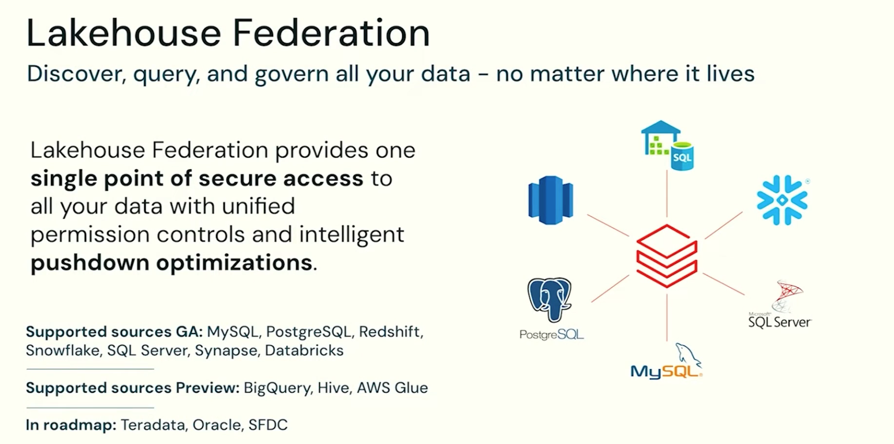

# Lakehouse Federation
> Module: Data Governance | Day 29 | Level: Intermediate | Time: 90 min

## Learning Objectives

After completing this session, you will be able to:
- Explain what Lakehouse Federation is and why it eliminates data copies
- Connect Databricks to external databases (Snowflake, MySQL, PostgreSQL, Redshift, SQL Server, Synapse)
- Query federated sources using standard SQL with Unity Catalog governance
- Understand pushdown optimizations and when federation outperforms ETL
- Apply UC access controls (GRANT/REVOKE) to federated foreign tables
- Decide when to federate vs when to ingest

---

## What is Lakehouse Federation?

Most enterprises have data in many places: a Snowflake warehouse, a PostgreSQL operational DB, a MySQL app database, a Redshift cluster, an Azure Synapse pool. Before Lakehouse Federation, the only way to query all of it together was to **copy everything into one place** — expensive, slow, and always slightly stale.

**Lakehouse Federation** lets you query external databases directly from Databricks — no copy, no ETL pipeline, no duplicated data — while Unity Catalog governs access with the same GRANT/REVOKE model you use for Delta tables.



> *Credit: Databricks, Inc. — "Lakehouse Federation: Discover, query, and govern all your data – no matter where it lives"*

---

## The Core Problem: Data Is Everywhere

```
  WITHOUT LAKEHOUSE FEDERATION
  ┌──────────────────────────────────────────────────────────────────────┐
  │                                                                       │
  │  Snowflake        PostgreSQL       MySQL           Redshift           │
  │  (finance data)   (app orders)     (product DB)    (marketing)        │
  │      │                │                │               │              │
  │      │   COPY         │   COPY         │   COPY        │   COPY       │
  │      ▼                ▼                ▼               ▼              │
  │  ┌──────────────────────────────────────────────────────────────┐    │
  │  │                  Databricks Delta Lake                        │    │
  │  │       (gold tables rebuilt from copies of everything)         │    │
  │  └──────────────────────────────────────────────────────────────┘    │
  │                                                                       │
  │  Problems:                                                            │
  │  ✗ Data is hours/days stale (copy lag)                               │
  │  ✗ Storage cost doubled (paying twice for the same data)             │
  │  ✗ ETL pipelines to maintain for every source                        │
  │  ✗ Governance duplicated: manage ACLs in source AND in Databricks    │
  │  ✗ Schema changes in source break your copy pipelines               │
  └──────────────────────────────────────────────────────────────────────┘
```

```
  WITH LAKEHOUSE FEDERATION
  ┌──────────────────────────────────────────────────────────────────────┐
  │                                                                       │
  │  Snowflake        PostgreSQL       MySQL           Redshift           │
  │  (finance data)   (app orders)     (product DB)    (marketing)        │
  │      │                │                │               │              │
  │      └────────────────┴────────────────┴───────────────┘              │
  │                                        │                              │
  │                              ┌─────────▼─────────┐                   │
  │                              │   Unity Catalog    │                   │
  │                              │   (Foreign Tables) │                   │
  │                              │   GRANT/REVOKE     │                   │
  │                              └─────────┬─────────┘                   │
  │                                        │                              │
  │                            Query with SQL                             │
  │                  SELECT * FROM snowflake_catalog.finance.revenue      │
  │                    JOIN postgresql_catalog.ops.orders ON ...          │
  │                                                                       │
  │  Benefits:                                                            │
  │  ✓ Always fresh — query live data in the source system               │
  │  ✓ No storage cost for copies                                        │
  │  ✓ No ETL pipelines to maintain                                      │
  │  ✓ One governance model: same GRANT/REVOKE for all sources          │
  │  ✓ Pushdown: filters, aggregations run IN the source system          │
  └──────────────────────────────────────────────────────────────────────┘
```

---

## Supported Sources

| Source | Status | Connection Type |
|--------|--------|----------------|
| MySQL | GA | JDBC |
| PostgreSQL | GA | JDBC |
| Amazon Redshift | GA | JDBC |
| Snowflake | GA | JDBC |
| Microsoft SQL Server | GA | JDBC |
| Azure Synapse Analytics | GA | JDBC |
| Databricks (other workspace) | GA | Databricks connector |
| Google BigQuery | Preview | JDBC |
| Apache Hive | Preview | JDBC |
| AWS Glue | Preview | API |
| Teradata | Roadmap | — |
| Oracle | Roadmap | — |
| Salesforce (SFDC) | Roadmap | — |

---

## How It Works: Three Objects in Unity Catalog

Lakehouse Federation uses three UC objects to represent external data:

```
  ┌────────────────────────────────────────────────────────────────────┐
  │                                                                     │
  │  1. CONNECTION                                                      │
  │     Stores credentials to reach the external system                │
  │     (hostname, port, username/password or secret)                  │
  │     Lives at the METASTORE level                                   │
  │                                                                     │
  │         CREATE CONNECTION snowflake_prod                           │
  │           TYPE SNOWFLAKE                                           │
  │           OPTIONS (host '...', user '...', password secret(...));  │
  │                                                                     │
  │  2. FOREIGN CATALOG                                                 │
  │     Maps a remote database/schema into UC namespace                │
  │     References a CONNECTION                                        │
  │                                                                     │
  │         CREATE FOREIGN CATALOG snowflake_catalog                   │
  │           USING CONNECTION snowflake_prod                          │
  │           OPTIONS (database 'PROD_DB');                            │
  │                                                                     │
  │  3. FOREIGN TABLE (auto-discovered)                                 │
  │     Mirrors a table in the external system                         │
  │     Queryable via SQL — reads live from source                     │
  │                                                                     │
  │         SELECT * FROM snowflake_catalog.finance.revenue;           │
  │         -- This query hits Snowflake directly, not Delta Lake      │
  │                                                                     │
  └────────────────────────────────────────────────────────────────────┘
```

### Object Hierarchy

```
  UC Metastore
  ├── Connection: snowflake_prod          ← Auth to Snowflake
  │
  ├── Foreign Catalog: snowflake_catalog  ← Maps PROD_DB in Snowflake
  │   ├── Schema: finance                 ← Snowflake schema (auto-discovered)
  │   │   ├── Foreign Table: revenue      ← Live Snowflake table
  │   │   └── Foreign Table: budgets
  │   └── Schema: hr
  │       └── Foreign Table: headcount
  │
  ├── Connection: postgres_ops            ← Auth to PostgreSQL
  │
  └── Foreign Catalog: postgres_catalog   ← Maps PostgreSQL database
      └── Schema: public
          ├── Foreign Table: orders
          └── Foreign Table: customers
```

---

## Pushdown Optimization

When you query a foreign table, Databricks pushes as much computation as possible into the source system:

```
  SELECT region, SUM(revenue) AS total
  FROM snowflake_catalog.finance.revenue
  WHERE year = 2024
  GROUP BY region

  Without pushdown:                    With pushdown (Lakehouse Federation):
  ──────────────────────               ─────────────────────────────────────
  Pull ALL rows from Snowflake   →    Send SQL to Snowflake:
  (millions of rows over network)      SELECT region, SUM(revenue)
  Filter/aggregate in Spark            FROM revenue
  (slow, expensive, network-heavy)     WHERE year = 2024
                                       GROUP BY region
                                       (only the aggregated result comes back)
```

Pushdown works for: `WHERE` filters, `GROUP BY`, `LIMIT`, column pruning, `JOIN` conditions (in some cases).

---

## Setting Up Lakehouse Federation: Snowflake Example

### Step 1: Store Credentials in a Databricks Secret

```bash
# CLI: create a secret scope and store Snowflake password
databricks secrets create-scope federation-secrets
databricks secrets put-secret federation-secrets snowflake-password
```

### Step 2: Create the Connection

```sql
-- Must be done by a Metastore Admin
CREATE CONNECTION snowflake_prod
  TYPE SNOWFLAKE
  OPTIONS (
    host        'myorg.snowflakecomputing.com',
    port        '443',
    sfWarehouse 'COMPUTE_WH',
    user        'databricks_federation_user',
    password    secret('federation-secrets', 'snowflake-password')
  )
  COMMENT 'Snowflake PROD connection for Lakehouse Federation';

-- Validate the connection works
SHOW CONNECTIONS;
```

### Step 3: Create the Foreign Catalog

```sql
-- Point to a specific Snowflake database
CREATE FOREIGN CATALOG IF NOT EXISTS snowflake_prod_catalog
  USING CONNECTION snowflake_prod
  OPTIONS (database 'PROD_DB')
  COMMENT 'Snowflake PROD_DB — federated via Lakehouse Federation';

-- Schemas and tables are auto-discovered from the source
SHOW SCHEMAS IN snowflake_prod_catalog;
SHOW TABLES IN snowflake_prod_catalog.finance;
```

### Step 4: Query the Foreign Catalog

```sql
-- Query exactly like a UC table — hits Snowflake live
SELECT *
FROM snowflake_prod_catalog.finance.revenue
WHERE year = 2024
LIMIT 100;

-- Cross-source join: Snowflake + local Delta
SELECT
  r.region,
  r.revenue_usd,
  o.order_count
FROM snowflake_prod_catalog.finance.revenue r
JOIN prod_catalog.silver.order_summary o
  ON r.region = o.region
WHERE r.year = 2024;
```

### Step 5: Govern the Foreign Catalog

```sql
-- Grant access just like a regular catalog
GRANT USE CATALOG ON CATALOG snowflake_prod_catalog TO `finance_team`;
GRANT USE SCHEMA  ON SCHEMA snowflake_prod_catalog.finance TO `finance_team`;
GRANT SELECT      ON TABLE snowflake_prod_catalog.finance.revenue TO `finance_team`;

-- Analysts with SELECT can query Snowflake through UC
-- They do NOT need Snowflake credentials or Snowflake access
-- UC acts as the single access point
```

---

## MySQL / PostgreSQL Connection Example

```sql
-- MySQL connection
CREATE CONNECTION mysql_app_db
  TYPE MYSQL
  OPTIONS (
    host     'mysql.internal.company.com',
    port     '3306',
    user     'databricks_ro',
    password secret('federation-secrets', 'mysql-password')
  );

CREATE FOREIGN CATALOG mysql_catalog
  USING CONNECTION mysql_app_db
  OPTIONS (database 'app_production');

-- PostgreSQL connection
CREATE CONNECTION postgres_analytics
  TYPE POSTGRESQL
  OPTIONS (
    host     'pg.internal.company.com',
    port     '5432',
    user     'databricks_ro',
    password secret('federation-secrets', 'pg-password')
  );

CREATE FOREIGN CATALOG postgres_catalog
  USING CONNECTION postgres_analytics
  OPTIONS (database 'analytics_db');

-- Cross-database query: MySQL app data + PostgreSQL analytics + Delta Gold
SELECT
  m.customer_id,
  m.signup_date,
  p.lifetime_value,
  d.churn_probability
FROM mysql_catalog.app_production.customers m
JOIN postgres_catalog.analytics_db.customer_ltv p
  ON m.customer_id = p.customer_id
JOIN prod_catalog.gold.churn_model_scores d
  ON m.customer_id = d.customer_id
WHERE p.lifetime_value > 1000;
```

---

## Federation vs Ingestion: When to Use Which

| Scenario | Use Federation | Use Ingestion (ETL) |
|----------|---------------|---------------------|
| Need real-time / live data | ✓ | — |
| Ad-hoc exploratory queries | ✓ | — |
| Source schema changes frequently | ✓ | — |
| Heavy transformation required | — | ✓ |
| Repeated large aggregations | — | ✓ (cache in Delta) |
| Source system can't handle extra load | — | ✓ |
| Data must survive source outage | — | ✓ |
| ML training (needs consistent snapshot) | — | ✓ |
| Reporting dashboard (sub-second latency) | — | ✓ (pre-aggregate in Gold) |

**Best practice**: Use federation for exploration and ad-hoc joins; ingest into Delta for production pipelines and dashboards.

---

## Key Takeaways

1. **Lakehouse Federation** = query external databases live from Databricks, no data copy
2. Three objects: **Connection** (credentials) → **Foreign Catalog** (maps a remote DB) → **Foreign Table** (auto-discovered, queryable)
3. **Governance is unified** — same GRANT/REVOKE model; users need no source-system credentials
4. **Pushdown optimization** — filters and aggregations run in the source system, minimizing data transfer
5. **GA sources**: MySQL, PostgreSQL, Redshift, Snowflake, SQL Server, Synapse, Databricks
6. **Federation ≠ replacement for ETL** — use it for live/ad-hoc; ingest for production pipelines

---

## Hands-On Walkthrough

See the companion notebook: [`29-lakehouse-federation_notebook.py`](29-lakehouse-federation_notebook.py)

The lab covers:
1. Creating a Connection to an external source
2. Creating a Foreign Catalog and exploring auto-discovered schemas
3. Querying foreign tables with SQL
4. Cross-source joins (foreign + local Delta)
5. Governing foreign catalogs with GRANT/REVOKE
6. Inspecting connections and foreign catalogs via information_schema

---

## Cloud Provider Notes

| Feature | AWS | Azure | GCP |
|---------|-----|-------|-----|
| Secrets for credentials | AWS Secrets Manager / Databricks Secrets | Azure Key Vault / Databricks Secrets | GCP Secret Manager / Databricks Secrets |
| Snowflake connectivity | VPC peering or PrivateLink | Private endpoint or public | VPC peering |
| Redshift support | GA | N/A | N/A |
| Synapse support | N/A | GA | N/A |

---

## Certification Tip

**Databricks Certified Data Engineer Professional** exam tests:
- What Lakehouse Federation is (query without copying)
- The three objects: Connection, Foreign Catalog, Foreign Table
- Governance model for foreign catalogs (same as regular UC)
- Pushdown optimization concept
- When to federate vs when to ingest

---

## Next Steps

- [Day 30: Delta Sharing](../day30-delta-sharing/) — share data externally across orgs and clouds
