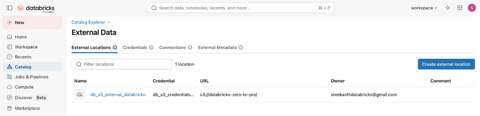
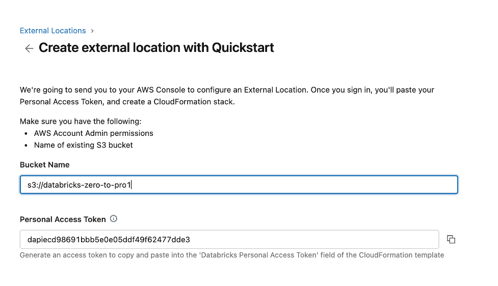
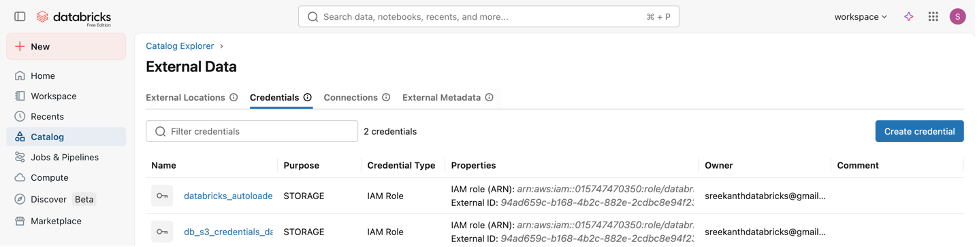

# Setting Up Databricks on AWS with External Locations

> Complete setup guide for running the labs in this repository using Databricks on AWS with Unity Catalog and S3 storage.

---

## Prerequisites

- An AWS account (free tier works for S3 storage)
- A Databricks account (free trial or paid)
- Admin permissions in both AWS and Databricks

---

## Part 1: Create an AWS Account

If you don't have an AWS account:

1. Go to [aws.amazon.com](https://aws.amazon.com/) and click **Create an AWS Account**
2. Enter your email, password, and account name
3. Choose **Personal** account type
4. Enter payment information (required, but free tier covers S3 for 12 months)
5. Verify your phone number
6. Select the **Basic Support (Free)** plan
7. Sign in to the AWS Management Console

### Create an S3 Bucket

1. In the AWS Console, search for **S3** and open the S3 service
2. Click **Create bucket**
3. Enter a bucket name (e.g., `databricks-zero-to-pro`)
4. Select your preferred region (e.g., `us-east-1`)
5. Leave all other settings as default (Block all public access = ON)
6. Click **Create bucket**

**Note**: Remember your bucket name and region -- you'll need them later.

---

## Part 2: Create a Databricks Account

### Option A: Databricks Free Trial (Recommended for this course)

1. Go to [databricks.com/try-databricks](https://www.databricks.com/try-databricks)
2. Click **Start Free Trial**
3. Fill in your information and select **AWS** as the cloud provider
4. Follow the guided setup to create a Databricks workspace on your AWS account
5. The trial gives you 14 days of Databricks Premium features (Unity Catalog, etc.)

### Option B: Databricks Community Edition (Limited)

1. Go to [community.cloud.databricks.com](https://community.cloud.databricks.com/)
2. Click **Sign Up** and follow the prompts
3. On the cloud provider page, click **"Get started with Community Edition"**

**Important**: Community Edition does NOT support Unity Catalog, external locations, or S3 integration. You will need at least a Databricks trial for the Medallion Architecture and Auto Loader labs.

See [setup-community-edition.md](setup-community-edition.md) for the Community Edition setup if you only need basic Spark labs.

---

## Part 3: Create a Databricks Cluster

1. In your Databricks workspace, click **Compute** in the left sidebar
2. Click **Create Compute**
3. Configure your cluster:
   - **Name**: `learning-cluster`
   - **Policy**: Unrestricted (or your org's policy)
   - **Databricks Runtime**: Latest LTS (e.g., 15.x LTS)
   - **Node Type**: `i3.xlarge` or similar (for trial, use smallest available)
   - **Workers**: 0 (single-node for labs) or 1-2 for performance
   - **Auto-terminate**: 60 minutes (saves costs)
4. Click **Create Compute**
5. Wait 3-5 minutes for the cluster to start

---

## Part 4: Generate a Personal Access Token (PAT)

You need a PAT to authenticate Databricks with AWS CloudFormation during external location setup.

1. In Databricks, click your **profile icon** (top-right corner)
2. Click **Settings**
3. In the left sidebar, click **Developer** > **Access Tokens**
4. Click **Manage** > **Generate new token**
5. Enter a comment (e.g., `AWS External Location Setup`)
6. Set lifetime (e.g., 90 days)
7. Click **Generate**
8. **Copy the token immediately** -- you won't be able to see it again

**Keep this token safe. Do not share it or commit it to version control.**

---

## Part 5: Create an External Location (AWS Quickstart)

An external location connects your Databricks workspace to your S3 bucket, allowing Unity Catalog to manage data stored in S3.

### Step 1: Navigate to External Locations

1. In Databricks, click **Catalog** in the left sidebar
2. Click **External Data** at the top
3. Click the **External Locations** tab
4. Click **Create external location**



### Step 2: Choose Quickstart

You'll see two options:

- **AWS Quickstart (Recommended)**: Creates the external location and IAM role automatically via CloudFormation. Use this unless you need custom IAM setup.
- **Manual**: For advanced users who already have a storage credential or need custom configuration.

Select **AWS Quickstart**.

### Step 3: Enter Bucket Name and PAT Token

1. Enter your **S3 bucket name** (e.g., `s3://databricks-zero-to-pro`)
2. Paste the **Personal Access Token** you generated in Part 4
3. Click **Launch in Quickstart**



> **Security Note**: The PAT token shown in the screenshot is for illustration only. Never share your actual PAT token. Regenerate it if you suspect it has been exposed.

### Step 4: AWS CloudFormation Stack

Clicking "Launch in Quickstart" opens the AWS Console with a pre-configured CloudFormation template. This template automatically creates:

- An **IAM Role** that Databricks can assume to access your S3 bucket
- An **IAM Policy** with the necessary S3 permissions:
  - `s3:GetObject`, `s3:PutObject`, `s3:DeleteObject` (object access)
  - `s3:ListBucket`, `s3:GetBucketLocation` (bucket listing)
  - `s3:GetBucketNotification`, `s3:PutBucketNotification` (for Auto Loader notifications)
- A **trust policy** allowing Databricks to assume the role

**Steps in AWS Console**:

1. You'll be redirected to the AWS CloudFormation console
2. The template is pre-filled -- review the parameters:
   - **Databricks Personal Access Token**: should already be filled from the previous step
   - **Stack name**: auto-generated (e.g., `databricks-external-location-...`)
3. Scroll to the bottom
4. Check the box: **"I acknowledge that AWS CloudFormation might create IAM resources"**
5. Click **Create stack**
6. Wait 2-3 minutes for the stack to complete (status: `CREATE_COMPLETE`)

### Step 5: Verify in Databricks

Once the CloudFormation stack completes, go back to Databricks:

1. Navigate to **Catalog** > **External Data** > **External Locations**
2. You should see your new external location pointing to `s3://your-bucket/`
3. Click on it to verify the URL and credential are correct

### Step 6: Verify Credentials

1. Click the **Credentials** tab in External Data
2. You should see a new credential with:
   - **Type**: IAM Role
   - **IAM Role ARN**: `arn:aws:iam::YOUR_ACCOUNT:role/databricks-...`
   - **Purpose**: STORAGE



---

## Part 6: Test Your Setup

Run this quick test in a Databricks notebook to verify everything works:

```python
# Test S3 write access
test_df = spark.createDataFrame([(1, "test")], ["id", "value"])
test_df.write.format("delta").mode("overwrite").save("s3://databricks-zero-to-pro/test_setup")
print("S3 write: SUCCESS")

# Test S3 read access
result = spark.read.format("delta").load("s3://databricks-zero-to-pro/test_setup")
result.display()
print("S3 read: SUCCESS")

# Cleanup
dbutils.fs.rm("s3://databricks-zero-to-pro/test_setup", recurse=True)
print("Cleanup: SUCCESS")
```

If all three succeed, your setup is complete.

---

## Part 7: Create Unity Catalog Schemas for Labs

The Medallion Architecture lab (Day 18) uses separate schemas per layer:

```sql
USE CATALOG databricks_pro;

CREATE SCHEMA IF NOT EXISTS bronze COMMENT 'Raw, unfiltered data';
CREATE SCHEMA IF NOT EXISTS silver COMMENT 'Cleansed, validated data';
CREATE SCHEMA IF NOT EXISTS gold   COMMENT 'Business-ready aggregations';
```

---

## Troubleshooting

### CloudFormation stack fails to create

- **Check your AWS region**: Make sure you're creating the stack in the same region as your S3 bucket
- **IAM permissions**: You need admin permissions in AWS to create IAM roles
- **PAT token expired**: Generate a new token in Databricks and try again

### "Access Denied" when writing to S3

- Verify the external location points to the correct S3 path
- Check that the IAM role has the necessary S3 permissions
- Ensure the S3 bucket exists and is in the expected region

### External location not found

- The CloudFormation stack may still be creating -- wait a few minutes
- Refresh the External Locations page in Databricks

### Auto Loader notifications fail

- The IAM role needs `s3:GetBucketNotification` and `s3:PutBucketNotification`
- For managed file events, ensure file events are enabled on the external location:
  ```sql
  ALTER EXTERNAL LOCATION my_location ENABLE FILE EVENTS;
  ```

---

## What's Next?

With your setup complete, you can run the labs:

- [Day 18: Medallion Architecture](../day18-medallion-architecture/) -- Bronze/Silver/Gold pipeline on S3
- [Day 19: Structured Streaming](../day19-structured-streaming/) -- streaming engine fundamentals
- [Day 20: Auto Loader](../day20-auto-loader/) -- optimized file ingestion from S3

---

## Quick Reference

| Item | Value |
|------|-------|
| Databricks Console | Your workspace URL (e.g., `https://dbc-xxxxx.cloud.databricks.com`) |
| AWS Console | [console.aws.amazon.com](https://console.aws.amazon.com) |
| S3 Bucket | `s3://databricks-zero-to-pro` (replace with yours) |
| Unity Catalog | `databricks_pro` (your catalog name) |
| Schemas | `bronze`, `silver`, `gold` |
| Cluster | `learning-cluster` |
